# Vulkan Samples

This repository holds many samples, showing various aspect of Vulkan, debugging tips and usage of other Nvidia tools. It has a dependency on [nvpro_core](https://github.com/nvpro-samples/nvpro_core) for some core Vulkan helper classes and other small utilities. All projects are using [GLFW](https://www.glfw.org/download) and [Dear ImGui](https://github.com/ocornut/imgui)

Each sample have its own documentation written in [Markdown](https://github.github.com/gfm/) describing what was done and where to get more information.

## Build

### Easy Method (Windows)

Clone this repository

```bash
git clone https://github.com/nvpro-samples/vk_samples.git
```

1. Deploy.bat : pull and update all dependencies.
2. Build.bat : build all projects in release and optionally to debug.
3. Install.bat : copy the binaries and dlls to the `_Install` directory.

### Hand Made

``` bash
git clone --recursive --shallow-submodules https://github.com/nvpro-samples/nvpro_core.git
git clone https://github.com/nvpro-samples/vk_samples.git
```

Generate solution

``` bash
cd vk_samples
mkdir build
cd build
cmake ..
```

**Note**: If there are missing dependencies in `nvpro_core`, run the following command in nvpro_core directory.

``` bash
git submodule update --init --recursive --checkout --force
```

### Extra SDK

Some samples depend on other SDKs. They are only required if you intend to build these projects.

* [OptiX 7.3+](https://developer.nvidia.com/designworks/optix/download) : OptiX denoiser
* [Cuda 10.x](https://developer.nvidia.com/cuda-downloads) : OptiX denoiser
* [Nsight Aftermath](https://developer.nvidia.com/nsight-aftermath) : Aftermath

## Samples

### Application Class

The examples are for most using the [Application class](application/application_vk/src/application.hpp). This class is a modified version of the Dear ImGui Vulkan example. It is creating the window, based on GLFW, creates and initialize the UI, but also creates the swapchain with ImGui framework.

Samples are attached to the application class as Engines. While the application runs, the sample will be called to render its UI, or to perform rendering operation in the current frame.

#### Init

The `init()` function will create the Vulkan context using `nvvk::Context`, create the GLFW window and create the swapchains by calling `ImGui_ImplVulkanH_CreateOrResizeWindow`.

#### Run

The `run()` function is an infinite loop until the close event is triggered. Within the loop, each engine will be called with:

* onResize : Called when the viewport size is changing
* onUIRender : Called for anything related to UI
* onRender : For anything to render within a frame, with the command buffer of the frame.
* onUIMenu : To add functions to the menubar

At the end of each loop the frame is rendered with `frameRender()` then the frame is presented with `framePresent()`.  

### Basic Samples

If you are new to this repository, the first samples to read to better understand the framwork are [solid color](samples/solid_color) and [rectangle](samples/rectangle).

| Name | Description | Image |
| ------ | ------ | ---- |
| [solid_color](samples/solid_color) | Set a user custom color to a pixel wide texture and display it.  | 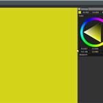 |
| [rectangle](samples/rectangle) | Render a 2D rectangle to GBuffer.  | 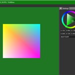 |
| [aftermath](samples/aftermath) | Integrate the Nsight Aftermath SDK to an existing application | 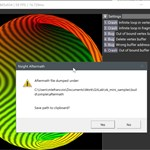 |
| [image_ktx](samples/image_ktx) | Display KTX image and apply tonemap post processing | 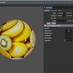 |
| [image_viewer](samples/image_viewer) | Load an image, allow to zoom and pan under mouse cursor | 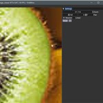 |
| [mm_displacement](samples/mm_displacement) | Micro-mesh displacement  | 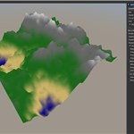 |
| [mm_opacity](samples/mm_opacity) | Micromap opacity  | 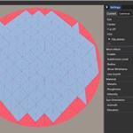 |
| [msaa](samples/msaa) | Hardware Multi-Sampling Anti-Aliasing  | 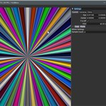 |
| [shader_printf](samples/shader_printf) | Add printf to shader and display in a log window  | 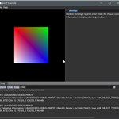 |
| [raytrace](samples/raytrace) | Simple ray tracer using metalic-roughness shading, reflection and shadows and simple sky shader.  | 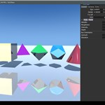 |
| [shading execution reorder](samples/ser_pathtrace) | Known also as SER, this shows how to reorder execution rays to gain a better usage of the GPU.  | 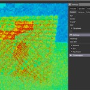 |
| [simple_polygons](samples/simple_polygons) | Rasterizing multiple polygonal objects.  | 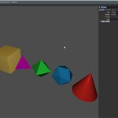 |
| [offscreen](samples/offscreen) | Render without window context and save image to disk.  |  |
| [tiny_shader_toy](samples/tiny_shader_toy) | Compile shader on the fly, diplay compilation errors, multiple pipeline stages.  | 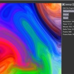 |
| [barycentric_wireframe](samples/barycentric_wireframe) | Draw wifreframe in a a single pass using `gl_BaryCoordNV` | 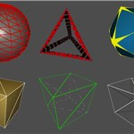 |
| [texture 3d](samples/texture_3d) | Create a 3D texture and do ray marching. | 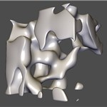 |

## LICENSE

Copyright 2023 NVIDIA CORPORATION. Released under Apache License,
Version 2.0. See "LICENSE" file for details.
