# Vulkan Samples

[](LICENSE)
[](https://www.khronos.org/vulkan/)
[]()

A comprehensive collection of Vulkan examples demonstrating various aspects of modern graphics programming, debugging techniques, and integration with NVIDIA tools. This repository serves as both a learning resource and a reference implementation for Vulkan development.

## Quick Start

### Prerequisites
- [nvpro_core2](https://github.com/nvpro-samples/nvpro_core2): Vulkan helper classes and utilities
- Vulkan 1.4+ compatible GPU and drivers
- CMake 3.18+

### Build Instructions

```bash
# Clone repositories
git clone https://github.com/nvpro-samples/nvpro_core2.git
git clone https://github.com/nvpro-samples/vk_mini_samples.git

# Build
cd vk_mini_samples
cmake -B build -S .
cmake --build build -j 8
```

Compiled files will be under the `_bin` directory.


## Learning Path

### For Beginners
Start with these foundational samples to understand the framework:
| Sample | Description | Image | GLSL | Slang |
|--------|-------------|-------|------|-------|
| [solid_color](samples/solid_color) | Single-pixel texture creation and display |  | - | - |
| [rectangle](samples/rectangle) | 2D rectangle rendering to GBuffer |  | ✅ | ✅ |

## Sample Catalog

### Graphics & Rendering
| Sample | Description | Image | GLSL | Slang |
|--------|-------------|-------|------|-------|
| [barycentric_wireframe](samples/barycentric_wireframe) | Single-pass solid-wireframe rendering using `gl_BaryCoordNV` |  | ✅ | ✅ |
| [gltf_raytrace](samples/gltf_raytrace) | glTF scene loading with path-tracing renderer | 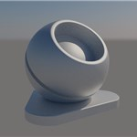 | ❌ | ✅ |
| [image_ktx](samples/image_ktx) | KTX image display with tonemapping post-processing |  | ✅ | ✅ |
| [image_viewer](samples/image_viewer) | Image loading with zoom and pan functionality |  | ✅ | ✅ |
| [line_stipple](samples/line_stipple) | Dashed line rendering with stipple pattern | 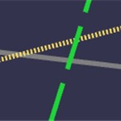 | ✅ | ✅ |
| [mm_opacity](samples/mm_opacity) | Micromap opacity implementation |  | ✅ | ✅ |
| [msaa](samples/msaa) | Hardware Multi-Sampling Anti-Aliasing demonstration |  | ✅ | ✅ |
| [offscreen](samples/offscreen) | Windowless rendering with image save functionality |  | ✅ | ✅ |
| [rectangle](samples/rectangle) | 2D rectangle rendering to GBuffer |  | ✅ | ✅ |
| [simple_polygons](samples/simple_polygons) | Multi-polygon object rasterization |  | ✅ | ✅ |
| [solid_color](samples/solid_color) | Single-pixel texture creation and display |  | ✅ | ✅ |
| [texture_3d](samples/texture_3d) | 3D texture creation and ray marching |  | ✅ | ✅ |

### Ray Tracing & Advanced Graphics
| Sample | Description | Image | GLSL | Slang |
|--------|-------------|-------|------|-------|
| [ray_query](samples/ray_query) | Inline raytracing in compute shaders | 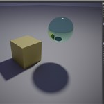 | ✅ | ✅ |
| [ray_query_position_fetch](samples/ray_query_position_fetch) | Using VK_KHR_ray_tracing_position_fetch in ray query | 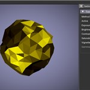 | ✅ | ✅ |
| [ray_trace](samples/ray_trace) | Basic ray tracer with metallic-roughness shading | 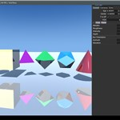 | ❌ | ✅ |

More raytracing examples can be found in the  **[vk_raytracing_tutorial_KHR](https://github.com/nvpro-samples/vk_raytracing_tutorial_KHR/tree/v2?tab=readme-ov-file#complete-tutorial-series)**.


### Compute & Performance
| Sample | Description | Image | GLSL | Slang |
|--------|-------------|-------|------|-------|
| [compute_multi_threaded](samples/compute_multi_threaded) | Executing compute shaders in separate threads | 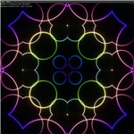 | ✅ | ✅ |
| [compute_only](samples/compute_only) | Basic compute and display example | 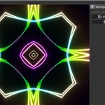 | ✅ | ✅ |
| [memory_budget](samples/memory_budget) | Dynamic memory allocation within budget constraints | 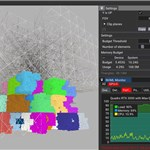 | ✅ | ✅ |
| [realtime_analysis](samples/realtime_analysis) | Real-time GPU information display | 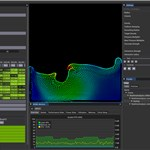 | ✅ | ❌ |

### Development & Debugging
| Sample | Description | Image | GLSL | Slang |
|--------|-------------|-------|------|-------|
| [crash_aftermath](samples/crash_aftermath) | Integration of Nsight Aftermath SDK | 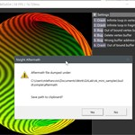 | ✅ | ✅ |
| [gpu_monitor](samples/gpu_monitor) | GPU usage visualization | 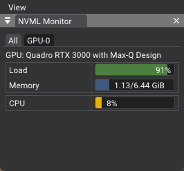 | ✅ | ✅ |
| [shader_object](samples/shader_object) | Shader object and dynamic pipeline usage | 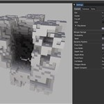 | ✅ | ✅ |
| [shader_printf](samples/shader_printf) | Shader debugging with printf functionality |  | ✅ | ✅ |
| [tiny_shader_toy](samples/tiny_shader_toy) | Real-time shader compilation with error display |  | ✅ | ✅ |

## Architecture

### Rendering Pipeline
The samples demonstrate an indirect rendering approach with the following structure:

1. **Off-screen Rendering** → Sample renders to off-screen buffer
2. **GUI Integration** → Rendered content embedded in GUI layout  
3. **Composite Rendering** → `nvapp::Application` combines GUI elements
4. **Swapchain Presentation** → Final composition presented to screen

## Application Architecture

The examples in this repository leverage various utilities from the [nvpro_core2](https://github.com/nvpro-samples/nvpro_core2) framework. Central to each sample's implementation is the [`Application`](https://github.com/nvpro-samples/nvpro_core2/blob/master/nvapp/application.hpp) class, which provides core functionality for:

- Window creation and management
- User interface (UI) initialization
- Swapchain setup integrated with the ImGui framework

The `Application` class is an enhanced derivative of the Dear ImGui Vulkan example, optimized for our use cases.

### Modular Design

Samples are implemented as `Elements` and attached to the `Application` instance. This modular approach allows for:

1. Separation of concerns between core application logic and sample-specific code
2. Consistent handling of UI rendering and frame operations across different samples

### Application Lifecycle

The following diagram illustrates the complete application lifecycle, from initialization through the main rendering loop:

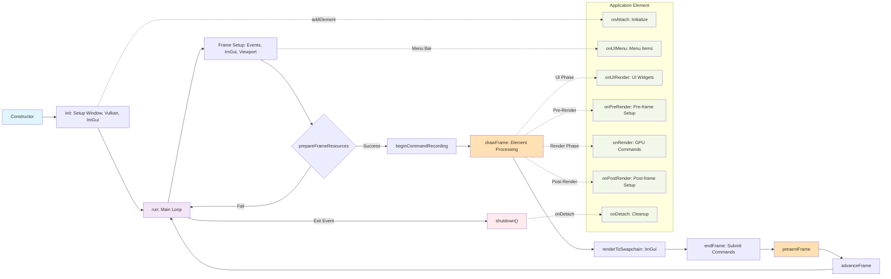

### Initialization Process

The `init()` method orchestrates the following setup procedures:

1. **GLFW Initialization**: `glfwInit()` sets up the windowing system
2. **Vulkan Context**: `nvvk::Context::init()` creates the Vulkan instance, device, and queues
3. **Window Creation**: `ImGui_ImplVulkanH_CreateOrResizeWindow()` creates the window and swapchain
4. **ImGui Setup**: `ImGui_ImplVulkan_Init()` initializes the ImGui Vulkan backend
5. **Swapchain**: Manages presentation images

During initialization, core Vulkan resources are provided by the framework:
- **VkInstance**: Connection between application and Vulkan library
- **VkPysicalDevice**: Representation of the physical GPU
- **VkDevice**: Logical representation of the physical GPU
- **VkQueue**: Command submission queue for GPU operations

### Execution Cycle

The `run()` method implements the main application loop, continuing until a termination event is triggered. Each iteration follows this sequence:

#### Frame Preparation
1. **Frame Setup**: Process events, update ImGui, handle viewport changes
2. **Resource Management**: `prepareFrameResources()` acquires swapchain image
3. **Cleanup**: `freeResourcesQueue()` releases previous frame resources
4. **Synchronization**: `prepareFrameToSignal()` sets up frame synchronization

#### Command Recording
5. **Command Buffer**: `beginCommandRecording()` starts recording GPU commands
6. **Element Processing**: `drawFrame()` invokes element callbacks in sequence:
   - `onUIRender`: UI widget rendering
   - `onPreRender`: Pre-frame setup operations
   - `onRender`: Sample-specific GPU commands
   - `onPostRender`: Post-frame cleanup operations

#### Frame Completion
7. **ImGui Rendering**: `renderToSwapchain()` renders UI to swapchain image
8. **Synchronization**: `addSwapchainSemaphores()` sets up presentation synchronization
9. **Submission**: `endFrame()` submits command buffers to GPU
10. **Presentation**: `presentFrame()` presents the completed frame
11. **Advancement**: `advanceFrame()` moves to next frame resources

### Element Lifecycle

Elements attached to the application follow a well-defined lifecycle:

- **`onAttach`**: Called during `addElement()`, used for initialization
- **`onUIMenu`**: Called during frame setup, adds menu items to the menu bar
- **`onUIRender`**: Called during UI phase, renders ImGui widgets
- **`onPreRender`**: Called before main rendering, handles pre-frame setup
- **`onRender`**: Called during render phase, records GPU commands
- **`onPostRender`**: Called after main rendering, handles post-frame cleanup
- **`onDetach`**: Called during shutdown, used for cleanup and resource deallocation


## Shader Language Support

### SPIR-V Intermediate Representation
Vulkan uses SPIR-V as its intermediate shader representation, enabling support for multiple high-level shader languages.

### Supported Languages

#### Slang (Default)
[Slang](https://github.com/shader-slang/slang) - High-level shader language with C++-like syntax
- **Targets**: SPIR-V (Vulkan), DirectX 12, CUDA, C++
- **Usage**: Set `USE_SLANG=1` in CMakeLists.txt

#### GLSL
OpenGL Shading Language - Native Vulkan ecosystem support
- **Usage**: Set `USE_SLANG=0` in CMakeLists.txt

## Additional Dependencies

### Required SDKs
- **Nsight Aftermath SDK**: Required for the [crash_aftermath](samples/crash_aftermath) sample
  - Download from [NVIDIA Developer](https://developer.nvidia.com/nsight-aftermath)

## Resources

### Shader Language Resources
- **[Slang Documentation](https://shader-slang.com/getting-started.html)**
- **[SPIR-V Specification](https://registry.khronos.org/SPIR-V/specs/unified1/SPIRV.html)**
- **[GL_EXT_spirv_intrinsics](https://github.com/microsoft/DirectXShaderCompiler/wiki/GL_EXT_spirv_intrinsics-for-SPIR-V-code-gen)**

### Related Projects
- **[nvpro_core2](https://github.com/nvpro-samples/nvpro_core2)**: Core framework and utilities
- **[vk_raytracing_tutorial_KHR](https://github.com/nvpro-samples/vk_raytracing_tutorial_KHR/tree/v2)**: Original KHR ray tracing tutorial

## License

Copyright 2024-2025 NVIDIA CORPORATION. Released under Apache License, Version 2.0. See [LICENSE](LICENSE) file for details.
