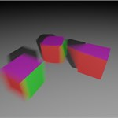
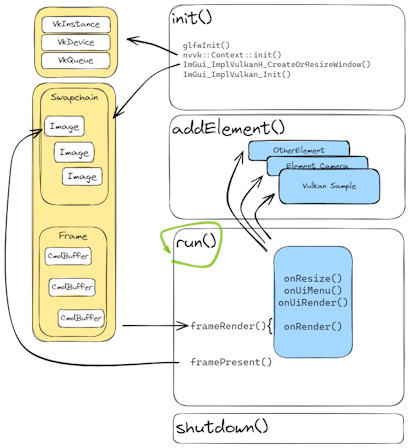

# Vulkan Samples

This repository contains many examples showing different aspects of Vulkan, debugging tips, and using other Nvidia tools. See the [samples](#Samples) section below.

Each sample has its own documentation that describes the functionality and where to get more information.

Dependencies
*  [nvpro_core](https://github.com/nvpro-samples/nvpro_core) : Vulkan helper classes and other small utilities.


## Build

Cloning repositories

``` bash
git clone --recursive --shallow-submodules https://github.com/nvpro-samples/nvpro_core.git
git clone https://github.com/nvpro-samples/vk_mini_samples.git
```

Generate solution

``` bash
cd vk_mini_samples
mkdir build
cd build
cmake ..
```

### Extra SDK

The Aftermath sample requires to download the SDK separately:  [Nsight Aftermath SDK](https://developer.nvidia.com/nsight-aftermath)


### GLSL, HLSL or SLANG

By default, the samples are created using GLSL. However, many of them also have equivalent shaders written in [HLSL](https://learn.microsoft.com/en-us/windows/win32/direct3dhlsl/dx-graphics-hlsl) and [SLANG](https://github.com/shader-slang/slang). To switch between them, select the shader language to use. Afterward, regenerate CMake and the solution will update with compatible projects and their respective shaders.


## Samples

If you are new to this repository, the first samples to read to better understand the framework are [solid color](samples/solid_color) and [rectangle](samples/rectangle).

| Name | Description | Image | GLSL | HLSL | Slang |
| ------ | ------ | ---- | ---- | ---- | ---- |
| [barycentric_wireframe](samples/barycentric_wireframe) | Draw wifreframe in a a single pass using `gl_BaryCoordNV` |  | [x] |  [x] | [x] |
| [compute_only](samples/compute_only) | Simple compute and display example |  | [x] | [x] | [x] |
| [crash_aftermath](samples/crash_aftermath) | Integrate the Nsight Aftermath SDK to an existing application |  | [x] | [x] | [x] |
| [gltf_raytrace](samples/gltf_raytrace) | Load a glTF scene and use path-tracing to render |   | [x] | [x] | [x] |
| [gpu_monitor](samples/gpu_monitor) | Showing GPU usage |  | [x] | [x] | [x] |
| [image_ktx](samples/image_ktx) | Display KTX image and apply tonemap post processing |  | [x] | [x] | [x] |
| [image_viewer](samples/image_viewer) | Load an image, allow to zoom and pan under mouse cursor |  | [x] | [x] | [x] |
| [memory_budget](samples/memory_budget) | Dynamically allocate memory during rendering, while staying into memory budget.|  | [x] | [x] | [x] |
| [mm_displacement](samples/mm_displacement) | Micro-mesh displacement  |  | [x] | [x] | [x] |
| [mm_opacity](samples/mm_opacity) | Micromap opacity  |  | [x] | [x] | [x] |
| [msaa](samples/msaa) | Hardware Multi-Sampling Anti-Aliasing  |  | [x] | [x] | [x] |
| [offscreen](samples/offscreen) | Render without window context and save image to disk.  |  | [x] | [x] | [x] |
| [ray_query](samples/ray_query) | Doing inline raytracing in a compute shader |  | [x] | [x] | [x] |
| [ray_query_position_fetch](samples/ray_query_position_fetch) | Using VK_KHR_ray_tracing_position_fetch in ray quary |  | [x] | [ ] | [x] |
| [ray_trace](samples/ray_trace) | Simple ray tracer using metalic-roughness shading, reflection and shadows and simple sky shader.  |  | [x] | [x] | [x] |
| [ray_trace_motion_blur](samples/ray_trace_motion_blur) | Tracing object having motion, using the NVIDIA raytrace extension |  | [x] | [ ] | [x] |
| [ray_tracing_position_fetch](samples/ray_tracing_position_fetch) | Using VK_KHR_ray_tracing_position_fetch. |  | [x] | [ ] | [x] |
| [realtime_analysis](samples/realtime_analysis) | Displaying in realtime GPU informations |  | [x] | [ ] | [x] |
| [rectangle](samples/rectangle) | Render a 2D rectangle to GBuffer.  |  | [x] | [x] | [x] |
| [ser_pathtrace](samples/ser_pathtrace) | Shading execution reorder (SER), this shows how to reorder execution rays to gain a better usage of the GPU.  |  | [x] | [x] | [x] |
| [shader_object](samples/shader_object) | Using shader object and dynamic pipline |  | [x] | [x] | [x] |
| [shader_printf](samples/shader_printf) | Add printf to shader and display in a log window  |  | [x] | [x] | [x] |
| [simple_polygons](samples/simple_polygons) | Rasterizing multiple polygonal objects.  |  | [x] | [x] | [x] |
| [solid_color](samples/solid_color) | Set a user custom color to a pixel wide texture and display it.  |  | [x] | [x] | [x] |
| [texture 3d](samples/texture_3d) | Create a 3D texture and do ray marching. |  | [x] | [x] | [x] |
| [tiny_shader_toy](samples/tiny_shader_toy) | Compile shader on the fly, diplay compilation errors, multiple pipeline stages.  |  | [x] | [ ] | [ ] |


## Application Class

The examples utilize many helpers from the [nvpro_core repository](https://github.com/nvpro-samples/nvpro_core). Each sample's core uses the [`Application`](https://github.com/nvpro-samples/nvpro_core/blob/master/nvvkhl/application.hpp) class to create a window, initialize the UI, and create a swapchain with the ImGui framework. The `Application` class is a modified version of the Dear ImGui Vulkan example.

Samples are attached to the `Application` class as `Engines`. While the application is running, the sample will be called to render its UI or to perform rendering operations in the current frame.

### Init

The `init()` function will create the Vulkan context using `nvvk::Context`, create the GLFW window and create the swapchains by calling `ImGui_ImplVulkanH_CreateOrResizeWindow`.

### Run

The `run()` function is an infinite loop until the close event is triggered. Within the loop, each engine will be called (in order) with:

* onResize : Called when the viewport size is changing
* onUIMenu : To add functions to the menubar
* onUIRender : Called for anything related to UI
* onRender : For anything to render within a frame, with the command buffer of the frame.

At the end of each loop the frame is rendered with `frameRender()` then the frame is presented with `framePresent()`.  




## Shader Languages

Instead of directly consuming shaders in a human-readable text format, Vulkan uses SPIR-V as an intermediate representation. This allows the use of shader languages other than GLSL as long as they can target the Vulkan SPIR-V environment.

The samples can use any of the shader languages, and the CMake option is : USE_SLANG our USE_HLSL. Only one of the two can be true and if both are false, it default to using GLSL.

### Slang

[Slang](https://github.com/shader-slang/slang) is a high-level based shader language, similar to C++. It is one of the primary language used by researchers at NVIDIA, as it can generate not only Spir-V, but also DX12, CUDA, CPP. 

Note: To change the version of the Slang compiler, select the path to `SLANG_COMPILER` in CMake. 

### HLSL

Microsoft's High Level Shading Language (HLSL), used by DirectX, can generate Spir-V code. The DXC compiler comes by default with recent Vulkan SDK.

Note: To use a different `dxc` binary, open `Vulkan` and change the path to `Vulkan_dxc_EXECUTABLE`.


#### Resources:

HLSL 
* HLSL to SPIR-V: [Feature Mapping Manual](https://github.com/microsoft/DirectXShaderCompiler/blob/main/docs/SPIR-V.rst)
* Ray Tracing: [HLSL](https://microsoft.github.io/DirectX-Specs/d3d/Raytracing.html)
* Porting to HLSL
  * [GLSL variables](https://learn.microsoft.com/en-us/windows/uwp/gaming/glsl-to-hlsl-reference#porting-glsl-variables-to-hlsl)
  * [GLSL types](https://learn.microsoft.com/en-us/windows/uwp/gaming/glsl-to-hlsl-reference#porting-glsl-types-to-hlsl)
  * [Global Variables](https://learn.microsoft.com/en-us/windows/uwp/gaming/glsl-to-hlsl-reference#porting-glsl-pre-defined-global-variables-to-hlsl)
  * [Mapping between HLSL and GLSL](https://anteru.net/blog/2016/mapping-between-HLSL-and-GLSL/)

SLANG

* Github: https://github.com/shader-slang/slang
* Releases: https://github.com/shader-slang/slang/releases
* Getting Started: https://shader-slang.com/getting-started.html
* User Guide: http://shader-slang.com/slang/user-guide/index.html
* Various Documentations: https://github.com/shader-slang/slang/tree/master/docs
* Interop GLSL, SPIR-V: https://shader-slang.com/slang/user-guide/a1-04-interop.html

#### Spir-V intrinsics

* [GL_EXT_spirv_intrinsics](https://github.com/microsoft/DirectXShaderCompiler/wiki/GL_EXT_spirv_intrinsics-for-SPIR-V-code-gen)
* [KHR Extensions](https://github.com/KhronosGroup/SPIRV-Registry/tree/main/extensions/KHR)
* [JSON](https://github.com/KhronosGroup/SPIRV-Headers/blob/main/include/spirv/unified1/spirv.json)
* [Specification](https://registry.khronos.org/SPIR-V/specs/unified1/SPIRV.html)


## LICENSE

Copyright 2024 NVIDIA CORPORATION. Released under Apache License,
Version 2.0. See "LICENSE" file for details.
