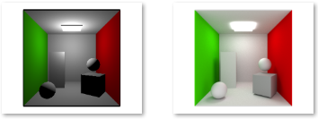
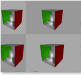
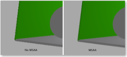
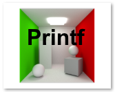
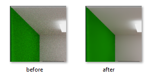
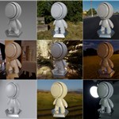

# Vulkan Samples

This repository holds many samples, showing various aspect of Vulkan, debugging tips and usage of other Nvidia tools.

Most of the samples have for starting point, the [base_sample](base_sample) sample. They are applying a few modifications to that base sample to illustrate the modifications required to enable the feature or what need to be demonstrate.

Each sample have its own documentation written in [Markdown](https://github.github.com/gfm/) describing what was modified and where to get more information.

## Build

### Easy Method (Windows)

Clone this repository

```bash
git clone https://github.com/nvpro-samples/vk_samples.git
```

1. Deploy.bat : pull and update all dependencies.
2. Build.bat : build all projects in release and optionally to debug.
3. Install.bat : copy the binaries and dlls to the `_Install` directory.

### Hand Made

``` bash
git clone --recursive --shallow-submodules https://github.com/nvpro-samples/nvpro_core.git
git clone https://github.com/nvpro-samples/vk_samples.git
```

Generate solution

``` bash
cd vk_samples
mkdir build
cd build
cmake ..
```

**Note**: If there are missing dependencies in `nvpro_core`, run the following command in nvpro_core directory.

``` bash
git submodule update --init --recursive --checkout --force
```

### Extra SDK

Some samples depend on other SDKs. They are only required if you intend to build these projects.

* [OptiX 7.3+](https://developer.nvidia.com/designworks/optix/download) : OptiX denoiser
* [Cuda 10.x](https://developer.nvidia.com/cuda-downloads) : OptiX denoiser
* [Nsight Aftermath](https://developer.nvidia.com/nsight-aftermath) : Aftermath

## Samples

### [Base Sample](base_sample)



**Extensions**:
[`VK_KHR_ray_tracing_pipeline`](https://www.khronos.org/registry/vulkan/specs/1.2-extensions/html/vkspec.html#VK_KHR_ray_tracing_pipeline), [`VK_KHR_acceleration_structure`](https://www.khronos.org/registry/vulkan/specs/1.2-extensions/man/html/VK_KHR_acceleration_structure.html), [`VK_KHR_ray_query`](https://www.khronos.org/registry/vulkan/specs/1.2-extensions/man/html/VK_KHR_ray_query.html), [`VK_KHR_deferred_host_operations`](https://www.khronos.org/registry/vulkan/specs/1.2-extensions/man/html/VK_KHR_deferred_host_operations.html), [`VK_KHR_buffer_device_address`](https://www.khronos.org/registry/vulkan/specs/1.2-extensions/man/html/VK_KHR_buffer_device_address.html)
 <br/>

This is a simple but complete Vulkan sample. It loads glTF scenes and renders using rasterizer or ray tracer. Note, at some point, the other samples were created from this one.

### [Aftermath SDK](aftermath)


**Extensions**:
[`VK_NV_device_diagnostics_config`](https://www.khronos.org/registry/vulkan/specs/1.2-extensions/man/html/VK_NV_device_diagnostics_config.html), [`VK_NV_device_diagnostic_checkpoints`](https://www.khronos.org/registry/vulkan/specs/1.2-extensions/man/html/VK_NV_device_diagnostic_checkpoints.html)
 <br/>
Adding Aftermath SDK to automatically generate GPU crash dump when a there is a device lost. Dumps are written before the computer crashes and can be inspected in Nsight Graphics.

### [Inherited Viewport](inherited)



**Extensions**:
[`VK_NV_inherited_viewport_scissor`](https://www.khronos.org/registry/vulkan/specs/1.2-extensions/man/html/VK_NV_inherited_viewport_scissor.html)
 <br/>
Using the inherited extension to avoid re-generating multiple recorded command buffers for different viewport sizes.

### [Multi-Sampling Anti-Aliasing (MSAA)](msaa)



Using multi-sampling anti-aliasing in efficient way for the rasterizer.

### [Shader Debug Printf](debug_printf)

<br/>
**Extensions**:
[`VK_KHR_shader_non_semantic_info`](https://www.khronos.org/registry/vulkan/specs/1.2-extensions/man/html/VK_KHR_shader_non_semantic_info.html)

Adding debug printing information directly in the shader code.

### [OptiX Denoiser](optix_denoiser)

<br/>
**Extensions**: [VK_KHR_synchronization2](https://www.khronos.org/registry/vulkan/specs/1.2-extensions/man/html/VK_KHR_synchronization2.html), [VK_KHR_external_memory](https://www.khronos.org/registry/vulkan/specs/1.2-extensions/man/html/VK_KHR_external_memory.html)

Using the OptiX denoiser on the path traced image to remove residual noise.

### [HDR sampling](hdr_sampling)

<br/>
**Extensions**:

High Dynamic Range image sampling is added to the base sample for both raster and ray trace, using multiple importance sampling acceleration structure and convoluted cubemaps.

## LICENSE

Copyright 2021 NVIDIA CORPORATION. Released under Apache License,
Version 2.0. See "LICENSE" file for details.
