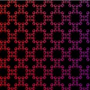

# Vulkan Samples

This repository holds many samples, showing various aspect of Vulkan, debugging tips and usage of other Nvidia tools. It has a dependency on [nvpro_core](https://github.com/nvpro-samples/nvpro_core) for some core Vulkan helper classes and other small utilities. All projects are using [GLFW](https://www.glfw.org/download) and [Dear ImGui](https://github.com/ocornut/imgui)

Each sample have its own documentation written in [Markdown](https://github.github.com/gfm/) describing what was done and where to get more information.

## Build

### Easy Method (Windows)

Clone this repository

```bash
git clone https://github.com/nvpro-samples/vk_mini_samples.git
```

1. Deploy.bat : pull and update all dependencies.
2. Build.bat : build all projects in release and optionally to debug.
3. Install.bat : copy the binaries and dlls to the `_install` directory.

### Hand Made

``` bash
git clone --recursive --shallow-submodules https://github.com/nvpro-samples/nvpro_core.git
git clone https://github.com/nvpro-samples/vk_mini_samples.git
```

Generate solution

``` bash
cd vk_mini_samples
mkdir build
cd build
cmake ..
```

**Note**: If there are missing dependencies in `nvpro_core`, run the following command in nvpro_core directory.

``` bash
git submodule update --init --recursive --checkout --force
```

### HLSL or SLANG

The samples can use two other shading languages besides GLSL, [HLSL](https://learn.microsoft.com/en-us/windows/win32/direct3dhlsl/dx-graphics-hlsl) and [SLANG](https://github.com/shader-slang/slang). To switch between them, select one of option: USE_HLSL or USE_SLANG. Then regenerate CMake and the solution will be updated with compatible projects and their shaders.


### Extra SDK

Some samples depend on other SDKs. They are only required if you intend to build these projects.

* [OptiX 7.3+](https://developer.nvidia.com/designworks/optix/download) : OptiX denoiser
* [Cuda 10.x](https://developer.nvidia.com/cuda-downloads) : OptiX denoiser
* [Nsight Aftermath](https://developer.nvidia.com/nsight-aftermath) : Aftermath

## Samples

### Application Class

The examples uses many helper from nvpro_core: https://github.com/nvpro-samples/nvpro_core repository. The core of each sample uses the [Application class](https://github.com/nvpro-samples/nvpro_core/blob/master/nvvkhl/application.hpp) to create a window, initialize the UI, and create a swapchain with the ImGui framework. The `Application` class is a modified version of the Dear ImGui Vulkan example.

Samples are attached to the `Application` class as `Engines`. While the application is running, the sample will be called to render its UI or to perform rendering operations in the current frame.


#### Init

The `init()` function will create the Vulkan context using `nvvk::Context`, create the GLFW window and create the swapchains by calling `ImGui_ImplVulkanH_CreateOrResizeWindow`.

#### Run

The `run()` function is an infinite loop until the close event is triggered. Within the loop, each engine will be called with:

* onResize : Called when the viewport size is changing
* onUIRender : Called for anything related to UI
* onRender : For anything to render within a frame, with the command buffer of the frame.
* onUIMenu : To add functions to the menubar

At the end of each loop the frame is rendered with `frameRender()` then the frame is presented with `framePresent()`.  

### Samples

If you are new to this repository, the first samples to read to better understand the framwork are [solid color](samples/solid_color) and [rectangle](samples/rectangle).

| Name | Description | Image | HLSL | Slang |
| ------ | ------ | ---- | ---- | ---- |
| [solid_color](samples/solid_color) | Set a user custom color to a pixel wide texture and display it.  |  | [x] | [x] |
| [rectangle](samples/rectangle) | Render a 2D rectangle to GBuffer.  |  | [x] | [x] |
| [aftermath](samples/aftermath) | Integrate the Nsight Aftermath SDK to an existing application |  | [x] | [ ] |
| [image_ktx](samples/image_ktx) | Display KTX image and apply tonemap post processing |  | [x] | [x] |
| [image_viewer](samples/image_viewer) | Load an image, allow to zoom and pan under mouse cursor |  | [x] | [x] |
| [mm_displacement](samples/mm_displacement) | Micro-mesh displacement  |  | [x] | [x] |
| [mm_opacity](samples/mm_opacity) | Micromap opacity  |  | [x] | [x] |
| [msaa](samples/msaa) | Hardware Multi-Sampling Anti-Aliasing  |  | [x] | [x] |
| [shader_printf](samples/shader_printf) | Add printf to shader and display in a log window  |  | [x] | [x] |
| [ray_trace](samples/ray_trace) | Simple ray tracer using metalic-roughness shading, reflection and shadows and simple sky shader.  |  | [x] | [x] |
| [shading execution reorder](samples/ser_pathtrace) | Known also as SER, this shows how to reorder execution rays to gain a better usage of the GPU.  |  | [x] | [x] |
| [simple_polygons](samples/simple_polygons) | Rasterizing multiple polygonal objects.  |  | [x] | [x] |
| [offscreen](samples/offscreen) | Render without window context and save image to disk.  |  | [x] | [x] |
| [tiny_shader_toy](samples/tiny_shader_toy) | Compile shader on the fly, diplay compilation errors, multiple pipeline stages.  |  | [ ] | [ ] |
| [barycentric_wireframe](samples/barycentric_wireframe) | Draw wifreframe in a a single pass using `gl_BaryCoordNV` |  |  [ ] | [x] |
| [texture 3d](samples/texture_3d) | Create a 3D texture and do ray marching. |  | [x] | [x] |
| [position fetch](samples/ray_tracing_position_fetch) | Using VK_KHR_ray_tracing_position_fetch. |  | [ ] | [ ] |
| [ray_query](samples/ray_query) | Doing inline raytracing in a compute shader |  | [x] | [ ] |
| [ray_query_position_fetch](samples/ray_query_position_fetch) | Using VK_KHR_ray_tracing_position_fetch in ray quary |  | [ ] | [ ] |
| [shader_object](samples/shader_object) | Using shader object and dynamic pipline |  | [x] | [x] |


## HLSL

The two main shading languages that are used with Vulkan are:

* GLSL (OpenGL Shading Language)
* HLSL (High Level Shading Language)

Both GLSL and HLSL are supported by the samples. To switch between then, open CMake and under **USE**, toggle the **USE_HLSL**.

Note: it is also possible to use a different `dxc` binary. By default, it uses the one coming with the Vulkan SDK, but there is the option to use the one of your choice. Open `Vulkan` and change the path to `Vulkan_dxc_EXECUTABLE`. If you do not see `Vulkan`, make sure the `Advanced` option is selected.

Note: To compile all samples with dxc, the [Preview Release for June 2023](https://github.com/microsoft/DirectXShaderCompiler/releases/tag/v1.8.2306-preview) is needed.

| Feature       | GLSL            | HLSL | 
| --------      | -------         | -------|
| Ease of use   | Easier to learn | More difficult to learn |
| Feature set   | Less powerful   | More powerful |
| Support       | More widely supported | Less widely supported |

### Resources:
* [HLSL to SPIR-V Feature Mapping Manual](https://github.com/microsoft/DirectXShaderCompiler/blob/main/docs/SPIR-V.rst)
* [HLSL Ray Tracing](https://microsoft.github.io/DirectX-Specs/d3d/Raytracing.html)
* [HLSL to SPIR-V Feature Mapping](https://github.com/microsoft/DirectXShaderCompiler/blob/main/docs/SPIR-V.rst)
* [Porting GLSL variables to HLSL](https://learn.microsoft.com/en-us/windows/uwp/gaming/glsl-to-hlsl-reference#porting-glsl-variables-to-hlsl)
* [Porting GLSL types to HLSL](https://learn.microsoft.com/en-us/windows/uwp/gaming/glsl-to-hlsl-reference#porting-glsl-types-to-hlsl)
* [Porting GLSL pre-defined global variables to HLSL](https://learn.microsoft.com/en-us/windows/uwp/gaming/glsl-to-hlsl-reference#porting-glsl-pre-defined-global-variables-to-hlsl)
* [Mapping between HLSL and GLSL](https://anteru.net/blog/2016/mapping-between-HLSL-and-GLSL/)

### Spir-V intrinsics

* [GL_EXT_spirv_intrinsics](https://github.com/microsoft/DirectXShaderCompiler/wiki/GL_EXT_spirv_intrinsics-for-SPIR-V-code-gen)
* [KHR Extensions](https://github.com/KhronosGroup/SPIRV-Registry/tree/main/extensions/KHR)
* [JSON](https://github.com/KhronosGroup/SPIRV-Headers/blob/main/include/spirv/unified1/spirv.json)

### Releases: 
* [DX Compiler Preview Release for June 2023](https://github.com/microsoft/DirectXShaderCompiler/releases/tag/v1.8.2306-preview)
* [All releases](https://github.com/microsoft/DirectXShaderCompiler/releases)


## Slang

Some samples have also been converted to use Slang. When configurating CMake, it should download automatically one of the release. To change the version of the Slang compiler, select the path to `SLANG_EXE` in CMake. 

To use Slang, check USE_SLANG then re-configure and re-generate.

### Resources

* Github: https://github.com/shader-slang/slang
* Releases: https://github.com/shader-slang/slang/releases
* Getting Started: https://shader-slang.com/getting-started.html
* User Guide: http://shader-slang.com/slang/user-guide/index.html
* Various Documentations: https://github.com/shader-slang/slang/tree/master/docs


## LICENSE

Copyright 2023 NVIDIA CORPORATION. Released under Apache License,
Version 2.0. See "LICENSE" file for details.
