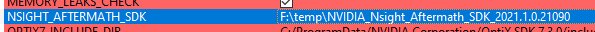

# Nsight Aftermath


This example shows how to add Nsight Aftermath SDK to the project, to generate a dump helping to dump GPU crashes.

We will make it crash when switching to raster rendering. :smiley: 


## SDK sources

This project is downloading the Aftermath SDK from https://developer.nvidia.com/nsight-aftermath, and extracting its content
under `external/aftermath`. 


### Setting the NSIGHT_AFTERMATH_SDK variable

If the above didn't work or you want to use a different version. Download, extract the SDK content and copy the location of the SDK.

In the CMake-gui, open the  `Ungrouped Entries` and fill the `NSIGHT_AFTERMATH_SDK` variable with the path of where the SDK was extracted.

Example:


Now, rerun CMake and the new SDK should be used.

## SDK Callbacks

Nsight Aftermath requires callback when there is a crash, to simplify the operation, a simple self-contain class can do the job. You can find this class locally under:

* [nsight_aftermath_gpu_crash_tracker.cpp](src/nsight_aftermath_gpu_crash_tracker.cpp)
* [nsight_aftermath_gpu_crash_tracker.h](src/nsight_aftermath_gpu_crash_tracker.h)

## Enabling Nsight Aftermath

To enable Nsight Aftermath, we need to enable some device extensions and set the callbacks **before** creating the Vulkan device.

In `main.cpp`, include 

```` C
#include "NsightAftermathGpuCrashTracker.h"
````

Then add the following extensions at the end of the other ones.

```` C
  // #Aftermath
  // Set up device creation info for Aftermath feature flag configuration.
  VkDeviceDiagnosticsConfigCreateInfoNV aftermathInfo{VK_STRUCTURE_TYPE_DEVICE_DIAGNOSTICS_CONFIG_CREATE_INFO_NV};
  aftermathInfo.flags =
      VK_DEVICE_DIAGNOSTICS_CONFIG_ENABLE_RESOURCE_TRACKING_BIT_NV  // Additional information about the resource related to a GPU virtual address
      | VK_DEVICE_DIAGNOSTICS_CONFIG_ENABLE_AUTOMATIC_CHECKPOINTS_BIT_NV  // Automatic checkpoints for all draw calls (ADD OVERHEAD)
      | VK_DEVICE_DIAGNOSTICS_CONFIG_ENABLE_SHADER_DEBUG_INFO_BIT_NV;  // instructs the shader compiler to generate debug information (ADD OVERHEAD)
  // Enable NV_device_diagnostic_checkpoints extension to be able to use Aftermath event markers.
  contextInfo.addDeviceExtension(VK_NV_DEVICE_DIAGNOSTIC_CHECKPOINTS_EXTENSION_NAME);
  // Enable NV_device_diagnostics_config extension to configure Aftermath features.
  contextInfo.addDeviceExtension(VK_NV_DEVICE_DIAGNOSTICS_CONFIG_EXTENSION_NAME, false, &aftermathInfo);
```` 

Immediately following and before the creation of the Vulkan context, we initialize the GPU crash tracker.

 ````C
  // #Aftermath - Initialization
  GpuCrashTracker m_gpuTracker;
  m_gpuTracker.Initialize();
```` 
  
:warning: **Note**: At the time of writting those lines the `aftermathInfo.flags` will not be taken into concideration and all supported feature will be turned on. This is handled like this for all extensions by the `nvvk::Context`.

:warning: **Note**: Turning on Aftermath might impact the time of shader creation and will add overhead to the application.

## Testing

The best way to test if it works, is to have a `VK_ERROR_DEVICE_LOST`.

In the fragment shader `frag_shader.frag`, we can access the material far beyond the safe memory point.
```` C
  ShadingMaterial mat     = gltfMat.m[pc.materialId + 10000000];
```` 

Running the sample will generate a crash as soon as we switch to Raster mode. 

## Dump File


The Aftermath dump file by default is written in the current working directory. On Windows, this will be the project directory `$(VulanSamples)\build\aftermath`. 


Open [Nsight Graphics](https://developer.nvidia.com/nsight-graphics), and `File>Open Files` or drag and drop the `vk_aftermath-*.nv-gpudmp` file. 

Click on **Crash Info** to have information about the crash. You will see that it is a **General_PageFault**.

If you click on the **Shader Location** file, you will have an approximated line where the crash happend.

## Other Crashes

Fix the previous crash before adding new ones.

### Infinit Loop

In the vertex shader, at the end of the file, add the following lines

```` glsl
  float alpha = 1.0;
  while(alpha > 0.0)
  {
    alpha += frameInfo.clearColor.x;
  }
  worldPos.x += 0.1 * alpha;
````

If you inspect the crash in Nsight Graphics, you will see that it has crashed over the while loop.

### Wrong Binding

In the same vertex shader, we can replace the binding to something that doesn't exist, such as

```` glsl
layout(set = 0, binding = 5) readonly buffer SceneDesc_ { SceneDescription sceneDesc; } ;
````

Now this will be catch by validation layer, but if we let it through, it will produce a crash when we switch to the raster mode.

The error will now point where we are accessing `sceneDesc.instInfoAddress`.


