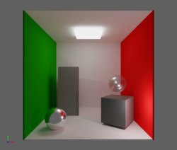
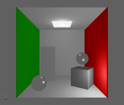
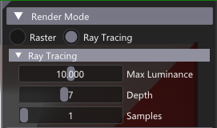
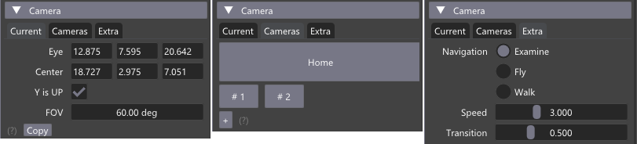
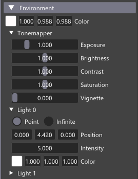

# glTF Simple

 

This sample is a glTF scene renderer with is using both the Vulkan rasterizer and ray tracer. The functionality is minimal, but offers enough to be a starting point for many other examples.

## Loading Scenes

Loading a scene can be done using an argument: `vk_base_sample.exe -f path_to_scene\a_scene.gltf`

Or, after start up, drag&drop a `.gltf` scene in the main window.

## Functionalities

**Rendering Mode**

Select raster or ray tracing, and ray tracing settings

**Cameras**

Position and camera manipulation style. 
Double click set the center of interest.

**Environment**

Clear color, tone mapping and 2 default lights.

## Schema of the program

1. The initialization of Vulkan and enabling extensions is done in `main.cpp` using the [`nvvk::Context`](https://github.com/nvpro-samples/nvpro_core/tree/master/nvvk#context_vkhpp)
1. Loading the [glTF](https://www.khronos.org/gltf/) scene uses [tinygltf](https://github.com/syoyo/tinygltf) and [`nvh::GltfScene`](https://github.com/nvpro-samples/nvpro_core/tree/master/nvh#gltfscenehpp) to get teh data in an abstracted form.
   1. Each primitive has its own allocated buffer of `Vertex` and indices. (`createVertexBuffer`)
   1. Materials are only a subset of glTF and are in a separated buffer. (`createMaterialBuffer`)
   1. Textures are loaded and mipmap are generated. (`createTextureImages`)
   1. Array of matrices for each node are stored in a separate buffer. (`createInstanceInfoBuffer`)
1. The infinite rendering loop is done in `main.cpp`, and define the following rendering loop skeleton.
1. Ray tracing uses the RTX pipeline, in addition to the scene descriptor set, it adds the top-level-acceleration-structure (TLAS) and a reference to the offscreen image for writing the result.
1. The raster is rendering in an offscreen framebuffer, sharing the same image as for the raytracer. It loops over all node and render each primitives. This loop is recorded in a secondary command buffer, to be more rapidely executed (no CPU overhead) on the next frames.
1. The resulted image is then rendered in the swapchain frame buffer, using a fullscreen quad. A fragment program will also apply tonemapping.
1. In the same last render pass, the Ui from [Dear Imgui](https://github.com/ocornut/imgui) is rendered on top.

Note: This example is a modification of the [ray_tracing_gltf](https://github.com/nvpro-samples/vk_raytracing_tutorial_KHR/tree/master/ray_tracing_gltf) tutorial.

## Chapters

* [Scene Geometry](docs/scene_geometry.md)
* [Rendering Loop](docs/render_loop.md)
* Resource Allocator
