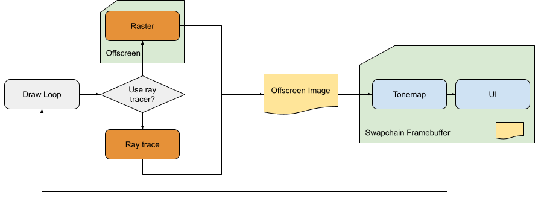

# Rendering Loop

For each image, the sample can be rendered with a raster or a ray tracer. With the raster, we use a framebuffer where we attach an RGBA32 image to render, but with the ray tracer, we can render that image directly. In a second step, the rendered image is applied to a full screen triangle and the tone mapping is applied to the resulting image. In the same rendering pass, we also add the orientation axis to the bottom left and the user interface to the top of the image.

## Offscreen Image

The decision to render into a separate image rather than directly into the swapchain image is to give the rendering pipeline more flexibility. It allows us to render in floating point, where swapchain images are rather limited. We can reuse the image in ray tracing to accumulate overtime for the raster, to create a framework for generating G-Buffers in future samples.
