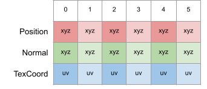
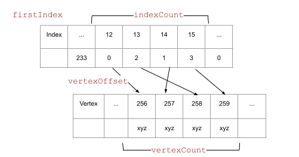
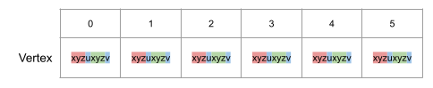
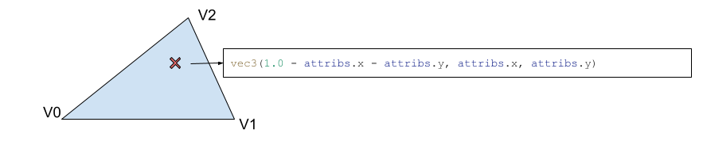

# Scene Geometry

The loaded scene come from [glTF](https://github.com/KhronosGroup/glTF/blob/master/README.md) and loaded with [TinyGLTF](https://github.com/syoyo/tinygltf). To simplify the pipeline, the call to `importDrawableNodes()` convert slightly the way the scene is described.

* Nodes: the nodes are kept, but the hierarchy is flatten and  transformation resolved.
* Mesh and primitives: multiple primitives in a mesh are splitted to individual primMesh. The node referencing the mesh, will reference all primMesh. Each primMesh will be pushed as a BLAS.
* Vertex Attributes:
  * We convert all attributes to a format we know. For example, all colors will become RGBA32F.
  * If the attribute is not present, it will be created. For example, if the normals are not present but requested, the geometric normal will be created. Same for tangents, and any other attribute.

This results to multiple arrays: positions, normals, texcoords, ... all having the same length.



Note: a **Vertex** is the combination of the position and all attributes at an index **i**.

The index array will define the triangles. Each index triplet (**i**) defines the triangle.

The primMesh has the following information

* `vertexOffset` : index `i` + `vertexOffset` == position in the vertex array.
* `vertexCount` : number of vertices in the primMesh
* `firstIndex` : the offset in the index array, for this primMesh.
* `indexCount` : number of indices (always a multiple of 3)
* `materialIndex` : the material Id used by the primMesh



## Interleaving

What we do in `createVertexBuffer()` is interleave the data. Instead of having separate arrays for position and attributes, we create the vertex as: {position, normal, texCoord}. Because of the packing rules, we set the texCoord values to the `w` component of the position and normal.



## Buffers

For each primMesh, we create an array of vertex interleaves, and an array of indices to create the triangles from that array. These buffers will be used to create the BLAS, to rasterize the primitive and also to retrieve the mesh information in the ray tracer shader.

We create an array of buffer addresses {vertex, index}, and create a buffer containing this information: `PrimMeshInfo`. This will be very useful later when we want to access the primitive data.

Next, we create a buffer containing the addresses of all the data in the scene buffer that we will need to access: `SceneDescription`.

* materialAddress: the buffer address for all materials
* primInfoAddress: the address of the buffer address array mentioned above.
* instInfoAddress: the address of an array of transformation matrices for each instance/node.

## Retrieving Data in Ray Tracing

When ray tracing the scene, we have little information about what has been hit.

* `gl_PrimitiveID` : indicates which triangle has been touched.
* `gl_Instance` : the node/instance.
* `hitAttributeEXT` : the barycentric coordinates of the triangle.

We don't even have information about the position of the triangle's vertices. So how do we get all the information we need?

First, we use the `instanceCustomId` of the TLAS node, and tell which primMesh ID it comes from. In the shader, we can get this value using `gl_InstanceCustomIndexEXT`.

The `PrimMeshInfo` information we stored earlier is now useful.

But first we need to get the scene information, and we get the buffer information with the following layout.

````cpp
layout(set = 1, binding = eSceneDesc) readonly buffer SceneDesc_ { SceneDescription sceneDesc; };
````

The SceneDescription contains the addresses of the buffers of the different structures, so we have to declare their layout.

````cpp
layout(buffer_reference, scalar) readonly buffer Vertices  { Vertex v[]; };
layout(buffer_reference, scalar) readonly buffer Indices   { uvec3 i[]; };
layout(buffer_reference, scalar) readonly buffer PrimMeshInfos { PrimMeshInfo i[]; };
layout(buffer_reference, scalar) readonly buffer Materials { ShadingMaterial m[]; };
````

We can retrieve the primInfo buffer with the following code:

````cpp
  PrimMeshInfos pInfo_ = PrimMeshInfos(sceneDesc.primInfoAddress);
  PrimMeshInfo  pinfo  = pInfo_.i[gl_InstanceCustomIndexEXT];

````

And with the primitive information, we can access both, the vertices and the indices.

````cpp
  Vertices vertices = Vertices(pinfo.vertexAddress);
  Indices  indices  = Indices(pinfo.indexAddress);
````

Since the `Indices` are `uvec3, we can access the 3 index of the triangle directly

````cpp
  uvec3 triangleIndex = indices.i[gl_PrimitiveID];
````

With those indices, we can get the 3 vertex.

````cpp
  Vertex v0 = vertices.v[triangleIndex.x];
  Vertex v1 = vertices.v[triangleIndex.y];
  Vertex v2 = vertices.v[triangleIndex.z];
````

To know the hit position on the triangle, we use the barycentric to get the interpolated position.

````cpp
  // barycentric coordinate on the triangle
  const vec3 barycentrics = vec3(1.0 - attribs.x - attribs.y, attribs.x, attribs.y);

  const vec3 pos0           = v0.position.xyz;
  const vec3 pos1           = v1.position.xyz;
  const vec3 pos2           = v2.position.xyz;
  const vec3 position       = pos0 * barycentrics.x + pos1 * barycentrics.y + pos2 * barycentrics.z;
````




This is giving us the position in object space. To transform the position to world, we could use the `instanceData`, but we can avoid pulling memory data and access the the transformation matrix faster by using the provided `gl_ObjectToWorldEXT`.

````cpp
const vec3 world_position = vec3(gl_ObjectToWorldEXT * vec4(position, 1.0));
````

We can do the same with normal, multiplying by the inverse transform.

````cpp
  const vec3 nrm0         = v0.normal.xyz;
  const vec3 nrm1         = v1.normal.xyz;
  const vec3 nrm2         = v2.normal.xyz;
  vec3       normal       = normalize(nrm0 * barycentrics.x + nrm1 * barycentrics.y + nrm2 * barycentrics.z);
  const vec3 world_normal = normalize(vec3(normal * gl_WorldToObjectEXT));
````

### Material

Getting the material from the mesh primitive is trivial. The scene description buffer contains the address of the material buffer, and the primitive information contains the index of the material to use.

````cpp
  Materials materials = Materials(sceneDesc.materialAddress);
  uint      matIndex  = max(0, pinfo.materialIndex);  // material of primitive mesh
  ShadingMaterial mat = materials.m[matIndex];
````

With the above shading state and the material, we have all the information to apply the material shading.
