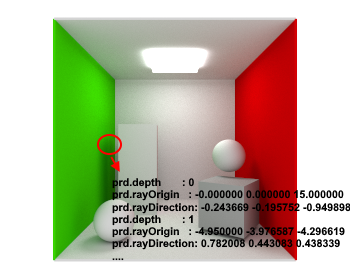
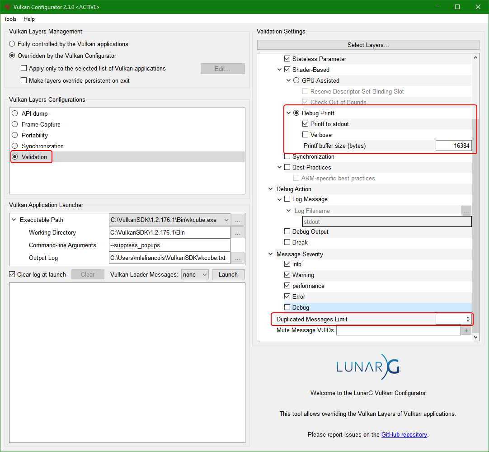

# Debug Printf



[Debug Printf](https://github.com/KhronosGroup/Vulkan-ValidationLayers/blob/master/docs/debug_printf.md) allows to debug shaders using a debug printf function. This function works conjunctly with [VK_EXT_debug_utils](https://www.khronos.org/registry/vulkan/specs/1.2-extensions/man/html/VK_EXT_debug_utils.html), and the print messages will be sent with the `VK_DEBUG_UTILS_MESSAGE_SEVERITY_INFO_BIT_EXT` flag.

In debug, the [nvvk](https://github.com/nvpro-samples/nvpro_core/tree/master/nvvk) framework vulkan context creation ([context_vk](https://github.com/nvpro-samples/nvpro_core/blob/master/nvvk/context_vk.cpp)) uses validation layers by default. In addition, the while creating the Vulkan instance, the helper class creates the callback mechanism to catch various messages.

Look for [`Context::debugMessengerCallback()`](https://github.com/nvpro-samples/nvpro_core/blob/master/nvvk/context_vk.cpp#L122) for the callback and `Context::initDebugUtils()` for the creation.

## Enabling Debug_printf

In `main()`,  after adding the extensions and before creating the Vulkan instance, we will need a new extension [`VK_KHR_shader_non_semantic_info`](https://www.khronos.org/registry/vulkan/specs/1.2-extensions/man/html/VK_KHR_shader_non_semantic_info.html) and enabling validation features through [`VkValidationFeaturesEXT`](https://www.khronos.org/registry/vulkan/specs/1.2-extensions/man/html/VkValidationFeaturesEXT.html). In this sample, we are only enabling **debug printf** and not disabling any features.

````cpp
  // #debug_printf
  contextInfo.addDeviceExtension(VK_KHR_SHADER_NON_SEMANTIC_INFO_EXTENSION_NAME);
  std::vector<VkValidationFeatureEnableEXT> enables{VK_VALIDATION_FEATURE_ENABLE_DEBUG_PRINTF_EXT};
  std::vector<VkValidationFeatureDisableEXT> disables{};
  VkValidationFeaturesEXT features{VK_STRUCTURE_TYPE_VALIDATION_FEATURES_EXT};
  features.enabledValidationFeatureCount  = static_cast<uint32_t>(enables.size());
  features.pEnabledValidationFeatures     = enables.data();
  features.disabledValidationFeatureCount = static_cast<uint32_t>(disables.size());
  features.pDisabledValidationFeatures    = disables.data();
  contextInfo.instanceCreateInfoExt       = &features;
````

## Printf in Shaders

To print messages in a shader you need to add an extension.

````cpp
#extension GL_EXT_debug_printf : enable 
````

Then you can use `debugPrintfEXT()` to print messages, but please note the [limitations](https://github.com/KhronosGroup/Vulkan-ValidationLayers/blob/master/docs/debug_printf.md).

````cpp
debugPrintfEXT("HERE");
````

## Interactive Debug

We should avoid many printf, more specifically avoiding to be executed once per fragment. By default, the message buffer has a limitation of 1024 bytes. This is quite small and we should be careful not to exceed the buffer size.

Example of the error when exceeding the buffer size.

````
WARNING - Debug Printf message was truncated, likely due to a buffer size that was too small for the message
````

### User Interaction

To add interactivity, we can add debug print information of the pixel under the mouse cursor when the user is pressing the button. To do this, we have to extend the `struct FrameInfo` to have the coordinates of the mouse.

````cpp
struct FrameInfo
{
  mat4  view;
  mat4  proj;
  mat4  viewInv;
  mat4  projInv;
  vec4  clearColor;
  Light light[NB_LIGHTS];
  vec2  coord;
};
````

Then in the `VulkanSample::updateUniformBuffer()` function we set this value by default to an invalid coordinate to avoid printing any information.

````cpp
  hostUBO.coord = nvmath::vec2f(-1, -1);
````

The following code will set the coordinate of the mouse only when the mouse button is click, from !down to down.

````cpp
  if(ImGui::GetIO().MouseClicked[0])
  {
    double x, y;
    glfwGetCursorPos(m_window, &x, &y);
    hostUBO.coord = nvmath::vec2f(x, y);
  }
````

### Shader Coord test

To print the information of each ray bouncing in the ray tracing, in the `pathtrace.rgen` shader, just before `traceRayEXT`, we can add the following.

````cpp
    if(gl_LaunchIDEXT.xy == frameInfo.coord)
    {
      debugPrintfEXT("\n Depth \t: %d \n rayOrigin \t: %f %f %f \n rayDirection \t: %f %f %f \n", depth,  //
                     payload.rayOrigin.x, payload.rayOrigin.y, payload.rayOrigin.z,                       //
                     payload.rayDirection.x, payload.rayDirection.y, payload.rayDirection.z);
    }
````

Now, whenever we click over the image, the information of ray path will be displayed.

Example of output

````bash
INFO: UNASSIGNED-DEBUG-PRINTF
 --> Validation Information: [ UNASSIGNED-DEBUG-PRINTF ] Object 0: handle = 0x2a0c36454a8, type = VK_OBJECT_TYPE_DEVICE; | MessageID = 0x92394c89 |
 Depth  : 0
 rayOrigin      : -0.000000 0.000000 17.320505
 rayDirection   : -0.065669 0.035639 -0.997205
 ````

Other print information can be added, but the message can be trunked out if it is too long.

## Vulkan Config

Using the [Vulkan Configurator](https://vulkan.lunarg.com/doc/view/1.2.135.0/windows/vkconfig.html), it is possible to overide the size of the printf buffer. Open the configurator, set the values and while it is still open, run sample. The messages can be longer.



## References

* <https://github.com/KhronosGroup/Vulkan-ValidationLayers/blob/master/docs/debug_printf.md>
