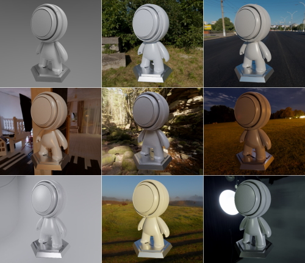

# HDR Sampling

Ray tracing

Raster

Having HDRi (High Dynamic Range Imaging) to illuminate the scene greatly simplifies complex lighting environments. It also helps to integrate 3D objects into its environment.

This example loads HDR images, then creates an importance sampling acceleration structure used by the ray tracer and stores the [PDF](https://en.wikipedia.org/wiki/Probability_density_function) in the alpha channel of the RGBA32F image.

For real-time rendering, we use the created acceleration structure and create two cubemaps. One containing the diffuse irradiance and the other, storing the glossy reflection, where different levels of glossiness are stored in different mipmap levels.

## Generation

For ray tracing, only the first step of loading and creating the acceleration structure is needed. This is done in [hdr_env.cpp](src/hdr_env.cpp). The technique is described in the source.

For real-time, we use the information created above to generate 2 cubemap and also creating a BRDF lookup table, which will be use to determine the level of glossy to apply. The generation of the cubemaps are done using compute shaders ([diffuse](shaders/hdr_prefilter_diffuse.comp), [glossy](shaders/hdr_prefilter_glossy.comp)). The invocation of the shaders is done in [hdr_env_dome.cpp](src/hdr_env.cpp).

## Dome

For real-time rendering, there is no `miss` shader where we can sample the HDR. Therefore, we replace the cleared color pass. We modified the render pass (`m_offscreenRenderPass`) to no longer erase the color channels. Then, before calling the raster render pass, we call `drawDome()` which calls a compute shader ([hdr_dome](shaders/hdr_dome.comp)) and replaces all the pixels with the HDR image, respecting the camera viewpoint.

# Resources

HDRi : <https://polyhaven.com/>
