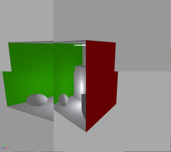
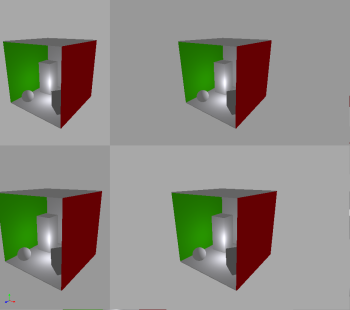

# VK_NV_inherited_viewport_scissor

Often with CAD rendering, the scene is rendered from different point of view, using a top, right, left orthographic camera and a perspective view. Each quadrant don't necessary have the same size, therefore it is not possible to re-use the recorded command buffer of the scene to render all four views. 

If we would do so, this could look like this:



instead of the correct way like this




## Extension

To get around this issue, we can use the [VK_NV_inherited_viewport_scissor](https://www.khronos.org/registry/vulkan/specs/1.2-extensions/man/html/VkCommandBufferInheritanceViewportScissorInfoNV.html) extension.<br/>
**NOTE:** This might require a [Beta Driver](https://developer.nvidia.com/vulkan-driver). 

In our modified sample from [base_sample](../base_sample), we are enabling the extension in main. Like the other extensions, this adds the extension to the device and enable the feature if available.

```` C
VkPhysicalDeviceInheritedViewportScissorFeaturesNV inheritedViewportScissorFeatures{VK_STRUCTURE_TYPE_PHYSICAL_DEVICE_INHERITED_VIEWPORT_SCISSOR_FEATURES_NV};
  contextInfo.addDeviceExtension(VK_NV_INHERITED_VIEWPORT_SCISSOR_EXTENSION_NAME, false, &inheritedViewportScissorFeatures);
````

## Recorded Command

The recorded command buffer for the rasterizer is done in `rasterize()`, but before this, we will request if the feature is available.

In the header, we add a new member

```` C
  VkPhysicalDeviceInheritedViewportScissorFeaturesNV m_inheritedViewport{
      VK_STRUCTURE_TYPE_PHYSICAL_DEVICE_INHERITED_VIEWPORT_SCISSOR_FEATURES_NV};
```` 

and in `VulkanSample::setup()` we can query the support.

```` C
  // Requesting Viewport Feature
  VkPhysicalDeviceFeatures2 features{VK_STRUCTURE_TYPE_PHYSICAL_DEVICE_FEATURES_2};
  features.pNext = &m_inheritedViewport;
  vkGetPhysicalDeviceFeatures2(physicalDevice, &features);
````

To use the extension, we are adding the `VkCommandBufferInheritanceViewportScissorInfoNV` structure to the `pNext` of `VkCommandBufferInheritanceInfo`

```` C
    // The extension struct needed to enable inheriting 2D viewport+scisors.
    VkCommandBufferInheritanceViewportScissorInfoNV inheritViewportInfo{VK_STRUCTURE_TYPE_COMMAND_BUFFER_INHERITANCE_VIEWPORT_SCISSOR_INFO_NV};
    inheritViewportInfo.viewportScissor2D  = m_inheritedViewport.inheritedViewportScissor2D;
    inheritViewportInfo.viewportDepthCount = 1;
    inheritViewportInfo.pViewportDepths    = &m_viewportDepth;

    VkCommandBufferInheritanceInfo inheritInfo{VK_STRUCTURE_TYPE_COMMAND_BUFFER_INHERITANCE_INFO};
    inheritInfo.renderPass = m_offscreenRenderPass;
    inheritInfo.pNext      = &inheritViewportInfo;
````

and we skip the viewport setting

```` C
    // Dynamic Viewport
    if(m_inheritedViewport.inheritedViewportScissor2D == VK_FALSE)
      setViewport(m_recordedCmdBuffer);
````

The `m_viewportDepth` is a constant in our case, as we are not changing the depth values. A member was added to the class

```` C
  VkViewport    m_viewportDepth{0.0f, 0.0f, 0.0f, 0.0f, 0.0f, 1.0f};  // Only care about minDepth and maxDepth
````

## Playback and Usage

In `VulkanSample::onResize()` we no longer need to free the recorded command buffer in order to re-create it each time we are resizing the window.

````C
  if(m_inheritedViewport.inheritedViewportScissor2D == VK_FALSE)
  {
    vkFreeCommandBuffers(m_device, m_cmdPool, 1, &m_recordedCmdBuffer);
    m_recordedCmdBuffer = VK_NULL_HANDLE;
  }
````
In `main()`, before begining the renderpass for the raster, we can set the viewport

````C
vkSample.setViewport(cmdBuf);
vkCmdBeginRenderPass(cmdBuf, &offscreenRenderPassBeginInfo, VK_SUBPASS_CONTENTS_SECONDARY_COMMAND_BUFFERS);
vkSample.rasterize(cmdBuf);
vkCmdEndRenderPass(cmdBuf);
```` 

## Four Views

The current sample have modified the call to the raster, to render the same view in four different viewports. 

The modifications include

* A new `VulkanSample::fourViews()` function calling 4 times `rasterize()` with different viewport.
* Calling `vkSample.fourViews(cmdBuf)` in main
* Adding UI to control the extension
* `updateUniformBuffer()` has new parameter to pass the size of the viewport.


