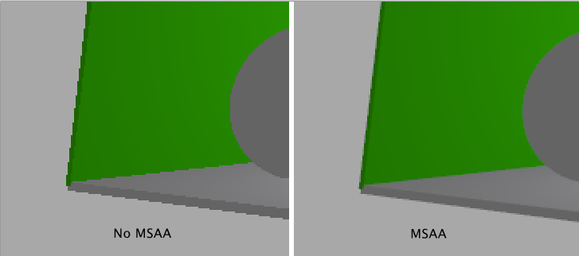
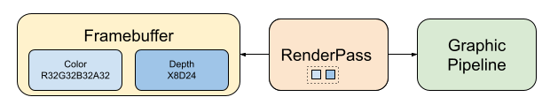
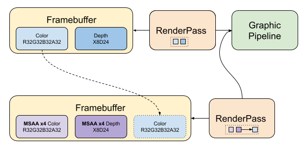

# Multi-Sampling Anti-Aliasing (MSAA)



This sample is adding MSAA to an existant sample. The [original sample](../base_sample) is rendering in an offscreen frame buffer, before going through a post-process applying tone mapping and then display the image. Also to be notice, the image used by the rasterizer is also used by the ray tracer.

## Framebuffer and Renderpass

The framebuffer for offline rendering is using an image (`VK_FORMAT_R32G32B32A32_SFLOAT`) and depth buffer (format defined by the most optimal one) and the renderpass uses only those attachments, with a clear and store for both, see `createOffscreenRender()`.



### MSAA

The multisampling pass, will add MSAA color and depth images with the sampling set. A render pass that is using those images and will resolve in the offscreen image, and finally a framebuffer taking 3 images, the MSAA + the offscreen color image.



### Images

The MSAA images are created using only the following usage for color and depth respectively:

```` C
color.usage = VK_IMAGE_USAGE_TRANSIENT_ATTACHMENT_BIT | VK_IMAGE_USAGE_COLOR_ATTACHMENT_BIT;
depth.usage = VK_IMAGE_USAGE_TRANSIENT_ATTACHMENT_BIT | VK_IMAGE_USAGE_DEPTH_STENCIL_ATTACHMENT_BIT;
````

### Renderpass

The render pass will have three attachments, the two MSAA images and the resolve image. Since we cannot display the MSAA images, we have to resolve the color image to a display-able one. We don't care about the resolving depth, because the next steps in the drawing pipeline (tonemapper and ui) don't need the depth information.

One optimization we are doing in the renderpass is to set the the MSAA images `storeOp` to `VK_ATTACHMENT_STORE_OP_DONT_CARE` and the resolve image `loadOp` to `VK_ATTACHMENT_LOAD_OP_DONT_CARE`.

**Note**: resolving in the rendering pass is the most efficient way to do this. Better than using `VkImageResolve2KHR` or `vkCmdBlitImage`.

## Changes

The changes needed to add MSAA to the [original sample](../base_sample) are idetified with `#MSAA` and are:

`main.cpp`

* Add a call to create the MSAA renderpass and framebuffer: `vkSample.createMsaaRender()`
* Toggle the information for the `VkRenderPassBeginInfo` to use either the offscreen or MSAA rendering pass and framebuffer, if the MSAA is active or not.

`vulkan_sample.hpp` : adding the function and members

```` C
  void createMsaaRender(VkSampleCountFlagBits samples);
  ...
  nvvk::Image           m_msaaColor;
  nvvk::Image           m_msaaDepth;
  VkImageView           m_msaaColorIView{VK_NULL_HANDLE};
  VkImageView           m_msaaDepthIView{VK_NULL_HANDLE};
  VkRenderPass          m_msaaRenderPass{VK_NULL_HANDLE};
  VkFramebuffer         m_msaaFramebuffer{VK_NULL_HANDLE};
  VkSampleCountFlagBits m_msaaSamples{VK_SAMPLE_COUNT_4_BIT};
````

`vulkan_sample.cpp`

* Toggle the renderpass to use in `createGraphicsPipeline()`
* Destroy all allocated resources in `destroyResources()`
* Toggle the renderpass to use in `rasterize()`
* Recreate the FB and renderpass `onResize()`
* Create a function `createMsaaRender()`
* Adding UI to toggle MSAA in `renderUI()`

## References

Other Vulkan projects using MSAA

* <https://github.com/KhronosGroup/Vulkan-Samples/blob/master/samples/performance/msaa/msaa_tutorial.md>
* <https://vulkan-tutorial.com/Multisampling>
* <https://github.com/SaschaWillems/Vulkan/blob/master/examples/multisampling/multisampling.cpp>
