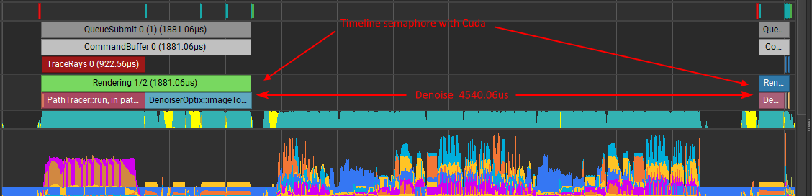
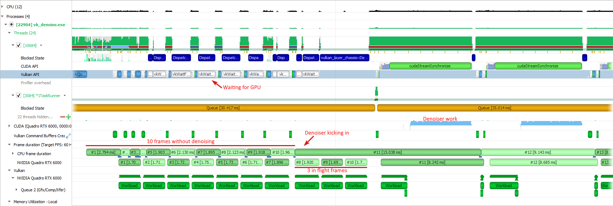
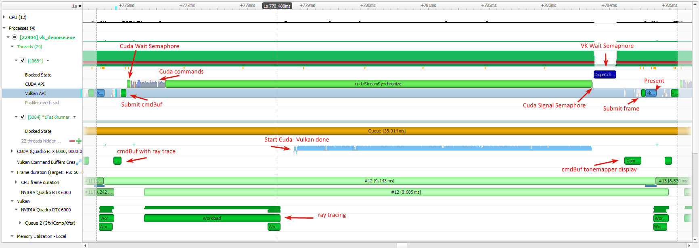
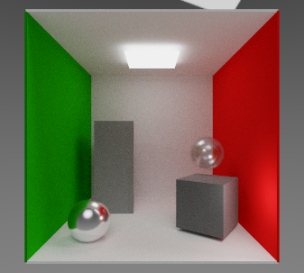
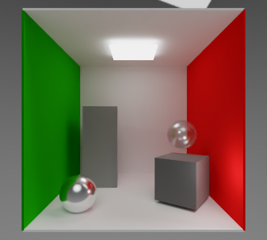
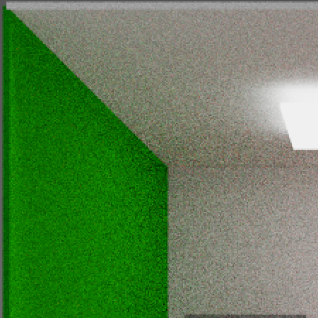
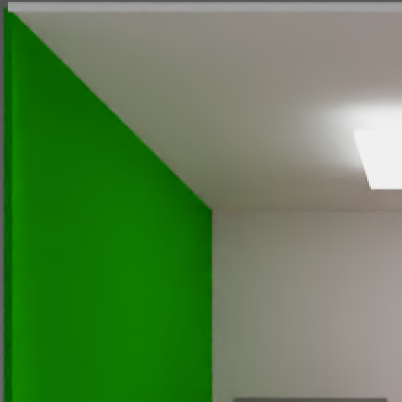

# VK_DENOISE

This example is ray tracing a glTF scene (-f <scene.gltf>) using a simplified path tracing technique and focus on the denoiser. Path-tracing is generally very noisy for the first frames and using a denoiser helps getting a converged image quicker. For the denoiser, we will be using the [Optix7 denoiser](https://developer.nvidia.com/optix-denoiser).

The OptiX denoiser is using Cuda, so our image will need to be shared between Vulkan and Cuda. The denoiser is actually requiring linear images, which are not available to Vulkan, so instead of directly sharing the images, we are creating buffers which are shared between Vulkan and Cuda and we are copying the image to the buffer, converting them to linear images.

## SDKs

This project needs two external SDK. Follow the default installation and re-run CMake. If the path aren't found, you may need to delete the cache and re-run.

* [OptiX 7.3+](https://developer.nvidia.com/designworks/optix/download)
* [Cuda 10.x](https://developer.nvidia.com/cuda-downloads)

## External Memory

Only the buffers, which are the linear-image copy of the default tiled image, are created with the external memory flag. For the allocation, we are using a derived class of the dedicated allocator, which is adding the flag decoration on the buffer allocation and memory allocation. See also the examples on interop: <https://github.com/nvpro-samples/gl_vk_simple_interop> and <https://github.com/nvpro-samples/gl_vk_raytrace_interop>.

## Timeline Semaphore

The denoiser is using Cuda and rendering is done with Vulkan, if we would simply add all Vulkan commands to a single command buffer, we would not be synchronized and the image to display will be sometime denoised, sometime not. We could add a hard synchronization on the CPU, making sure the ray traced is finished, denoised the image, wait for it, then display. But this would be losing a lot of the GPU cycle. Instead, we are adding a Vulkan timeline semaphore to signal when the ray traced image is rendered and transferred the buffer and a Cuda wait semaphore to hold the execution of the denoiser on the GPU. We add the inverse process at the end of the denoiser with a Cuda semaphore signaling the image is denoised and on Vulkan a wait semaphore to copy the buffer back to an image, tonemap it and display.

 

### Nsight System

The following image was done using [Nsight System](https://developer.nvidia.com/nsight-systems), which is at the time of writing those lines, the only tool which can inspect both Vulkan ray tracing and Cuda simultaneously. In the following image; the rendering was set to start denoising the image after 10 iterations. It is quicker to render and not denoising each frame. Also, sometimes the denoiser is not that great with the first few frames, as the image is too noisy to reconstruct it correctly. After 10 frames, the denoiser will be apply on frame #11. Because the frame #11 is really long to do, the in-flight frames will be displayed before it even finishes.

 

 This is a closeup on what is happening while denoising a frame. The first command buffer gets the ray tracing and image copy commands and is submitted. The Cuda wait semaphore is done before calling the OptiX denoiser. Cuda commands are called, but they won't be executed before the ray tracing is completed. At the end of cuda, Vulkan waits to take back the control and the second command buffer, which is transferring the buffer to image, tonemap and display will be executed.

 

## Possible Modifications

The denoiser is setup to use RGB, ALBEDO and NORMAL buffers. All three buffers help getting a clearer image faster, but it is also possible to use only RGB + ALBEDO or RGB only. This information to the denoiser is done in `DenoiserOptix::initOptiX()`. By modifying the `inputKind` and re-running the example, you can see how the denoiser is behaving. Using all three buffers is especially useful with images having texture details, bumps, cracks and other fine details.

The other modification would be to tonemap the image before sending it to the denoiser and use the LDR denoiser training set. This could be better in some cases, as the training set was done on a less high variance, but this might not give radical improvements.

## Results

After 5000 iterations, there are still residual noise in the image. The denoiser helps removing it.

### Denoiser OFF

### Denoiser ON

### Denoiser OFF

### Denoiser ON

Tags:

- raytracing, path-tracing, GLTF, HDR, tonemapper, picking, BLAS, TLAS, PBR material, denoising, Cuda, interop

Extensions:

- VK_KHR_GET_PHYSICAL_DEVICE_PROPERTIES_2_EXTENSION_NAME, VK_NV_RAY_TRACING_EXTENSION_NAME, VK_KHR_GET_MEMORY_REQUIREMENTS_2_EXTENSION_NAME, VK_KHR_MAINTENANCE3_EXTENSION_NAME, VK_EXT_DESCRIPTOR_INDEXING_EXTENSION_NAME,
VK_KHR_EXTERNAL_MEMORY_CAPABILITIES_EXTENSION_NAME,
VK_KHR_EXTERNAL_SEMAPHORE_CAPABILITIES_EXTENSION_NAME,
VK_KHR_EXTERNAL_FENCE_CAPABILITIES_EXTENSION_NAME,
VK_KHR_GET_PHYSICAL_DEVICE_PROPERTIES_2_EXTENSION_NAME,
VK_KHR_EXTERNAL_MEMORY_WIN32_EXTENSION_NAME,
VK_KHR_EXTERNAL_SEMAPHORE_EXTENSION_NAME,
VK_KHR_EXTERNAL_SEMAPHORE_WIN32_EXTENSION_NAME,
VK_KHR_EXTERNAL_FENCE_EXTENSION_NAME,
VK_KHR_EXTERNAL_FENCE_WIN32_EXTENSION_NAME,
