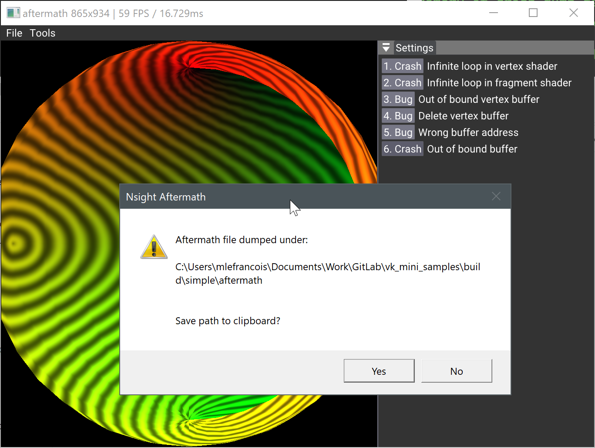
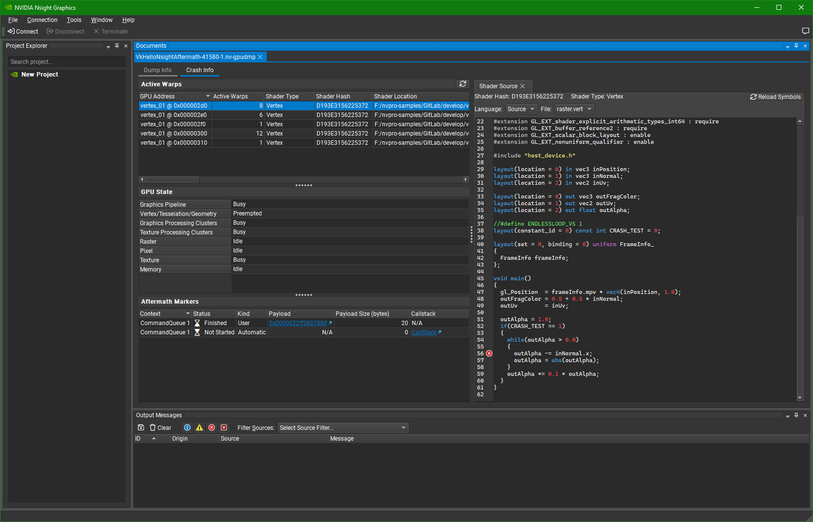

# Nsight Aftermath



This example shows how to add Nsight Aftermath SDK to the project, to generate a dump helping to dump GPU crashes.

There are a few wrong things that can go wrong, and this sample contains a few of them. Clicking on Crash button should create a device lost and dump a file on disk. This file can be openned in Nsight Graphics to see where the error occured. 

## Aftermath SDK

Download the Aftermath SDK from https://developer.nvidia.com/nsight-aftermath and copy the `lib` and `include` directories under [`aftermath_sdk`](aftermath_sdk). 

### Setting the NSIGHT_AFTERMATH_SDK variable

The Cmake file is also looking for the system environment variable `NSIGHT_AFTERMATH_SDK`. If you want to use a different version. Download, extract the SDK content and copy the location of the SDK.

Set the `NSIGHT_AFTERMATH_SDK` variable with the path of where the SDK was extracted.

## SDK Callbacks

Nsight Aftermath requires callback when there is a crash, to simplify the operation, a simple self-contain class can do the job. You can find this class locally under:

* [NsightAftermathGpuCrashTracker.cpp](src/NsightAftermathGpuCrashTracker.cpp)
* [NsightAftermathGpuCrashTracker.h](src/NsightAftermathGpuCrashTracker.h)

## Enabling Nsight Aftermath

To enable Nsight Aftermath, we need to enable some device extensions and set the callbacks before creating the Vulkan device.

Check for all `USE_NSIGHT_AFTERMATH` in the code to see where the additions were made to the sample.

Those extensions have been added.

```` C
  // Enable NV_device_diagnostic_checkpoints extension to be able to use Aftermath event markers.
  spec.vkSetup.addDeviceExtension(VK_NV_DEVICE_DIAGNOSTIC_CHECKPOINTS_EXTENSION_NAME);
  // Enable NV_device_diagnostics_config extension to configure Aftermath features.
  VkDeviceDiagnosticsConfigCreateInfoNV aftermath_info{VK_STRUCTURE_TYPE_DEVICE_DIAGNOSTICS_CONFIG_CREATE_INFO_NV};
  aftermath_info.flags = VK_DEVICE_DIAGNOSTICS_CONFIG_ENABLE_SHADER_DEBUG_INFO_BIT_NV
                         | VK_DEVICE_DIAGNOSTICS_CONFIG_ENABLE_RESOURCE_TRACKING_BIT_NV
                         | VK_DEVICE_DIAGNOSTICS_CONFIG_ENABLE_AUTOMATIC_CHECKPOINTS_BIT_NV;
  spec.vkSetup.addDeviceExtension(VK_NV_DEVICE_DIAGNOSTICS_CONFIG_EXTENSION_NAME, false, &aftermath_info);
```` 

Immediately following and before the creation of the Vulkan context, we initialize the GPU crash tracker.

 ````C
  // #Aftermath - Initialization
  g_aftermath_tracker = std::make_unique<GpuCrashTracker>(g_marker_map);
  g_aftermath_tracker->initialize();
```` 
  
:warning: **Note**: At the time of writting those lines the `aftermathInfo.flags` will not be taken into concideration and all supported feature will be turned on. This is handled like this for all extensions by the `nvvk::Context`.

:warning: **Note**: Turning on Aftermath might impact the time of shader creation and will add overhead to the application.

## Testing

The best way to test if it works, is to have a `VK_ERROR_DEVICE_LOST`. Click on the fist Crash button, a dislog should popup offering to save to the clipbord the path of the dump file.

The first crash, is the use of a modified pipeline. In `createPipeline()`, many pipelines are created, using various constant specializations. If you look in the shader, you will find `CRASH_TEST` and this variable is set as constant in the creation of the pipeline. The first button will set this value to **1** creating an infinite loop in the vertex shader.
## Dump File



Open [Nsight Graphics](https://developer.nvidia.com/nsight-graphics), and `File>Open Files` or drag and drop the `aftermath-*.nv-gpudmp` file. 

Click on **Crash Info** to have information about the crash. 

## Other Crashes

Try other scenarios, not all of them might crash in this sample as the driver might be able to get over it, but some will definitly crash and the error will be reported.
