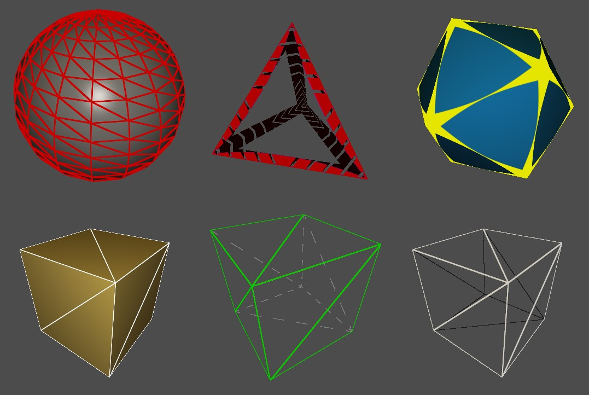
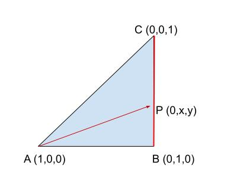

#Simple Polygons



Draw wireframe on geometry in a single pass using [`gl_BaryCoordNV`](https://github.com/KhronosGroup/GLSL/blob/master/extensions/nv/GLSL_NV_fragment_shader_barycentric.txt)


## Technique

We are using distance field function with the barycentric coordinates of the triangle to draw a line on the edges. 

Barycentric coordinates of a triangle are a way to describe the position of a point in relation to the vertices of a triangle. In a given triangle ABC, any point P can be uniquely represented by a set of three weights (u, v, w) such that u + v + w = 1, where u is the weight assigned to vertex A, v to vertex B, and w to vertex C. These weights indicate the relative distances from P to the vertices of the triangle.

In the image below, a weight of zero on the `x`, gives position on the opposite edge of `A`.




[`gl_BaryCoordNV`](https://github.com/KhronosGroup/GLSL/blob/master/extensions/nv/GLSL_NV_fragment_shader_barycentric.txt) is returning the weights on a given fragment. With this information, it is possible to get the distance to the edge and if the value is below a threshold, the edge can be highlighted.


## Fragment Shader Code

The sample does a little more then the following, but here is the code to get screen space wireframe line width.

```GLSL
  float thickness = 1.0;
  float smoothing = thickness * 0.5;
  vec3 wireColor  = vec3(1,0,0);
  vec3 deltas     = fwidth(gl_BaryCoordNV);
  vec3 barys      = smoothstep(deltas * thickness, deltas * (thickness + smoothing), gl_BaryCoordNV);
  float minBary   = min(barys.x, min(barys.y, barys.z));
  float lineWidth = 1.0 - minBary;

  // Final color
  color = mix(color, wireColor, lineWidth);
```

