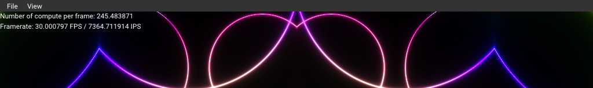

# Multi-threaded Compute Shader

This sample demonstrate how to use compute shader in a separate thread to render an image. 
The image is then copied to the main thread for display. The compute shader is rendering
as fast as possible, while the main thread is displaying the image at the screen refresh rate.

Note: The amount of compute frame it can do per display iteration depends on the GPU. On laptops, 
      and integrated GPUs, the difference is minimal. On high-end GPUs, the difference can be significant.