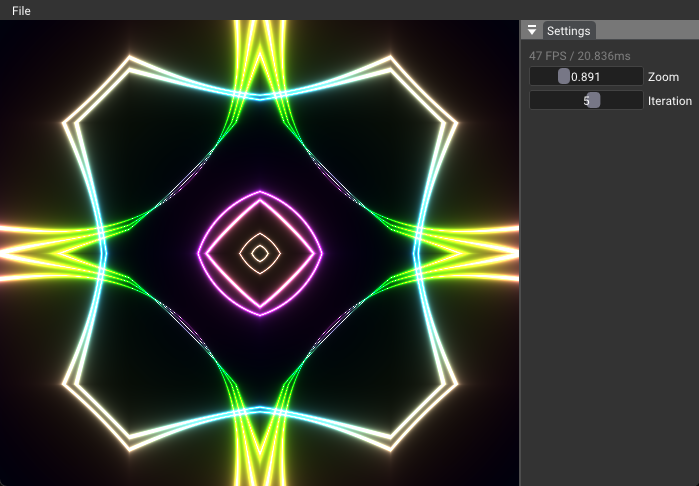

# Compute Only

This is showing a really simple Vulkan sample that runs a compute shader to fill an image, and then display this image.

To make the sample as simple as possible, two extensions are used:

* [VK_EXT_SHADER_OBJECT_EXTENSION_NAME](https://registry.khronos.org/vulkan/specs/1.3-extensions/man/html/VK_EXT_shader_object.html)
* [VK_KHR_PUSH_DESCRIPTOR_EXTENSION_NAME](https://registry.khronos.org/vulkan/specs/1.3-extensions/man/html/VK_KHR_push_descriptor.html)

The two extensions avoid the creation of Vulkan Pipeline and simplifies the creation and usage of descriptor set.

The sample uses the G-Buffer color image and writes to it. Then this image is diplayed in ImGui Window "viewport". 
