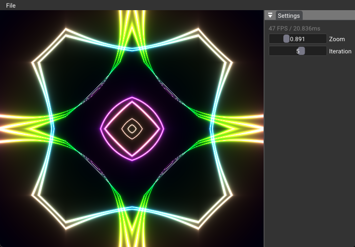

# Compute Only Sample

## Overview

This sample demonstrates a minimalist Vulkan implementation utilizing a compute shader to generate and display an image. The focus is on simplicity and efficiency in the Vulkan pipeline.

## Key Features

1. Compute shader-based image generation
2. Direct display of computed image
3. Utilization of advanced Vulkan extensions for pipeline simplification

## Technical Implementation

### Vulkan Extensions

To streamline the implementation, two modern Vulkan extensions are employed:

1. [VK_EXT_shader_object](https://registry.khronos.org/vulkan/specs/latest/man/html/VK_EXT_shader_object.html)
   - Purpose: Eliminates the need for explicit Vulkan Pipeline creation
   - Benefit: Reduces boilerplate code and simplifies shader management

2. [VK_EXT_descriptor_heap](https://registry.khronos.org/vulkan/specs/latest/man/html/VK_EXT_descriptor_heap.html)
   - Purpose: Replaces descriptor pools/sets with a GPU-visible heap buffer; the compute shader reaches its output image by heap slot
   - Benefit: Bindless access with no descriptor set allocation — see the [`descriptor_heap`](../descriptor_heap/) sample for the concept in depth

### Rendering Process

1. **Compute Shader Execution**: 
   - A compute shader is dispatched to populate the G-Buffer color image
   - The shader writes directly to the image, bypassing traditional graphics pipeline stages

2. **Image Display**:
   - The generated image is rendered within an ImGui "viewport" window
   - This approach demonstrates seamless integration between compute-generated content and GUI frameworks

### Performance Considerations

- The use of compute shaders for image generation can offer performance benefits over traditional fragment shader approaches, especially for complex image processing tasks
- Direct writing to the G-Buffer color image minimizes memory transfers, potentially improving overall rendering efficiency

## Conclusion

This sample serves as a concise demonstration of Vulkan's compute capabilities, showcasing how modern extensions can simplify implementation while maintaining high performance. It provides a foundation for more complex compute-based rendering techniques in Vulkan applications.