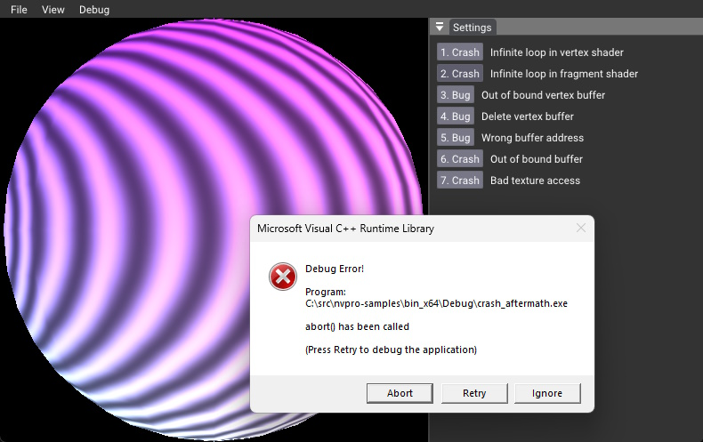
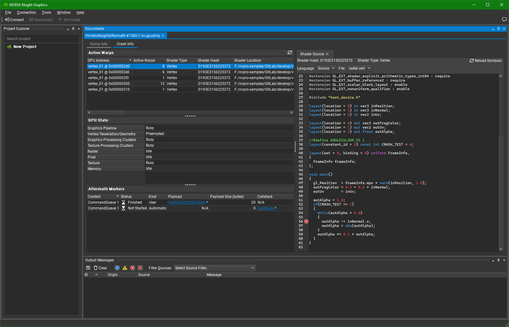

# NSight Aftermath



This example shows how to add NSight Aftermath SDK to the project, to generate a dump helping to dump GPU crashes.

There are a few wrong things that can go wrong, and this sample contains a few of them. Clicking on Crash button should create a device lost and dump a file on disk. This file can be openned in NSight Graphics to see where the error occured. 

## Aftermath SDK

Setup

* Download the Aftermath SDK from https://developer.nvidia.com/nsight-aftermath.
* In CMake, set `NSIGHT_AFTERMATH_SDK` with the path of where the SDK was extracted.

## Enabling NSight Aftermath

NSight Aftermath callbacks are integrated in `nvpro-core` under [nsight_aftermath_vk.cpp](https://github.com/nvpro-samples/nvpro_core/blob/master/nvvk/nsight_aftermath_vk.cpp). If CMake has set `NSIGHT_AFTERMATH_SDK` to a valid path, this is enabling the define `NVVK_SUPPORTS_AFTERMATH` and will allow the usage of the Aftermath SDK. At the construction of the Vulkan context in `nvvk::Context`, we are setting to true `enableAftermath` from `nvvk::ContextCreateInfo`. This will setup additional device extensions and will initialize the Aftermath SDK.

:warning: **Note**: Turning on Aftermath might impact the time of shader creation and will add overhead to the application.

## Testing

The best way to test if it works, is to have a `VK_ERROR_DEVICE_LOST`. Click on the fist Crash button, a dislog should popup offering to save to the clipbord the path of the dump file.

The first crash, is the use of a modified pipeline. In `createPipeline()`, many pipelines are created, using various constant specializations. If you look in the shader, you will find `CRASH_TEST` and this variable is set as constant in the creation of the pipeline. The first button will set this value to **1** creating an infinite loop in the vertex shader.

A message similar to this should appear in the console if Aftermath correctly intercepted the crash.

````
--------------------------------------------------------------
Writing Aftermath dump file to:
  C:\src\nvpro-samples\shipped\vk_mini_samples\build\samples\crash_aftermath\crash_aftermath-41584-1.nv-gpudmp
--------------------------------------------------------------
````

## Dump File



Open [NSight Graphics](https://developer.nvidia.com/nsight-graphics), and `File>Open Files` or drag and drop the `aftermath-*.nv-gpudmp` file. 

Click on **Crash Info** to have information about the crash. 

## Other Crashes

Try other scenarios, not all of them might crash in this sample as the driver might be able to get over it, but some will definitly crash and the error will be reported.
