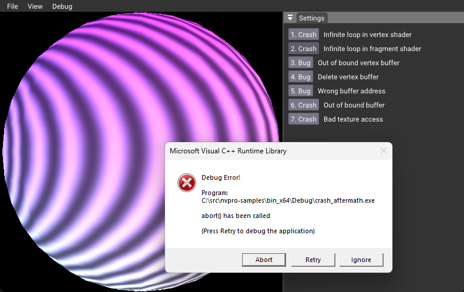
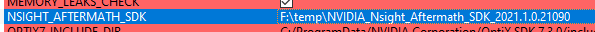
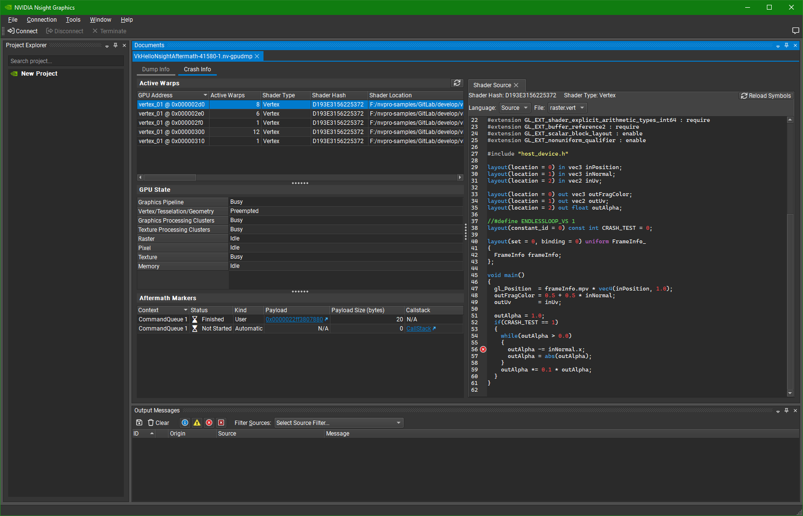

# NSight Aftermath Integration for Vulkan



This sample demonstrates how to integrate the NVIDIA Nsight Aftermath SDK to capture GPU crash dumps when `VK_ERROR_DEVICE_LOST` occurs. It includes 7 crash scenarios that deliberately trigger device lost through two mechanisms:

- **TDR (Timeout Detection and Recovery):** Infinite loops in shaders that stall the GPU beyond the Windows ~2-second timeout.
- **GPU page faults via BDA (Buffer Device Address):** Writing to unmapped GPU virtual memory through `buffer_reference` pointers.

## Prerequisites

[Nsight Graphics](https://developer.nvidia.com/nsight-graphics) must be installed. The installer bundles the Nsight Aftermath SDK, which is required to capture crash dumps. After installation the SDK is typically located at:

```
C:/Program Files/NVIDIA Corporation/Nsight Graphics 2026.x.x/SDKs/NsightAftermathSDK/202x.x.x.xxxxxx
```

## Setup

### 1. Set the Aftermath SDK path in CMake

Open CMake GUI (or your IDE's CMake settings) and set the variable:

| Variable              | Value                                |
|:----------------------|:-------------------------------------|
| `NsightAftermath_SDK` | Top-level directory of the Aftermath SDK (e.g. `.../NsightAftermathSDK/2025.5.0.251114`) |



### 2. Reconfigure and rebuild

After setting the path, reconfigure CMake and rebuild the project. When the SDK is found, the `AFTERMATH_AVAILABLE` preprocessor define is set automatically. If the sample shows a red **"Aftermath SDK not integrated"** label in the UI, the SDK path was not set correctly.

## Crash Scenarios

The sample provides 7 crash tests grouped by mechanism. Each one reliably triggers `VK_ERROR_DEVICE_LOST`:

### TDR Crashes (infinite loops)

| # | Test | Mechanism |
|---|------|-----------|
| 1 | Fragment infinite loop (sin) | `col.x *= sin(col.x)` keeps `col.x` in (0,1) forever; once it reaches 0.0, `0 * sin(0) = 0` and the loop never exits. |
| 2 | Fragment infinite loop (SSBO writes) | Same principle, but each iteration writes to an SSBO. The side-effect prevents the compiler from optimizing the loop away. |
| 3 | Compute shader infinite loop | Dispatches a compute shader with the same infinite-loop + SSBO-write pattern, demonstrating TDR from the compute stage. |

### Page Fault Crashes (BDA writes to unmapped memory)

| # | Test | Mechanism |
|---|------|-----------|
| 4 | BDA buffer overrun | Writes through a valid buffer address + 1 GB offset, landing in unmapped GPU virtual memory past the buffer end. |
| 5 | BDA wild pointer spray | Each fragment hashes its screen coordinates to produce a different address in the GPU's ~40-bit VA space. With thousands of fragments hitting scattered addresses, unmapped pages are inevitably reached. |
| 6 | BDA use-after-free | A dedicated-allocation buffer is destroyed, then the shader writes through the stale address. The dedicated allocation ensures the GPU VA range is truly unmapped after destruction. |
| 7 | BDA indirect use-after-free | A pointer chain: buffer A holds the BDA of buffer B. Buffer B is destroyed. The shader reads buffer A to get the (now stale) address of B, then writes through it. This mirrors real-world BDA patterns where scene descriptors point to other GPU buffers. |

## Triggering a Crash and Analyzing the Dump

### 1. Run the application

Launch the sample and click any **Crash** button. The application will freeze briefly while the GPU times out (TDR) or fault immediately (BDA), then print output similar to:

```
Saved D:\..\_bin\Debug\shader-dfd72f5241926188-64fa727f95cf2c56.nvdbg
Saved D:\..\_bin\Debug\shader-dfd72f5241926188-64fa727f95cf2c56.spv
--------------------------------------------------------------
Writing Aftermath dump file to:
  D:\..\_bin\Debug\crash_aftermath.exe-2540304-1.nv-gpudmp
Writing JSON dump file to:
  D:\..\_bin\Debug\crash_aftermath.exe-2540304-1.json
--------------------------------------------------------------
Vulkan error: VK_ERROR_DEVICE_LOST
```

The `.nv-gpudmp` file is the GPU crash dump. The `.json` file contains a human-readable summary.

### 2. Open the dump in Nsight Graphics

1. Launch **Nsight Graphics**.
2. Open the `.nv-gpudmp` file (**File > Open**).
3. Click the **Crash Info** tab.

### 3. Locate the faulting shader line

In the Crash Info view, look at the **Active Warps** or **Faulted Warps** list. Each entry shows a **GPU PC Address**. Click on one -- Nsight Graphics will open the source file with the cursor positioned at the exact shader line that caused the crash.



## Using the Aftermath Monitor without the SDK

You can capture and analyze crash dumps when the sample is built **without** the Nsight Aftermath SDK by using **Nsight Aftermath Monitor**.

### Monitor configuration

In **Nsight Aftermath Monitor** → **Settings**:

| Setting | Value |
|:--------|:------|
| Aftermath mode | Global |
| Generate Shader Debug information | Yes |
| Enable Resource Tracking | Yes |
| Enable Call Stack Capturing | Yes |
| Enable Additional Shader Error Reporting | Yes |

Click **Apply**, then run the application and trigger a crash. A dialog will offer to open Nsight Graphics with the dump.

### Viewing source in Nsight Graphics

By default only SASS is visible. To see shader source:

1. In **Nsight Aftermath Monitor** → **Settings** → **General**, copy the **Debug Info Dump Directory** path.
2. In **Nsight Graphics** → **Search paths**, locate **NVIDIA Shader Debug Information** and add that path.
3. Reload or re-open the dump; source-level navigation in Crash Info will then resolve.

### SPV fallback

The build copies compiled `.spv` shaders to the executable directory. In **Crash Dump Inspector**, point the search path at that directory; the Inspector matches dumps to shaders by content hash (filenames are ignored).

## Notes

- Aftermath adds overhead to shader compilation and runtime. It is intended for debugging, not production use.
- Validation layers are disabled in this sample to avoid interference with the deliberate crashes.
- The crash scenarios are chosen for reliability on modern NVIDIA drivers. Earlier approaches (out-of-bounds descriptors, deleted vertex buffers) no longer trigger device lost because the driver handles them gracefully via robustness extensions and reference counting.
