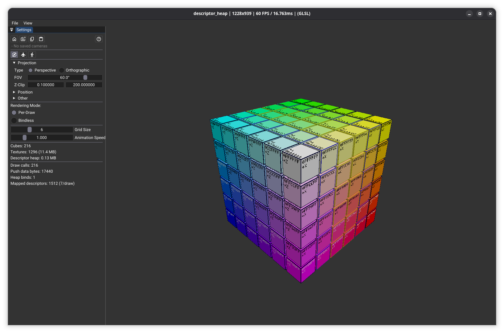

# Descriptor Heap Sample

## Overview

This sample demonstrates [VK_EXT_descriptor_heap](https://registry.khronos.org/vulkan/specs/latest/man/html/VK_EXT_descriptor_heap.html) (see also the [Vulkan Guide: Descriptor Heap](https://docs.vulkan.org/guide/latest/descriptor_heap.html)), which replaces traditional descriptor sets with GPU-visible heap buffers and push data. Descriptors are written directly to host-visible memory, and shaders access them either through set/binding mapping or direct heap indexing.

The scene is an NxNxN RGB color cube where each small cube has 6 unique face textures showing its hex color code. Three rendering modes are demonstrated:

- **Push Index**: the driver reads the index from push data (`HEAP_WITH_PUSH_INDEX_EXT`) and one draw is issued per cube.
- **Constant Offset**: set/binding unsized arrays are mapped to the heap base (`HEAP_WITH_CONSTANT_OFFSET_EXT`) and all cubes render in one instanced draw.
- **Direct Access**: shaders use `layout(descriptor_heap)` directly (same rendering pattern as Constant Offset, but no mapping struct).

## Why Descriptor Heaps?

Descriptor heaps replace descriptor pools and sets with simple GPU-visible buffers. Benefits include:

- **Scalability**: no pool fragmentation or set allocation limits; just write descriptors to memory.
- **Bindless patterns**: direct heap indexing enables flexible, data-driven rendering without rebinding.
- **Modern API alignment**: matches the resource binding model of D3D12 and Metal.

## Common Setup

All three modes share the same setup and frame-level flow:

- **Heap allocation**: sampler and resource heaps are device-local `VkBuffer` objects with `VK_BUFFER_USAGE_DESCRIPTOR_HEAP_BIT_EXT` for fast GPU reads. Heap properties (descriptor sizes, alignment, reserved range) come from `VkPhysicalDeviceDescriptorHeapPropertiesEXT`.
- **Descriptor writes**: `vkWriteSamplerDescriptorsEXT` and `vkWriteResourceDescriptorsEXT` write descriptors into host staging memory; the staging data is then uploaded to the device-local heaps via `StagingUploader`.
- **Per-frame binding**: `vkCmdBindSamplerHeapEXT` + `vkCmdBindResourceHeapEXT` bind both heaps once per frame.
- **Push data layout**: `FrameInfo` is pushed at offset `0`; per-draw data (`DrawData` for Push Index) or per-instance data (`InstancedPushData` for Constant Offset / Direct Access) is pushed immediately after, at offset `sizeof(FrameInfo)`. Both are sent via `vkCmdPushDataEXT`, which replaces `vkCmdPushConstants` for descriptor-heap shaders.

## Mode 1: Push Index

This demonstrates a possible migration path from traditional descriptor sets.
The shaders keep normal Vulkan resource declarations: in GLSL, `layout(set=N,
binding=M)`, and in Slang, `[[vk::binding(M, N)]]`. With descriptor heaps there
is no descriptor set object behind those declarations;
`VkShaderDescriptorSetAndBindingMappingInfoEXT` tells the driver how each
set/binding maps into the heap.

- **Shader access**: regular set/binding resources (`texture2D faceTextures[6]`, `sampler samp`).
- **Mapping source**: `VK_DESCRIPTOR_MAPPING_SOURCE_HEAP_WITH_PUSH_INDEX_EXT`
  for the texture array. The mapping reads `baseFaceTexIdx` from push data at
  `pushOffset` as the base heap index; the shader's `faceTextures[faceIdx]`
  access selects one of the six descriptors from that base. The sampler uses
  `HEAP_WITH_CONSTANT_OFFSET_EXT` at slot 0.
- **Rendering pattern**: one draw call per cube; each draw pushes `DrawData` carrying its `baseFaceTexIdx`.
- **Note**: the shader never reads `baseFaceTexIdx` directly — the mapping consumes it, then the shader simply samples `faceTextures[faceIdx]` and the driver resolves it to the right heap slot.

## Mode 2: Constant Offset

Using a constant offset of zero simply binds the whole heap and the shader reads
absolute descriptor indices.

- **Shader access**: set/binding unsized arrays (`texture2D heapTextures[]`, `sampler heapSamplers[]`).
- **Mapping source**: `VK_DESCRIPTOR_MAPPING_SOURCE_HEAP_WITH_CONSTANT_OFFSET_EXT` for both arrays — the array effectively *is* the heap starting at the configured offset.
- **Rendering pattern**: one instanced `vkCmdDrawIndexed` for all cubes; the vertex shader derives each cube from `gl_InstanceIndex`, and the fragment shader indexes `heapTextures[baseFaceTexIdx + faceIdx]`.

## Mode 3: Direct Access

Mapping can be skipped if using *untyped pointer* access with
`VK_KHR_shader_untyped_pointers` and
`layout(descriptor_heap)`/`require(spvDescriptorHeapEXT)`. The shader can
instead access heap descriptors directly with absolute indices. This is similar
to **Mode 2: Constant Offset** but requires shader changes compared to
descriptor sets.

- **Shader access**: GLSL declares `layout(descriptor_heap) uniform texture2D
  heapTextures[]` and indexes it directly. Slang has no resource declaration;
  the entry point is annotated `[require(spvDescriptorHeapEXT)]` and resources
  are constructed inline as `Texture2D.Handle(uint2(index, 0))` for example.
- **Mapping source**: none — no `VkShaderDescriptorSetAndBindingMappingInfoEXT` is chained into the shader.
- **Rendering pattern**: one instanced `vkCmdDrawIndexed`, same as Constant Offset.

## Other Mapping Sources

The sample illustrates two mapping sources, `HEAP_WITH_PUSH_INDEX_EXT` and `HEAP_WITH_CONSTANT_OFFSET_EXT`. `VkDescriptorMappingSourceEXT` defines more (indirect-index from buffer, push-data buffer references, shader-record data, etc.). See the [Vulkan Guide: Descriptor Heap](https://docs.vulkan.org/guide/latest/descriptor_heap.html) for more details.

## Code Map

Search for `#DESC_HEAP` in `descriptor_heap.cpp`:

| Responsibility                       | Location                                              |
|--------------------------------------|-------------------------------------------------------|
| Heap property query                  | `initHeaps()`                                         |
| Sampler/resource heap allocation     | `initHeaps()`, `resizeResourceHeap()`                 |
| Descriptor writes to staging         | `writeImageDescriptor()`                              |
| Staging upload to device             | `rebuildScene()`                                      |
| Per-frame heap binding               | `cmdBindHeaps()`                                      |
| Push data                            | `cmdPushData()`                                       |
| Push Index mapping + shader creation | `createShaders()` (PushIndex block)                   |
| Constant Offset mapping + shaders    | `createShaders()` (ConstantOffset block)              |
| Direct Access shaders                | `createShaders()` (DirectAccess block)                |
| Draw dispatch by mode                | `onRender()`                                          |

## Converting from Legacy Descriptor Sets

If you're familiar with traditional descriptor sets (e.g., the [gltf_raytrace](../gltf_raytrace/) sample), this table maps legacy concepts to descriptor heaps:

| Legacy Concept           | Example                                              | Descriptor Heap Equivalent                                                                                  |
|--------------------------|------------------------------------------------------|-------------------------------------------------------------------------------------------------------------|
| Descriptor pool + set    | `vkCreateDescriptorPool`, `vkAllocateDescriptorSets` | Heap buffers with `VK_BUFFER_USAGE_DESCRIPTOR_HEAP_BIT_EXT`; `vkWriteResourceDescriptorsEXT` to staging; upload to device |
| Set layout in pipeline   | `VkDescriptorSetLayout`                              | No set layout needed; use mapping info or `layout(descriptor_heap)`                                         |
| Push constants           | `vkCmdPushConstants`                                 | `vkCmdPushDataEXT`; push data also feeds heap indices via mapping                                           |
| Push descriptors         | `vkCmdPushDescriptorSet`                             | Write descriptors to heap at known indices; pass base index in push data                                    |
| Binding sets each frame  | `vkCmdBindDescriptorSets`                            | `vkCmdBindSamplerHeapEXT` + `vkCmdBindResourceHeapEXT` once per frame                                        |

## Implementation Details

### Descriptor Heap Setup

- Physical device properties are queried for descriptor sizes, alignment, and reserved range requirements.
- Sampler and resource heaps are allocated as device-local `VkBuffer` objects with `VK_BUFFER_USAGE_DESCRIPTOR_HEAP_BIT_EXT` for fast GPU reads.
- `vkWriteSamplerDescriptorsEXT` and `vkWriteResourceDescriptorsEXT` write descriptors into host staging memory. The staging data is then uploaded to the device-local heaps via `StagingUploader`.

### Push Data

`vkCmdPushDataEXT` replaces `vkCmdPushConstants` when using descriptor heaps. `FrameInfo` is pushed once per frame at offset `0`; the per-mode payload (`DrawData` or `InstancedPushData`) is pushed at offset `sizeof(FrameInfo)` — per cube in Push Index, once per frame in the other modes.

### Shader Creation

Shader objects are created with `VK_SHADER_CREATE_DESCRIPTOR_HEAP_BIT_EXT` and no descriptor set layout. (For pipeline-based workflows, the equivalent flag is `VK_PIPELINE_CREATE_2_DESCRIPTOR_HEAP_BIT_EXT`.)

- **Push Index**: `VkShaderDescriptorSetAndBindingMappingInfoEXT` is chained via `pNext`. Texture binding uses `HEAP_WITH_PUSH_INDEX` (heap index derived from push data at `pushOffset`); sampler binding uses `HEAP_WITH_CONSTANT_OFFSET` (fixed slot 0).
- **Constant Offset**: same chained `mappingInfo`, but both texture and sampler bindings use `HEAP_WITH_CONSTANT_OFFSET` with `heapArrayStride` set to the descriptor size, so the unsized arrays cover the whole heap.
- **Direct Access**: no `mappingInfo` is chained. Shaders access the heap directly via `VK_KHR_shader_untyped_pointers`.

## Extensions

- [VK_EXT_descriptor_heap](https://registry.khronos.org/vulkan/specs/latest/man/html/VK_EXT_descriptor_heap.html) — core descriptor heap functionality.
- [VK_KHR_shader_untyped_pointers](https://registry.khronos.org/vulkan/specs/latest/man/html/VK_KHR_shader_untyped_pointers.html) — required by SPIR-V emitted for `layout(descriptor_heap)` (Direct Access mode).
