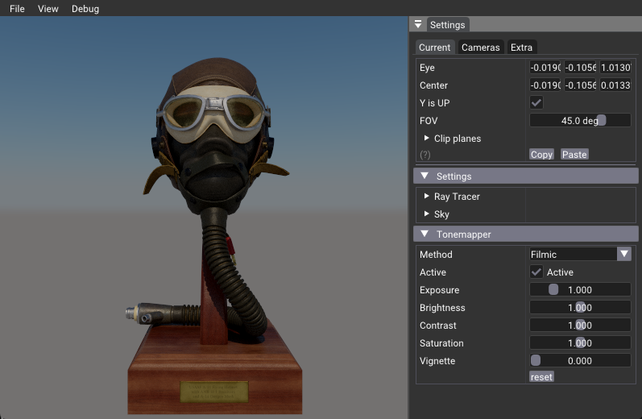

# glTF renderer

## Description

This mini-sample shows how to load a glTF scene (tinyGLTF) and store it in an internal format `nvh::gltf::Scene`. 
From this internal representation, a GPU version is created using `nvvkhl::SceneVk`, which basically creates the
the buffers that hold the geometry and material. For raytracing we use the `nvvkhl::SceneRtx` class, which takes
from the previously created buffers and creates the bottom and top level acceleration structures.

To load another glTF scene, pass the path to the scene to the executable argument.

## Pipeline

In this sample we use a single compute shader and ray query to trigger rays and get intersection information.
We use Shader Object and Push Descriptors. This works very well for scenes that don't have too many elements, 
but would raise a warning if there are too many textures. See `pushDescriptorSet()`.

## Rendering

Rendering become very simple with this framework

* Buffers that are changing each frame are updated, like the one holding the camera information
* Descriptors are push: TLAS, final image, scene representation, ..
* Push constants are also pushed
* Dispatch compute shader

A memory barrier was added, such that the following computer (tonemapper) would work on a finished image.