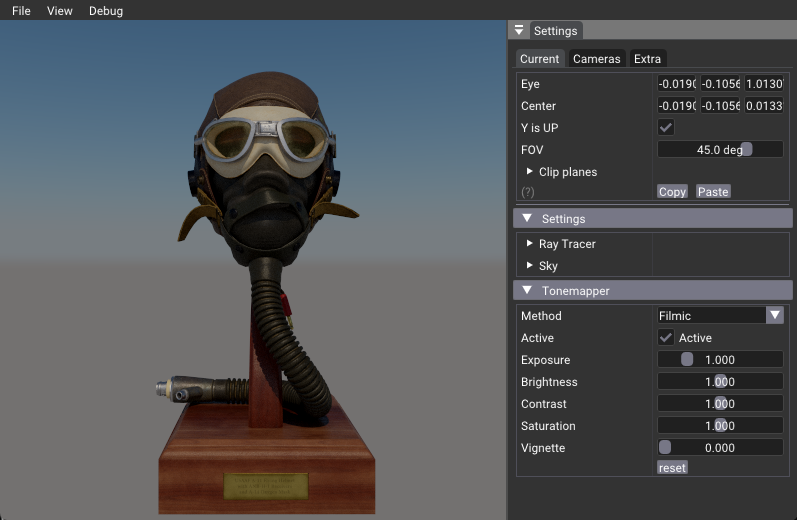

# Vulkan-based glTF Renderer

## Overview

This sample demonstrates loading and ray tracing glTF scenes using Vulkan. It uses tinygltf for scene loading, `nvvkgltf::Scene` for the internal representation, `nvvkgltf::SceneVk` for GPU resource creation, and `nvvkgltf::SceneRtx` for the acceleration structures. A single ray-query compute shader path traces the scene, followed by a tonemapping pass.

All shader resources are bound **bindless** through `nvvk::DescriptorHeap` (`VK_EXT_descriptor_heap`): there are no descriptor sets or pipeline layout.

## Key Components

- **Scene Loading**: tinygltf
- **Internal Representation**: `nvvkgltf::Scene`
- **GPU Resource Management**: `nvvkgltf::SceneVk`
- **Ray Tracing Acceleration Structures**: `nvvkgltf::SceneRtx`
- **Bindless Resources**: `nvvk::DescriptorHeap` (`VK_EXT_descriptor_heap` + `VK_KHR_shader_untyped_pointers`)
- **Shader**: `VK_EXT_shader_object` compute shader (Slang)

## Pipeline Architecture

- Single compute shader with ray query, created as a `VkShaderEXT` with `VK_SHADER_CREATE_DESCRIPTOR_HEAP_BIT_EXT` (so `setLayoutCount` and `pushConstantRangeCount` are 0).
- Two host-visible, persistently-mapped heaps written directly (no staging):
  - a **sampler heap** with one shared linear sampler, and
  - a **resource heap** laid out as images first (output storage image, HDR environment, glTF textures) then buffers (the environment importance-sampling table).
- The shader fetches every resource via `<Resource>.Handle(...)`, indexing it with the region bases passed in the push constant plus the shared slot constants in `shaders/shaderio.h`.
- Per-frame data is delivered with `vkCmdPushDataEXT` (read directly from the SPIR-V push-constant layout).
- The **TLAS** is passed by device address in the push constant and converted to an acceleration structure in-shader via `RaytracingAccelerationStructure(address)`, rather than stored in the heap. The camera, sky, and scene buffers are likewise buffer-reference (BDA) pointers.

## Render Process

1. Update frame-specific uniform buffers (camera, sky) and the push constant (frame index, BDA pointers, TLAS address).
2. Bind the shader object and the sampler/resource heaps (`cmdBindHeaps`).
3. Push the constant data (`vkCmdPushDataEXT`) and dispatch the compute shader.
4. Apply a memory barrier and run the tonemapper into the displayed G-Buffer.

The output storage-image descriptor is refreshed on resize (the render-target view changes); textures and the HDR environment are written into the heap when the scene/HDR are (re)loaded.

## Usage

Pass a glTF scene path (or drag-and-drop a `.gltf`/`.glb` or `.hdr` file onto the window) to load a custom scene. The first command-line argument is treated as the model file.

## Notes

- The bindless heap removes the per-texture descriptor-set churn (and the related validation warnings) of the previous push-descriptor design.
- The shader is authored in Slang (`shaders/gltf_pathtrace.slang`).
- This is the largest descriptor-heap sample (all three heap regions at scale). See the [`descriptor_heap`](../descriptor_heap/) sample for the concept in depth.
