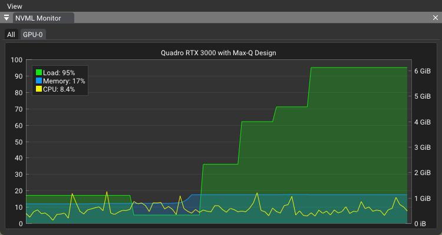

# GPU Monitor for Vulkan Applications

## Overview

This sample demonstrates integration of NVIDIA Management Library (NVML) for GPU usage monitoring within a Vulkan framework.

## Key Features

- Real-time GPU metrics retrieval
- Dockable display window for GPU statistics
- Non-intrusive integration with existing Vulkan applications

## Implementation Details

- Utilizes [NVIDIA Management Library (NVML)](https://developer.nvidia.com/nvidia-management-library-nvml)
- Periodic GPU data polling
- Customizable update intervals for performance optimization

## Use Case

While not Vulkan-specific, this module enhances development workflows by providing immediate visibility into GPU resource utilization during application execution.
