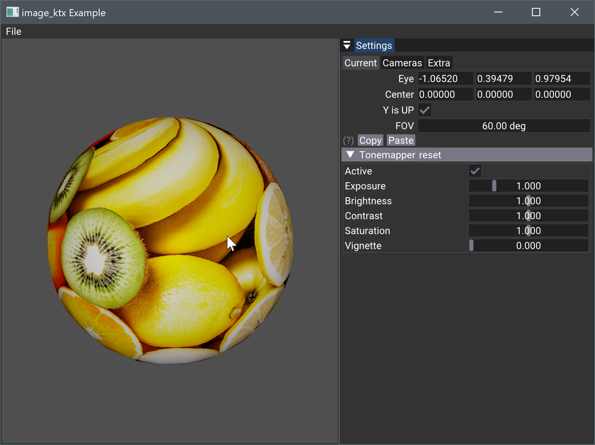

# KTX Texture Integration for Vulkan



## Overview

This sample demonstrates KTX texture usage with nvpro_core helpers and post-process tonemapping in Vulkan.

## Key Components

- **TextureKtx Class**: Handles texture creation and management
- **Tonemapper**: Implemented using `TonemapperPostProcess` class
  - Supports both compute and graphics pipeline approaches

## Implementation Details

### Texture Handling
- `TextureKtx::create(ktximage)` function manages texture and mipmap uploading
- Preserves original image format (e.g., sRGB)

### Render Pipeline
1. Load default image
2. Create simple sphere scene
3. Generate Vulkan buffers for vertices and indices
4. Create pipeline with basic vertex and fragment shaders
5. Update camera matrices in `m_frameInfo.buffer`
6. Render scene
7. Apply post-process tonemapping

### Vulkan Specifics
- Utilizes `VK_KHR_PUSH_DESCRIPTOR_EXTENSION_NAME`
- Fragment shader avoids gamma correction, deferring to tonemapper

## Dependencies

- Zstandard Supercompression
- Basis Universal

## Resources


- [Khronos KTX](https://www.khronos.org/ktx/)
- [KTX Specification](https://github.khronos.org/KTX-Specification)
- [NVIDIA Texture Tools Exporter](https://developer.nvidia.com/nvidia-texture-tools-exporter)
- [KTX-Software](https://github.com/KhronosGroup/KTX-Software)

## Build Configuration

```makefile
_add_package_KTX()
target_link_libraries(${PROJECT_NAME} libzstd_static zlibstatic basisu)