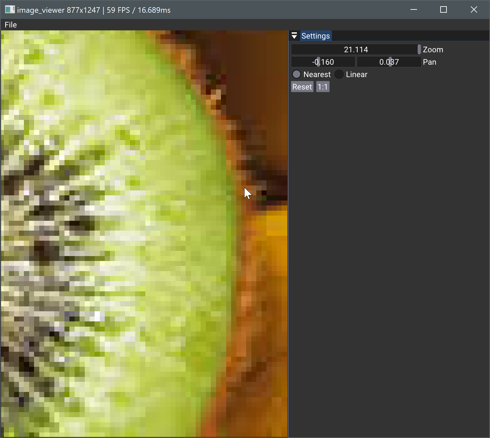

# Image Viewer

This example loads an image, displays it, and allows you to zoom (mouse wheel) and pan the image by following the position of the mouse pointer, as well as change the texture sampler from near to linear.

## Zoom and Pan

The math to zoom and pan can be find in `onUIRender()`. First there is a check to verify that the mouse is over the viewport. Zoom is incremented to decremented on mouse wheel, but this is affecting the pan amount. For this, we check what is the offset of require to keep the mouse position after zooming. Then dragging is ajusted taking into account the zoom. 

Those values of zoom and pan, are push to the shader in `onRender()` in an orthographic matrix where scaling is modified with zoom and translation with pan.

## Display

The image is rendered on a square, therefore scaling need to be applied to keep the right aspect ratio of the image in ralation to the size of the viewport. This is done at the beginning of the `onRender()` function. 
