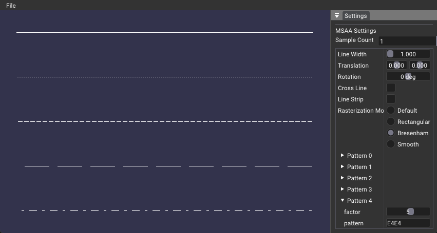

# Line Stipple Sample

## Overview

This sample demonstrates how line stippling can be implemented in Vulkan. Line stippling is a technique that allows for the rendering of dashed lines, which can be useful for visualizing wireframes or other line-based geometry.

## Implementation Details

### Pipeline Creation

The graphical pipeline is created with the following configuration:

- Primitive topology: `VK_PRIMITIVE_TOPOLOGY_LINE_LIST`
- Rasterization state:
  		- VkPipelineRasterizationLineStateCreateInfoEXT extension struct is added to the pNext chain of the VkPipelineRasterizationStateCreateInfo
- Dynamic state: `VK_DYNAMIC_STATE_LINE_WIDTH` and `VK_DYNAMIC_STATE_LINE_STIPPLE_KHR` are enabled
    - Also `VK_DYNAMIC_STATE_LINE_RASTERIZATION_MODE_EXT`, but it is optional.
-
### Extensions

- Adding the `VK_EXT_line_rasterization` extension to the device extensions list in `VulkanRenderer::createDevice`.
- Optionaly adding `VK_EXT_EXTENDED_DYNAMIC_STATE_3_EXTENSION_NAME` to allow for dynamically changing the line rasterization mode.

## Extra

- Check for line crossing each other to check for z-fighting.
- Line strip, for continous line-stipple.
- Line width, for thicker lines.
- Line rasterization mode, for changing the way lines are rasterized.
- Line stipple factor and pattern, for changing the pattern of the stipple.
- MSAA, for anti-aliasing the lines.
- Transformation, for moving the lines around.

[!NOTE] Depth test is disabled by default, but can be enabled in `createGraphicsPipeline()`.

## References
- VK_EXT_line_rasterization : https://registry.khronos.org/vulkan/specs/1.3-extensions/man/html/VK_EXT_line_rasterization.html 

