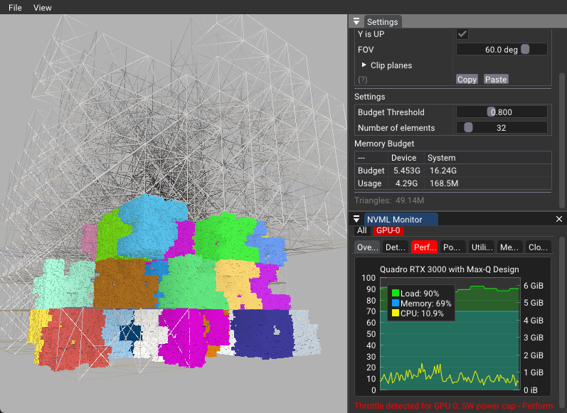

# Dynamic Memory Allocation in Vulkan

## Overview

This sample demonstrates dynamic memory allocation during rendering in Vulkan, utilizing the `VK_EXT_memory_budget` extension for GPU memory management.

## Key Features

- Runtime memory allocation
- GPU memory budget querying
- Adaptive memory deallocation

## Implementation Details

### Fractal Generation
- Menger sponge fractals with nested complexity
- Placeholder generation for higher-order fractals

### Memory Management
- Threaded memory allocation
- Per-frame memory budget querying
- Adaptive deallocation on budget exceedance

### Multi-Instance Behavior
- Dynamic budget adjustment based on application focus
- Mesh count reduction in non-focused instances

### Performance Optimization
- Separate queue families for allocation and rendering
- Transfer queue usage for non-blocking memory transfers

## Technical Specifications

- Average memory per Menger sponge: ~142MB (variable due to randomization)
- Example scenario:
  - 32 rendered sponges
  - 4.29 GB memory usage
  - 5.4 GB memory budget
  - 49.14 million triangles total

## Best Practices

- Query memory budget every frame
- Implement adaptive memory management for performance stability
- Utilize separate threads and queues for allocation and rendering

## Notes

Memory budget differs from free memory, allowing full-speed operation without system memory transfers, thus minimizing stuttering and enhancing performance.