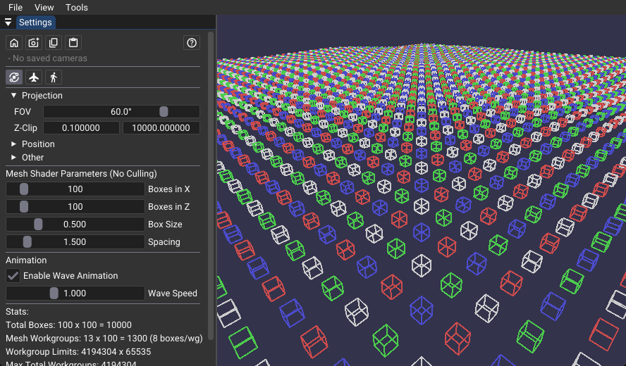

# Mesh Shaders



## Overview

This sample demonstrates mesh shaders in Vulkan by procedurally generating a 2D grid of wireframe bounding boxes. It renders all geometry without culling, providing a baseline for comparison with [mesh_task_shaders](../mesh_task_shaders/).

Pipeline: `Mesh Shader → Fragment Shader`

## Key Components

1. **Direct Mesh Dispatch**: Fixed workgroup grid dispatches all boxes regardless of visibility.
2. **Procedural Generation**: Each mesh workgroup generates multiple boxes using stride-based loops (typically 8 boxes = 64 vertices + 96 line primitives with 32-thread workgroups).
3. **Position Derivation**: Box positions calculated directly from `groupID` without intermediate buffers.
4. **No Culling**: All geometry processed every frame for predictable baseline performance.

## Implementation Details

> **Note:** In our sample code we sometimes list ranges of values like 0..31 threads or 0..7 boxes in the mesh shader, given those are typical results of the preferred values for NVIDIA mesh and task shaders. The actual runtime values however can be different as they depend on the hardware's properties.

### Dispatch Configuration

```cpp
uint32_t workgroupsX = (totalBoxesX + BOXES_PER_MESH - 1) / BOXES_PER_MESH;  // ceil division
uint32_t workgroupsZ = totalBoxesZ;
// Note: Actual implementation also clamps to hardware limits
vkCmdDrawMeshTasksEXT(cmd, workgroupsX, workgroupsZ, 1);
```

Each mesh workgroup handles up to `BOXES_PER_MESH` boxes (typically 8, derived as `workgroupSize / 4`). Workgroup calculates box indices from `groupID` and outputs geometry directly.

  > **Note:** Some `VK_EXT_mesh_shader` implementations only support 16-bit per launch grid dimension. As a result, if you want to launch 1D workloads with more than 16-bit elements, one needs to convert the launch grid into 2D. This is demonstrated in [vk_lod_clusters](https://github.com/nvpro-samples/vk_lod_clusters/blob/main/shaders/render_instance_bbox.mesh.glsl).

### Mesh Workgroup Output

- Hardware-dependent thread count per workgroup (typically 32, set to `maxPreferredMeshWorkGroupInvocations`)
- Up to `BOXES_PER_MESH × 8` vertices (typically 64 vertices with 32-thread workgroups)
- Up to `BOXES_PER_MESH × 12` line primitives (typically 96 lines with 32-thread workgroups)
- Stride-based generation: threads loop to generate all vertices/primitives

## Technical Requirements

- `VK_EXT_mesh_shader` extension
- `meshShader` feature enabled

## Mesh Shader Limitations

Mesh shaders have strict per-workgroup output limits (hardware-dependent):

- **Max vertices per workgroup**: Typically 256 (queried via `maxMeshOutputVertices`)
- **Max primitives per workgroup**: Typically 256 (queried via `maxMeshOutputPrimitives`)

This sample uses simple box geometry (8 vertices, 12 lines) which allows multiple boxes per workgroup. However, **more complex geometry may not fit these limits**.

Here we are rendering multiple simple boxes per workgroup, staying well within hardware limits.

## Performance Characteristics

- **Fixed Cost**: All boxes processed every frame regardless of visibility
- **Predictable**: No dynamic branching or culling logic
- **Zero Geometry Bandwidth**: Procedural generation eliminates vertex/index buffer reads


For GPU-driven culling optimization, see [mesh_task_shaders](../mesh_task_shaders/) which adds task shader frustum culling (30-70% improvement with off-screen geometry).
