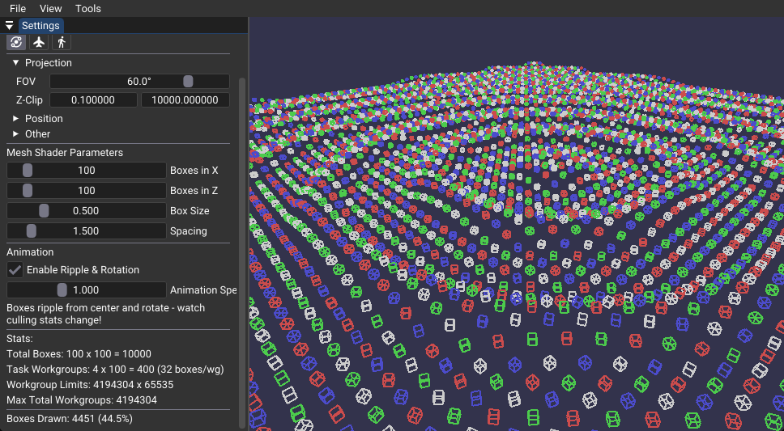
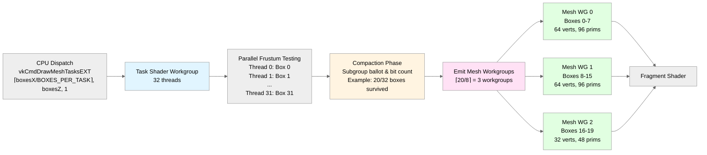

# Mesh and Task Shaders



## Overview

This sample demonstrates task shader optimization for mesh shader workloads in Vulkan. It renders a procedural 2D grid of wireframe bounding boxes with GPU-driven frustum culling, dynamically dispatching only visible geometry for fragment processing.

Pipeline: `Task Shader → Mesh Shader → Fragment Shader`

## Key Components

1. **Task Shader Culling**: Per-box frustum testing (6-plane sphere intersection) executed in parallel across 32 threads per workgroup.
2. **Subgroup Compaction**: Ballot and exclusive bit count operations to pack surviving boxes into contiguous array without gaps.
3. **Dynamic Mesh Dispatch**: Emits 0-4 mesh workgroups per task workgroup based on culling results, processing only visible boxes.
4. **Statistics Tracking**: Atomic counters via buffer device address for real-time culling metrics.

## Implementation Details

### Pipeline Flow



### Dispatch Configuration

```cpp
uint32_t workgroupsX = (totalBoxesX + BOXES_PER_TASK - 1) / BOXES_PER_TASK;  // ceil division
uint32_t workgroupsZ = totalBoxesZ;

// Clamp to hardware limits (maxTaskWorkGroupCount, maxTaskWorkGroupTotalCount)
workgroupsX = std::min(workgroupsX, maxTaskWorkGroupCount[0]);
workgroupsZ = std::min(workgroupsZ, maxTaskWorkGroupCount[1]);

vkCmdDrawMeshTasksEXT(cmd, workgroupsX, workgroupsZ, 1);
```

Each task workgroup processes up to `BOXES_PER_TASK` (32) boxes in parallel. After frustum culling, it emits mesh workgroups for survivors (up to `BOXES_PER_MESH` = 8 boxes per mesh workgroup).

### Frustum Culling Algorithm

- Bounding sphere test against 6 frustum planes extracted from view-projection matrix
- Per-thread visibility determination (each thread tests one box)
- Subgroup ballot collects visibility results across all threads in the wave
- Exclusive bit count calculates contiguous output indices for survivors

### Compaction Strategy

Subgroup intrinsics pack surviving boxes without gaps:
1. `subgroupBallot(boxSurvives)` collects all 32 thread visibility results into a bitmask (e.g., bits 0,1,3,5-7 set = boxes 0,1,3,5,6,7 survived)
2. `subgroupBallotExclusiveBitCount()` counts set bits before each thread's position, yielding contiguous indices 0,1,2,3,4,5 for the 6 survivors
3. Each surviving thread writes its box index to `survivingBoxIndices[compactedIndex]`

Result: Array `[0,1,3,5,6,7]` with no gaps. Example: 20/32 boxes pass culling, emitting ceil(20/8) = 3 mesh workgroups instead of 4. No shared memory barriers required.

## Technical Requirements

- `VK_EXT_mesh_shader` extension
- `taskShader` and `meshShader` features enabled
- Subgroup ballot operations (`VK_KHR_shader_subgroup_ballot` or Vulkan 1.1+)
- Buffer device address for statistics (`VK_KHR_buffer_device_address`)

## Performance Characteristics

- **Culling Effectiveness**: 30-70% performance improvement when significant portions of the grid are off-screen
- **Overhead**: Minimal when most geometry is visible; task shader overhead is negligible compared to culling benefits
- **Scalability**: Benefit increases with grid density and camera movement

For baseline comparison without task shader culling, see [mesh_shaders](../mesh_shaders/).
