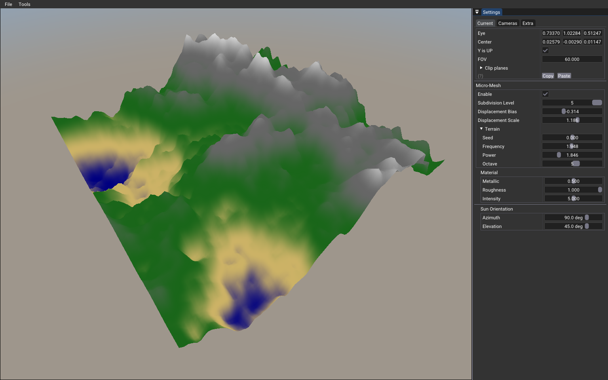
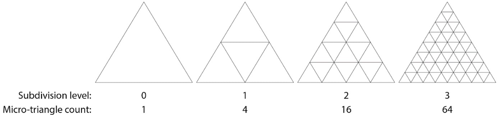
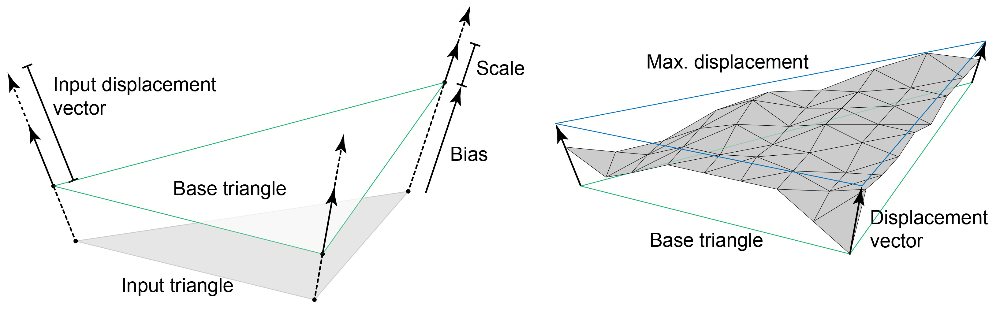
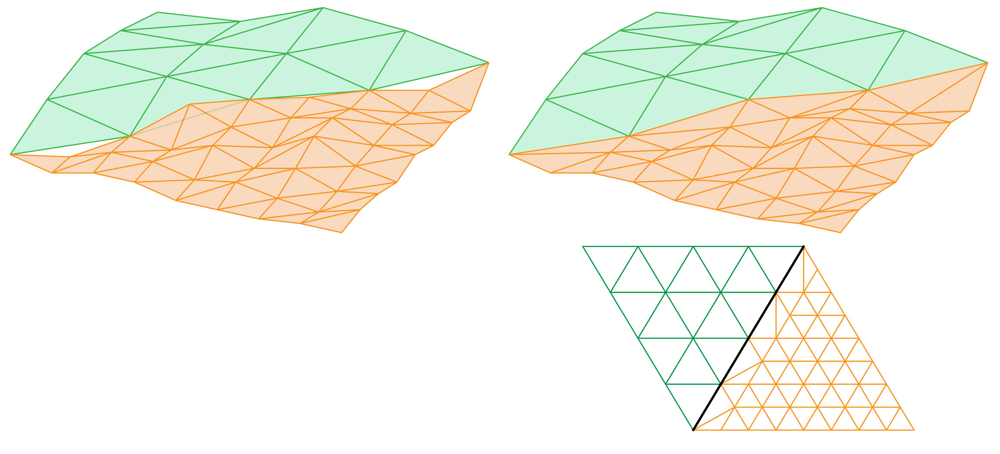

# Micro-Mesh Displacement

_**Micro-mesh displacement**_ adds high-resolution geometric detail to meshes, compactly and efficiently. Micro-mesh displacement subdivides each _base triangle_ to a certain _subdivision level_, and uses _displacement values_ to move vertices along _directions_ (which are interpolated from the base triangle's vertices). Renderers can provide other information, such as a _bias and scale_ buffer, and _primitive flags_ (which allow watertight joining of triangles with different subdivision levels).

## Displacement Values

Displacement _values_ specify how far to displace each micro-vertex from the base of the triangle, or the base of the bounding triangle volume.  The number of values corresponds to the level of subdivision.

### Table of Subdivision

| Level | Triangles | Vertices  |
|-------| --------- | --------  |
| 0     | 1         | 3         |
| 1     | 4         | 6         |
| 2     | 16        | 15        |
| 3     | 64        | 45        |
| 4     | 256       | 153       |
| 5     | 1024      | 561       |

Triangle = `4^level`
Vertices = `(2^level + 1) * (2^level + 2) / 2 `

Values must be packed or compressed. Up to level 3, the block format must be `VK_DISPLACEMENT_MICROMAP_FORMAT_64_TRIANGLES_64_BYTES_NV` and all displacement values of a triangle are packed in an array of 11 bits. This means that up to 64 triangles will be packed in 64 bytes. Level 4 and higher can also use this format, but multiple blocks of 64 triangles must be created (`VK_DISPLACEMENT_MICROMAP_FORMAT_64_TRIANGLES_64_BYTES_NV` allows up to subdivision 3).

For a higher level than 3, lossy compression of the values in the other block formats must be performed to achieve better memory footprint. The Micro-mesh SDK provides functions to perform this form of packaging.

## Direction Vectors

Direction vectors are the directions from which the displacement values will be multiplied. Note that the direction vectors aren't normalized. 

There are typically 3 direction vectors per triangle. 

## Bias and Scale

The position bias and displacement vector scale are optional, but they add some additional control over the displacement range. The biased base vertices and the scaled displacement vectors together define a bounding prismoid containing the possible displacements, with the minimum and maximum displacements each forming a triangle cap. 

When provided, there must be 3 tuple bias-scale per triangle.

## Edge Decimation

When two triangles sharing an edge have different subdivision levels, the edge must be flagged to tell the triangle with the higher level to reduce the subdivision of that edge to avoid cracks.  When adjacent base triangles have different subdivision levels, the number of segments on the shared edge will differ by a factor of 2. This introduces T-junctions which introduce cracking, as illustrated in the left image. In order to maintain water-tightness across varying resolutions, a stitching pattern is used along the edge of the higher resolution triangles, as shown to the right.

## VkMicromapUsageEXT

The _micromap usage_ can be seen as a histogram of the kinds of encoding formats and subdivision levels used for the micromap. The application must provide an array of `VkMicromapUsageEXT` structs; each struct tells how many triangles (`count`) use a specific subdivision level (`subdivisionLevel`) and encoding format (`format`).

The `VkMicromapUsageEXT` array is used to find the build size of the `VkMicromapEXT` and to construct the bottom-level acceleration structure.

## VkMicromapTriangleEXT

The micromap triangles are provided when constructing the `VkMicromapEXT`. There is one `VkMicromapTriangleEXT` per mesh triangle and each should provide the offset from the beginning of the packed/compressed values array, as well as the subdivision level for that triangle and the encoding format (`VkDisplacementMicromapFormatNV`).

For a subdivision up to level 3, the format `VK_DISPLACEMENT_MICROMAP_FORMAT_64_TRIANGLES_64_BYTES_NV` can be use and the `dataOffset` will be a multiple of 64 bytes.

## VkMicromapEXT

The micromap is the opaque structure that is built using the packed/compressed data, the information of each triangle (`VkMicromapTriangleEXT`), and the usage (`VkMicromapUsageEXT`).

The construction of of the Micromap is similar to the construction of the acceleration structure. First it is needed to find the size required for building the object. A Micromap size and a build scratch size are returned from `vkGetMicromapBuildSizesEXT`.  The size will be returned using the information from the array of `VkMicromapUsageEXT`. 

When creating the micromap buffers, they must have this usage flag: `VK_BUFFER_USAGE_MICROMAP_STORAGE_BIT_EXT` and also `VK_BUFFER_USAGE_STORAGE_BUFFER_BIT` for scratch buffers.

The Micromap is created by calling `vkCreateMicromapEXT` using the Micromap buffer, and building the Micromap is done by calling `vkCmdBuildMicromapsEXT` with the scratch buffer, the data and the triangle information.

## GPU Construction Check List

This section shows what must be added to a typical ray tracing application to render micro-mesh support. 

***

* **Create the Micromap**
	* Create a buffer with the packed/compressed displacement values
	* Create an array of `VkMicromapUsageEXT`
	* Create an array of `VkMicromapTriangleEXT`
	* Find Micromap and scratch buffer sizes
	* Create Micromap and scratch buffers
	* Create Micromap
	* Build Micromap
***
* **Create information Buffers**
	* Create a buffer of displacement vectors
	* Create a buffer of bias-scale
	* Create a buffer of primitive flags (edge decimation)
***
*  **Attach info to bottom-level-acceleration-structure**
	* Create a structure of `VkAccelerationStructureTrianglesDisplacementMicromapNV`
	* Set the data with the information created above: `VkMicromapEXT`, `VkMicromapUsageEXT`, displacement vectors, bias and scale, and primitive flags.
	* Set  `pNext` of `VkAccelerationStructureGeometryTrianglesDataKHR` to the created structure.
	

