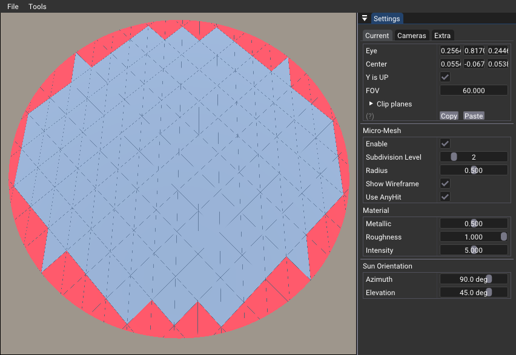
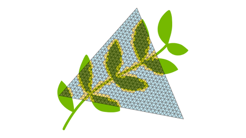

# Opacity Micro-Map

With Opacity Micro-map, it is possible to encode visibility to smaller portion of the triangle.

In the above picture, the blue triangles are flaged opaque, the red ones are flaged *transparent unknown* and the ones we don't see are flagged transparent. This allows to invoke the AnyHit shader only for the unknown state triangles.

## Sample

There are `4^subdivision` triangles for a specific subdivision level. For each triangle index, there is a function (`BirdCurveHelper::micro2bary`) that is returning the tripplet of barycentric coordinates. With those values, it is possible to project the base triangle information. In this sample, we find the world position of the micro-triangle and check if the triangle is outside , inside or crossing the radius.

The values stored are either a 2-states (1 bit) or 4-states (2-bits), telling if the triangle is opaque, transparent or unknown. We create a buffer holding all values for each triangle of the mesh. There is also a buffer of `VkMicromapTriangleEXT` telling where each triangle find its data in the value buffer, and finaly an index buffer, telling which `VkMicromapTriangleEXT` is used by the mesh triangle. For the latest, since we aren't reusing triangle data, the index is simply a continuoius array of `0, 1, 2, 3, 4, .. number of triangles`. With all those informations, we can build the `VkMicromapEXT`.

To the BLAS, we will attach the micromap information. This is done by filling the `VkAccelerationStructureTrianglesOpacityMicromapEXT` and attaching it to the `pNext` of `VkAccelerationStructureGeometryTrianglesDataKHR`.

## Opacity-MicroMap-SDK

    
    

The [Opacity Micro-Map SDK](https://github.com/NVIDIAGameWorks/Opacity-MicroMap-SDK/tree/main) automates the conversion of existing assets into a format that improves ray tracing performance. It analyzes existing textures and geometry to create optimized data, which can be done at runtime or offline depending on your needs. The choice between CPU and GPU conversion depends on factors like your workflow and hardware.

The SDK is designed to be flexible and easy to integrate into your existing pipeline. It can be used with any ray tracing application, and it supports a wide range of hardware and software configurations. The SDK is also designed to be easy to use, with a simple API that makes it easy to integrate into your existing workflow.

