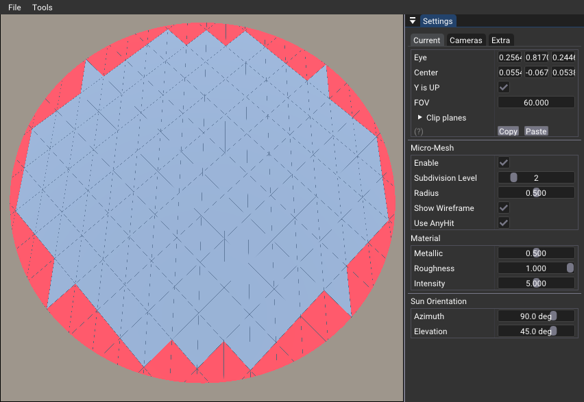
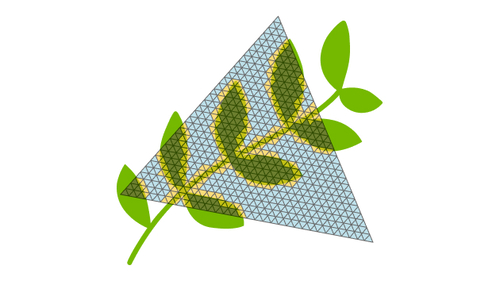

# Opacity Micro-Map in Vulkan

## Overview

This sample demonstrates the implementation of Opacity Micro-Maps in Vulkan for efficient ray tracing.

## Key Concepts

- Encodes visibility for triangle sub-regions
- Triangle classification: opaque (blue), transparent unknown (red), transparent (invisible)
- Selective AnyHit shader invocation based on opacity state

## Implementation Details

### Micro-Triangle Generation
- `4^subdivision` triangles per subdivision level
- Barycentric coordinate mapping using `BirdCurveHelper::micro2bary`
- World position projection for radius-based classification

### Data Structures
1. Value Buffer: 2-state (1-bit) or 4-state (2-bit) opacity encoding
2. `VkMicromapTriangleKHR` Buffer: Maps triangles to value buffer data
3. Index Buffer: Continuous array for `VkMicromapTriangleKHR` indexing
4. Micromap object: `VkMicromapEXT` (EXT path) or `VkAccelerationStructureKHR` (KHR path)

### BLAS Integration
- EXT path: `VkAccelerationStructureTrianglesOpacityMicromapEXT` chained via `pNext`
- KHR path: `VkAccelerationStructureTrianglesOpacityMicromapKHR` chained via `pNext`

## VK_KHR_opacity_micromap Support

The sample supports both `VK_EXT_opacity_micromap` (original NV extension) and `VK_KHR_opacity_micromap` (the promoted KHR standard). At startup the sample requests both; KHR is preferred when available, with EXT as a fallback for drivers that do not yet expose the KHR extension.

### Architectural difference

The two extensions differ fundamentally in how the micromap object is built and referenced:

| | `VK_EXT_opacity_micromap` | `VK_KHR_opacity_micromap` |
|---|---|---|
| Micromap handle | `VkMicromapEXT` | `VkAccelerationStructureKHR` |
| Create function | `vkCreateMicromapEXT` | `vkCreateAccelerationStructure2KHR` |
| Build function | `vkCmdBuildMicromapsEXT` | `vkCmdBuildAccelerationStructuresKHR` |
| Geometry type | *(dedicated API)* | `VK_GEOMETRY_TYPE_MICROMAP_KHR` |
| AS type | *(dedicated API)* | `VK_ACCELERATION_STRUCTURE_TYPE_OPACITY_MICROMAP_KHR` |
| Geometry data | `VkMicromapBuildInfoEXT` | `VkAccelerationStructureGeometryMicromapDataKHR` via `pNext` |
| BLAS attachment | `VkAccelerationStructureTrianglesOpacityMicromapEXT` | `VkAccelerationStructureTrianglesOpacityMicromapKHR` |

### KHR-specific spec rules (validation gotchas)

When using the KHR build path, several rules differ from a regular BLAS build:

- **`VK_KHR_device_address_commands`** must also be requested — it is a required dependency of `VK_KHR_opacity_micromap`.
- **`vkGetAccelerationStructureBuildSizesKHR`**: `pMaxPrimitiveCounts` must be `NULL` (size is derived from the usage counts on the geometry `pNext` chain).
- **`vkCreateAccelerationStructure2KHR`** (not `vkCreateAccelerationStructureKHR`) is required for `VK_ACCELERATION_STRUCTURE_TYPE_OPACITY_MICROMAP_KHR`; it takes a `VkDeviceAddressRangeKHR` instead of a `VkBuffer`.
- **`vkCmdBuildAccelerationStructuresKHR`**: `ppBuildRangeInfos` must be a valid pointer, but `ppBuildRangeInfos[i]` must be `NULL` for micromap geometry entries.
- **Input buffers** (`data`, `triangleArray`) must be created with `VK_BUFFER_USAGE_ACCELERATION_STRUCTURE_BUILD_INPUT_READ_ONLY_BIT_KHR`, not only the EXT micromap bit.

## Opacity-MicroMap-SDK

    
    

### Features
- Automated asset conversion for ray tracing optimization
- Texture and geometry analysis
- Runtime or offline processing capabilities
- CPU and GPU conversion options

### Integration
- Compatible with various ray tracing applications
- Flexible API for pipeline integration
- Supports diverse hardware and software configurations

[SDK Repository](https://github.com/NVIDIAGameWorks/Opacity-MicroMap-SDK/tree/main)

