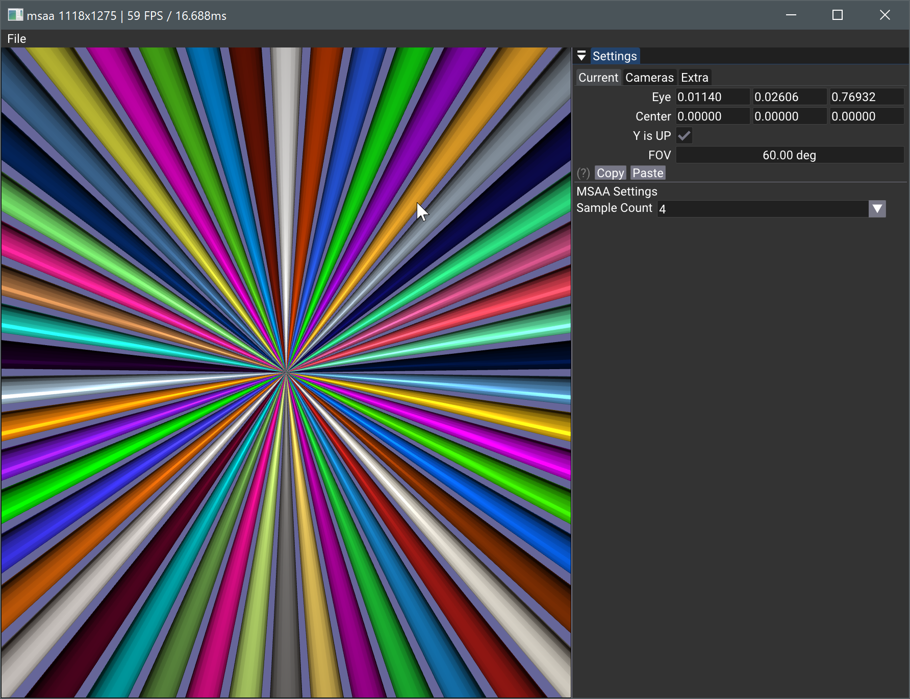

# Multi-Sample Anti-Aliasing (MSAA) in Vulkan



## Overview

This sample demonstrates the implementation of Multi-Sample Anti-Aliasing (MSAA) in Vulkan.

## Key Components

### MSAA G-Buffers
- Created in `createMsaaBuffers()`
- Dynamically recreated on image size or `VkSampleCountFlagBits` changes

#### Image Usage Flags
- Color: 
  ```c
  VK_IMAGE_USAGE_TRANSIENT_ATTACHMENT_BIT | VK_IMAGE_USAGE_COLOR_ATTACHMENT_BIT
  ```
- Depth:
  ```c
  VK_IMAGE_USAGE_TRANSIENT_ATTACHMENT_BIT | VK_IMAGE_USAGE_DEPTH_STENCIL_ATTACHMENT_BIT
  ```

### Non-MSAA G-Buffer
- Required for display (MSAA textures cannot be directly attached/displayed)
- Target for MSAA image resolution

## Rendering Pipeline

### `onRender(cmd)` Process
1. Utilizes dynamic rendering
2. Attaches G-Buffer as target
3. For MSAA:
   - Attaches multi-sampled image
   - Attaches G-Buffer as resolve image

## Technical Considerations
- MSAA images require resolution to non-MSAA G-Buffer for display
- Dynamic recreation of MSAA buffers ensures adaptability to runtime changes

## References

- [Khronos Vulkan Samples - MSAA Tutorial](https://github.com/KhronosGroup/Vulkan-Samples/blob/master/samples/performance/msaa/msaa_tutorial.md)
- [Vulkan Tutorial - Multisampling](https://vulkan-tutorial.com/Multisampling)
- [Sascha Willems Vulkan Examples - Multisampling](https://github.com/SaschaWillems/Vulkan/blob/master/examples/multisampling/multisampling.cpp)
