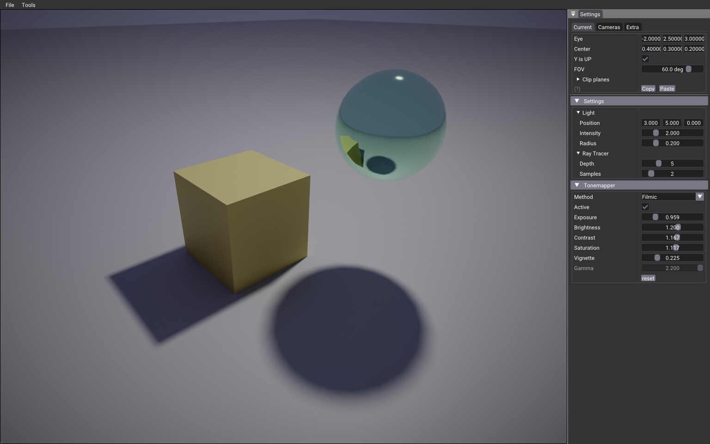

# Ray Query

In Vulkan, ray queries are a feature of the ray tracing extension [VK_KHR_ray_query](https://registry.khronos.org/vulkan/specs/1.3-extensions/man/html/VK_KHR_ray_query.html) introduced in Vulkan 1.2. Ray queries provide a way to perform intersection tests between rays and geometry directly on the GPU. This feature is particularly useful for applications that require efficient ray tracing, such as real-time rendering, ray-based physics simulations, and more.

The process of performing a ray query involves several steps:

1. Create a ray query acceleration structure: This structure represents the scene's geometry and allows for efficient traversal and intersection testing. It is constructed using the bottom-level and top-level acceleration structures, which describe the geometry and the hierarchy of objects, respectively.

2. Dispatch ray queries: Specify the origin and direction of the rays you want to test. You can dispatch a single ray query or a batch of ray queries simultaneously.

3. Process ray queries: The GPU performs ray traversal and intersection testing against the acceleration structure. This determines whether each ray intersects any objects in the scene.

4. Retrieve intersection results: After the ray queries are processed, you can obtain information about the intersections, such as the closest hit point, the surface normal, or the distance to the intersection point.

Ray queries provide additional capabilities compared to traditional ray tracing pipelines in Vulkan. They offer more flexibility and control by allowing you to selectively enable or disable certain intersection tests. For example, you can skip testing for shadows if you are only interested in primary ray intersections. This can help improve performance by reducing unnecessary computations.

Overall, ray queries in Vulkan enable efficient and powerful ray tracing capabilities, making them a valuable tool for various applications that require accurate intersection testing between rays and geometry.

