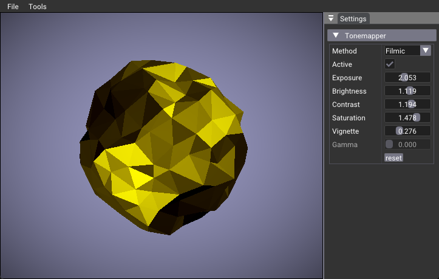

# Ray Query Position Fetch

This example is similar to the `ray_tracing_position_fetch' sample, but instead of using the raytracing pipeline, the triangle positions are retrieved in a compute shader after a [ray query](https://registry.khronos.org/vulkan/specs/1.3-extensions/man/html/VK_KHR_ray_query.html) call. 

In this example, the information about the position of the triangle is used to generate the geometric normal and to apply the shading. The animation is done by modifying and rebuilding the Top-Level Acceleration Structure (TLAS) matrix. 