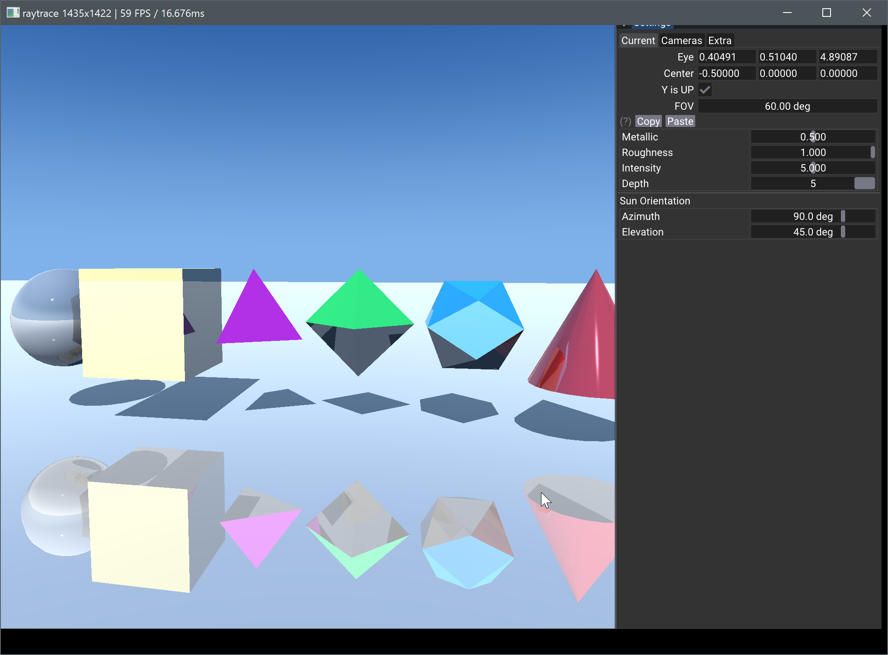

# Vulkan Raytracing Implementation

## Overview

This sample demonstrates basic raytracing in Vulkan, featuring GGX shading, shadows, and reflections.

## Descriptor Heap

Resources are bound **bindless** through [`VK_EXT_descriptor_heap`](https://registry.khronos.org/vulkan/specs/latest/man/html/VK_EXT_descriptor_heap.html) via `nvvk::DescriptorHeap`, instead of descriptor sets. This is the reference for descriptor heaps on a **ray-tracing pipeline**: ray-tracing stages cannot be shader objects, so the `VkRayTracingPipeline` opts in with `VK_PIPELINE_CREATE_2_DESCRIPTOR_HEAP_BIT_EXT` and is created with `layout == VK_NULL_HANDLE` (no `VkPipelineLayout`); push data is sent with `vkCmdPushDataEXT`.

The output storage image and the scene-info buffer are written into the heap. The **TLAS is not stored in the heap** — it is passed by device address in the push data and turned into an acceleration structure in-shader via `RaytracingAccelerationStructure(address)`. See the [`descriptor_heap`](../descriptor_heap/) sample for the concept in depth, and [`simple_polygons`](../simple_polygons/) for the same idea on a raster pipeline.

## Key Components

### `onAttach()` Method
- Initializes utility classes for:
  - Top-Level Acceleration Structure (TLAS)
  - Bottom-Level Acceleration Structure (BLAS)
  - Shading Binding Table (SBT)
- Scene creation and buffer uploading
- Acceleration structure generation
- Ray tracing pipeline setup

### `onUIRender()` Method
- UI rendering
- Full viewport image display

### `onRender(cmd)` Method
- Frame information buffer updates
- `vkCmdTraceRaysKHR` invocation

## Implementation Details

1. **Scene Creation**: `createScene()`
2. **Vulkan Buffer Generation**: `createVkBuffers()`
3. **Acceleration Structures**:
   - BLAS: `createBottomLevelAS()`
   - TLAS: `createTopLevelAS()`
4. **Pipeline Creation**: `createRtPipeline()`
   - Shader attachment (raygen, miss, closest-hit)

## Technical Considerations
- Optimization of acceleration structure updates
- Efficient SBT management
- Performance tuning for real-time raytracing

## Note
For global illumination implementations, refer to the `gltf_viewer` sample.