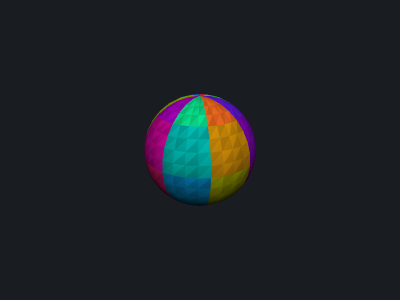
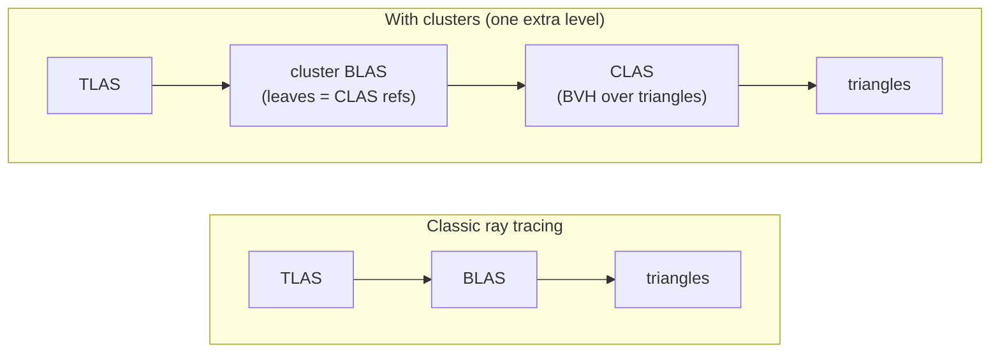
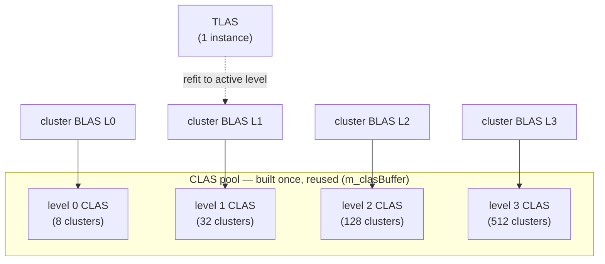

# Cluster Acceleration Structures (CLAS)

A minimal introduction to **Cluster Acceleration Structures**
(`VK_NV_cluster_acceleration_structure`), with a simple cluster-based
**level of detail (LOD)**. CLAS are the building block behind mega-geometry /
LOD-cluster ray tracing; this sample strips the idea down to the essentials.

## What it does

A sphere is generated at several **levels of detail**, and each level is split into
small contiguous triangle patches — the **clusters**. At startup the sample:

1. Builds **all** the clusters of **all** levels into **CLAS**
   (`vkCmdBuildClusterAccelerationStructureIndirectNV`,
   `opType = BUILD_TRIANGLE_CLUSTER`) — one time — assigning each a `clusterID`.
2. Builds **one cluster bottom-level AS per level**
   (`opType = BUILD_CLUSTERS_BOTTOM_LEVEL`), each referencing that level's CLAS.

Every frame it picks a level from the **camera distance** (or a manual override in
the UI) and points a regular **top-level AS** at that level's cluster BLAS, then ray
traces. The TLAS is built once with `ALLOW_UPDATE` and then **refit** (updated in
place) when the level changes — the instance count never changes, only which BLAS the
single instance references, so a cheap refit is enough (no destroy/rebuild). Move
closer and the level rises, so **more, finer clusters appear** (8 → 32 → 128 → 512 for
the four levels here). This "build the clusters once, compose a BLAS from a chosen
subset" pattern is exactly why CLAS exists.

On a hit, the closest-hit shader reads the per-hit **cluster ID** and colorizes the
surface, so the cluster decomposition is directly visible. Toggle *Color by cluster*
to compare with plain shading; use the *LOD selection* dropdown to force a level. A
subtle per-triangle brightness variation (from `PrimitiveIndex`, the triangle's index
**within its cluster**) makes the individual triangles inside a cluster visible too.

## How CLAS and the BLAS fit together

There are **two** acceleration structures below the TLAS, not one:

- A **CLAS** is a complete little BVH **over the triangles** of one cluster
  (`BUILD_TRIANGLE_CLUSTER`). This is where the triangle-level acceleration data lives.
  Each CLAS has its own device address. → `m_clasBuffer`, addresses in `m_clasAddressBuffer`.
- A **cluster BLAS** is a *real* BLAS with its own storage and device address (the one
  the TLAS instance references), **but its leaves are references to CLAS**, not triangles
  (`BUILD_CLUSTERS_BOTTOM_LEVEL`, input = a list of CLAS addresses). → `m_clusterBlasBuffer`.

So the traversal gains one level of indirection versus classic ray tracing:

The cluster BLAS is **not** "the CLAS concatenated together" — it is a separate, thin
structure that *indexes* them (a table of contents that says "this object is made of
CLAS #A, #B, #C…"). We really do build it; the input just happens to be CLAS references
instead of vertices/indices. And a TLAS instance can only reference a *BLAS*, so this
BLAS is also the adapter that makes a bag of CLAS look like one object the TLAS can
point at.

**Why split it this way:** CLAS are built **once** (the expensive triangle-BVH work),
and the cluster BLAS is **cheap to (re)build** because it only gathers pointers. That is
what makes per-frame LOD / streaming affordable — you re-assemble a BLAS from a chosen
subset of the already-built CLAS without ever touching triangles. In classic RT,
changing a BLAS means reprocessing all its triangles.

In this sample the CLAS for every level are built once into a shared pool, and each
level's cluster BLAS references that level's slice of the pool. The single-instance
TLAS is refit to point at whichever level is active:

A production renderer would instead build **one** BLAS per frame from a *mix* of CLAS
taken from different levels of the pool (per-cluster LOD) — see below.

### Can one BLAS mix CLAS from different levels?

**Yes.** The `clusterReferences` list can point at any CLAS from the shared pool, in any
mix — e.g. fine (level 3) CLAS for the front patches and coarse (level 0) CLAS for the
back. That is exactly how production per-cluster LOD works: each frame, per cluster,
pick a detail level by screen-space error, collect those CLAS addresses, and **rebuild
the (cheap) cluster BLAS** from the mixed list (the CLAS never change). This sample only
uses one level at a time to stay minimal, but the mechanism is identical.

**The catch — cracks.** Putting a fine cluster next to a coarse one leaves mismatched
edges (T-junctions) → visible holes. In *this* sample mixing levels **would** crack,
because each level is an independent UV-sphere tessellation with no shared boundary
vertices. Production systems (Nanite; `vk_lod_clusters` via meshoptimizer) avoid this by
building a **boundary-locked cluster LOD hierarchy (DAG)**: shared group edges are
preserved across levels and whole groups are switched together, so adjacent selected
clusters always share matching edges. That boundary-locked simplification is the genuinely
hard part of a cluster-LOD system, and it is what this minimal sample deliberately omits.

## Key points

- CLAS by itself is **not** LOD — it's the mechanism. The LOD here (select a level,
  swap which cluster BLAS the TLAS references) is a thin layer on top. The production-
  scale version of this idea is the `vk_lod_clusters` sample (streaming + screen-space
  error + per-frame BLAS rebuild).
- Both CLAS and cluster-BLAS builds use `IMPLICIT_DESTINATIONS`: the driver
  sub-allocates each output AS from one storage blob and writes the resulting device
  addresses into an array we provide (CLAS addresses feed straight into the BLAS build,
  entirely on the GPU).
- Per-cluster vertices are local `vec3` lists with **8-bit** indices, so each cluster
  stays within the 256-vertex limit.
- The pipeline must be created with
  `VkRayTracingPipelineClusterAccelerationStructureCreateInfoNV{ allowClusterAccelerationStructure = VK_TRUE }`
  for the cluster-ID built-in to be valid.
- Reading the cluster ID:
  - **Slang** (primary): inline SPIR-V (`spirv_asm { ... OpLoad builtin(ClusterIDNV:int) }`).
  - **GLSL** (fallback, `#define USE_SLANG false`): `gl_ClusterIDNV_` declared via
    `GL_EXT_spirv_intrinsics`.

The interesting host code is `buildClusterAccelerationStructures()` (build) and
`setLevel()` / `selectLod()` (LOD); everything else follows the `ray_trace` /
`ray_query` samples.
