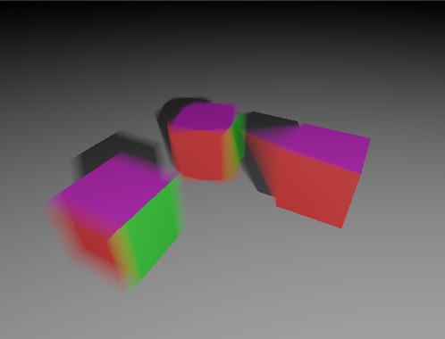

# Raytrace Motion Blur


This example shows 3 different motion blur methods: Matrix, SRT and Object.

For a quick search, look for `#NV_Motion_blur` in the code.


## How to use Raytraced Motion Blur

### Extension

The `VK_NV_ray_tracing_motion_blur` extension must be enabled along with the `VkPhysicalDeviceRayTracingMotionBlurFeaturesNV` property, where `rayTracingMotionBlur` must be true. In this framework, the extension feature structures are always filled with the capabilities of the GPUt, so values aren't set.

### Top-Level Acceleration Structure

In the top level acceleration structure, this is where we can define the MATRIX and SRT motion. 

First we have to store the information in a `VkAccelerationStructureMotionInstanceNV` structure. Unfortunately, the structure doesn't have the 160 byte stride it needs, so we add padding to it. 

As you can see in the `createTopLevelAS()` function, the two motion methods are fairly self-explanatory. There is one transformation at time 0 and one at time 1. In the shader we can trace a ray at time _t_ and these transformations will be linearly interpolated.

For static objects, they have to go through the same motion structure, but they are marked with `VK_ACCELERATION_STRUCTURE_MOTION_INSTANCE_TYPE_STATIC_NV`.

Note that for object deformation, the instance can be static, it is the bottom-level acceleration structure that describes the deformation.

### Bottom-Level Acceleration Structure

For deformation motion, the bottom-level acceleration structure must reference two objects, the one at time 0 and the one at time 1. The default is time 0, so adding the one at time 1 is done using the `VkAccelerationStructureGeometryMotionTrianglesDataNV` structure. The `pNext` of the geometry triangle must point to the additional information. See the details in `createBottomLevelAS()`. 

### Pipeline

Note that the raytracing pipeline must also have a flag set in `VkRayTracingPipelineCreateInfoKHR`.
```
ray_pipeline_info.flags = VK_PIPELINE_CREATE_RAY_TRACING_ALLOW_MOTION_BIT_NV
```


### Shader

The shader can call `traceRayMotionNV` to trace rays with a specific time. This is similar to `traceRay`, only an extra parameter has been added to express the time to sample. In this example the time is chosen randomly.

Note that the shader must have the extension
```
#extension GL_NV_ray_tracing_motion_blur : require
```