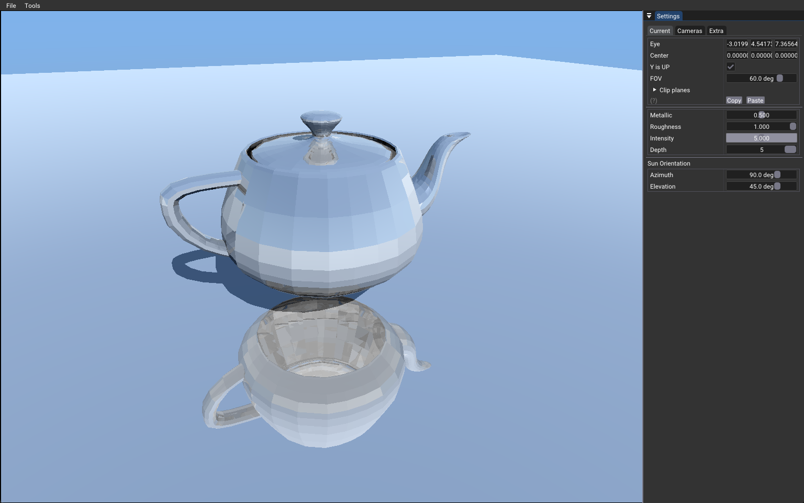

# Position Fetch



Only the information provided by the acceleration structure is used to raytrace an object. The positions are fetched and the geometric normal is calculated from them. All buffers used to create the acceleration structures are deleted before rendering. This makes the rendering extremely lightweight.

You can find more information on VK_KHR_ray_tracing_position_fetch in this blog: https://www.khronos.org/blog/introducing-vulkan-ray-tracing-position-fetch-extension

## Implementation

As usual, follow the `#FETCH` for what is specific to the sample.

### createBottomLevelAS()

The flag `VK_BUILD_ACCELERATION_STRUCTURE_ALLOW_DATA_ACCESS_KHR` needed to be added to the bottom acceleration structure.

### main()

And the following extention was needed too:

```
 VkPhysicalDeviceRayTracingPositionFetchFeaturesKHR fetchFeatures{VK_STRUCTURE_TYPE_PHYSICAL_DEVICE_RAY_TRACING_POSITION_FETCH_FEATURES_KHR};
  spec.vkSetup.addDeviceExtension(VK_KHR_RAY_TRACING_POSITION_FETCH_EXTENSION_NAME, false, &fetchFeatures);  // #FETCH
```

### raytrace.chit

In the shader we are using `gl_HitTriangleVertexPositionsEXT[n]` to retrieve the 3 triangle positions.

