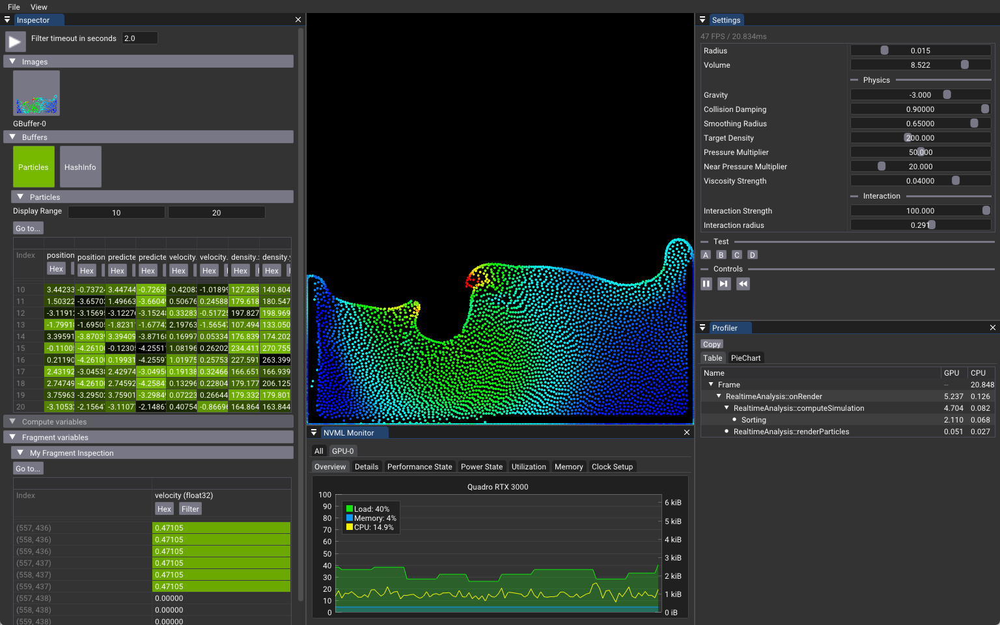
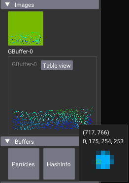
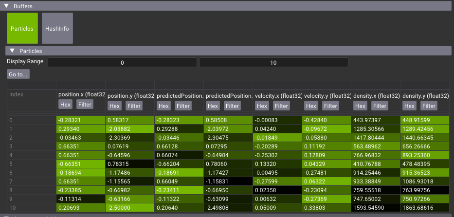
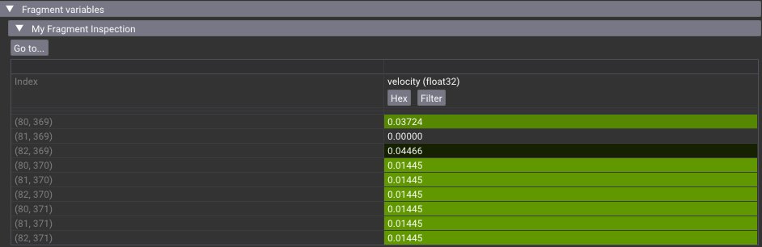
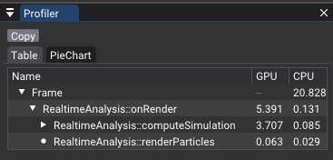
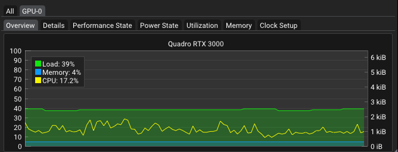

# Realtime Analysis

This example shows different tools to inspect data on the GPU while the application is running.

The inspection tools are non-intrusive to the application, meaning that they don't need to know the internal structures of the data, but are used and initialized using straight Vulkan objects.

## Inspector: 

The Inspector element is used to visualize data on the GPU in real-time.
This helps to inspect data stored in buffers, images, or just to inspect a variable in a fragment or compute shader.

### Images

The inspector can grab the image at any point in the rendering and in the example we inspect the GBuffer. The values at each pixel can then be inspected.

### Buffers

The inspector can display the values in buffers. The example inspects two buffers, one that contains all particles, and the other that is used for the sorting of the particles. The image above shows the values of the Particle Struct, information that we provide when initializing the Buffer Inspector.

### Fragment

This shows the live output of a variable in the fragment shader that we want to examine. In the example we are looking at 2x2 pixels around the mouse cursor, and the values for each pixel are displayed.

To see where and how it is used, look for `#INSPECTOR`
 
## Profiler: 

The profiler element gets the time it took to perform some operations on the GPU. 
The profiler is scoped in functions and can be nested. In the image above we can see the two functions in `onRender` and their respective times.

Look for `#PROFILER` in the code

## NVML Monitor: 

It is application-independent and provides real-time GPU status.
Information such as memory usage, GPU utilization, and many other metrics.
 