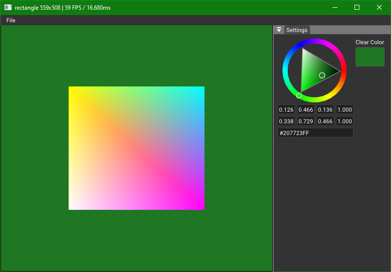

# Rectangle

This sample looks like `solid_color`, but in this one a simple quad will be render using vertex and fragment shaders. 

When we add the `RectangleSample` to the `nvvk::Application`, the `onAttach(app)` method of `RectangleSample` is called. As with `solid_color`, we create an instance of the allocator and a utility to debug and view our named resources in Nsight Graphics. We also create the pipeline (`createPipeline()`) which has information about how things will be rendered, and we create in `createGeometryBuffers()` the vertice and index buffers that define the rectangle. 

The `onResize(w,h)` will take care of creating the GBuffer, in which the rectangle will be rendered. The color format is set to `VK_FORMAT_R8G8B8A8_UNORM`, and the depth format is queried to get the best from the current physical device. The GBuffer image is displayed in `onUIRender()`, as mentioned in `solid_color`, the rendering is done in GBuffers and the result is displayed using ImGui. We never draw directly on the swapchain in the samples. 

In `onRender()`, we are using the [Vulkan Dynamic Rendering](https://github.com/KhronosGroup/Vulkan-Docs/blob/main/proposals/VK_KHR_dynamic_rendering.adoc) and attach the Gbuffer color and depth, following the rendering of the primitive.
