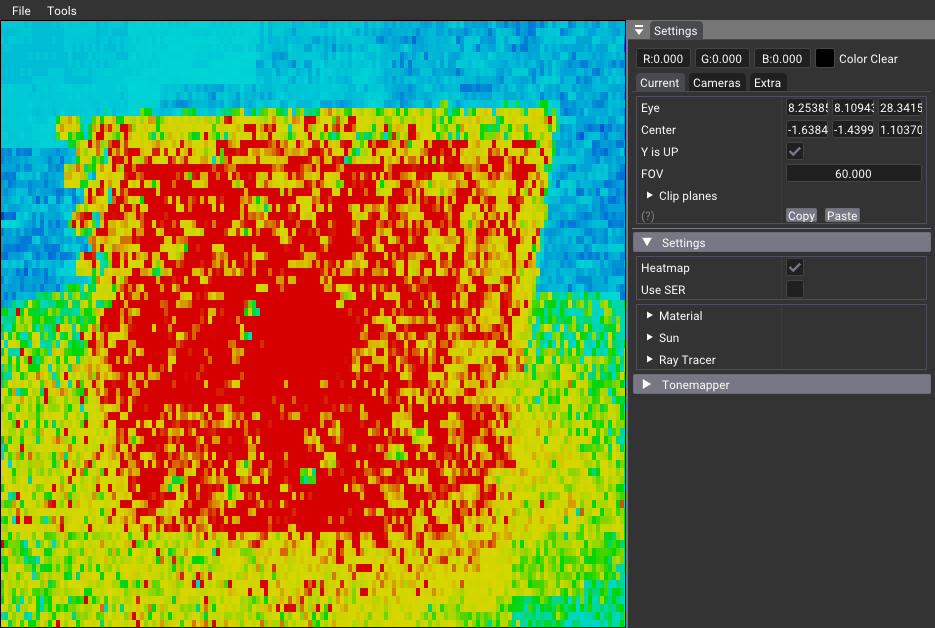
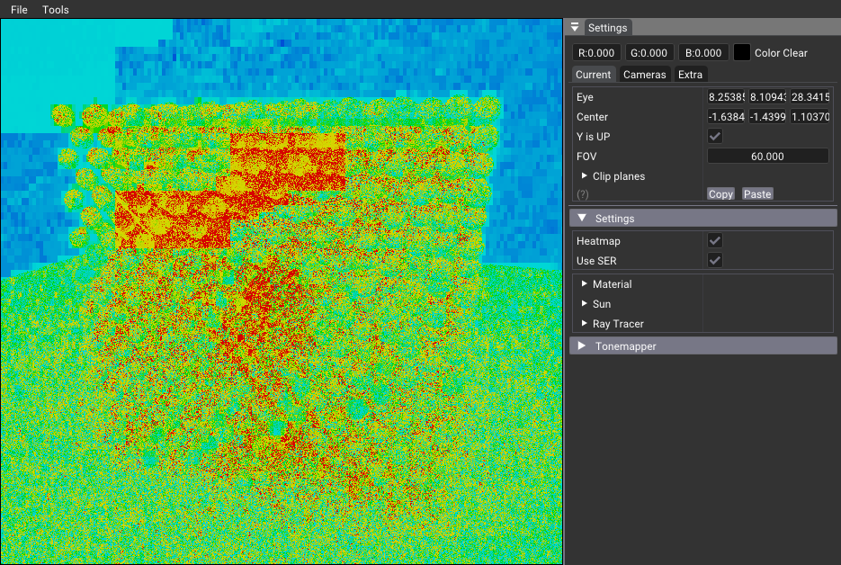

# Shading Execution Reorder (SER) Implementation

Shading Execution Reorder (SER) is an advanced GPU optimization technique that allows fine-grained control over the scheduling of ray tracing operations. By intelligently reordering shader invocations, SER significantly reduces both execution and data divergence, leading to improved performance in ray tracing applications.

For a comprehensive understanding of SER, refer to NVIDIA's [technical whitepaper](https://developer.nvidia.com/sites/default/files/akamai/gameworks/ser-whitepaper.pdf).

## Implementation Details

### Main Application (`main()`)

To enable SER functionality, the following modification has been made:

- Added the `VK_NV_ray_tracing_invocation_reorder` extension to the Vulkan instance creation process.

### Ray Generation (RGEN) Shader

The RGEN shader has been modified to implement SER:

- Reordering logic is based on whether the ray has intersected with the environment or geometry.
- The reordering implementation is encapsulated within the `USE_SER` scope, controlled by a specialization constant variable.

## Performance Analysis

Activation of SER results in a more efficient distribution of execution workloads, as illustrated in the following visualization:

## Slang-Specific Configuration

For implementations using the Slang shader language:

- SER is enabled by default in the shader code.
- To disable SER, modify the `USE_SER` value in `shaders/pathtrace.slang`.