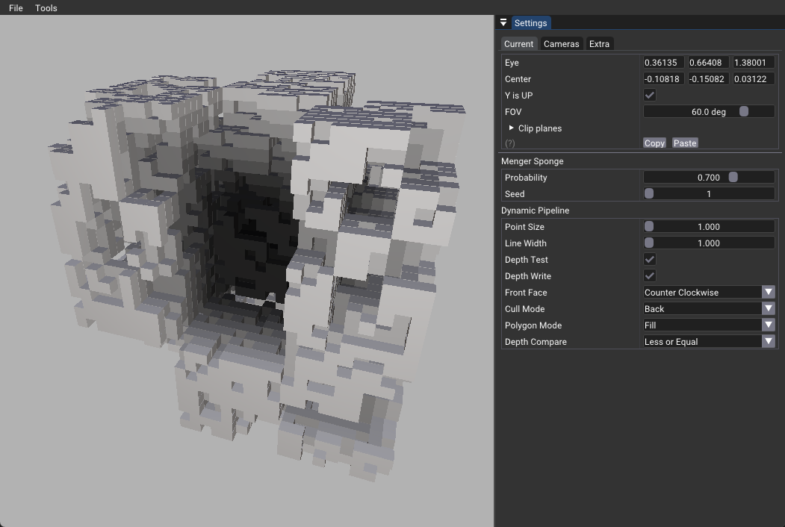

# Shader Object Sample

This sample demonstrates the implementation and usage of Shader Objects as specified in the [Vulkan Shader Object extension](https://registry.khronos.org/vulkan/specs/1.3-extensions/man/html/VK_EXT_shader_object.html). It showcases dynamic value modification without predefined pipelines, offering greater flexibility in shader management.

## Features

1. **Shader Objects**: Implementation of vertex and fragment shader objects.
2. **Dynamic Menger Sponge Generation**: Interactive creation of a [Menger Sponge](https://en.wikipedia.org/wiki/Menger_sponge) variant through user input.
3. **Alternative Memory Allocation**: Utilizes [DeviceMemoryAllocator](https://github.com/nvpro-samples/nvpro_core/tree/master/nvvk#class-nvvkdevicememoryallocator) from nvvk, demonstrating an alternative to AMD's [VMA](https://github.com/GPUOpen-LibrariesAndSDKs/VulkanMemoryAllocator).

> **Note**: To identify shader object-related code changes, search for `#SHADER_OBJECT` in the source files.

## Key Components

### Initialization (`onAttach`)

- Creates descriptor sets
- Generates shader objects for vertex and fragment shaders (see `createShaderObjects()`)
- Omits traditional Vulkan pipeline creation

### Rendering (`onRender`)

Implements a flexible rendering approach:

1. Sets pipeline values individually in `setupShaderObjectPipeline()`
   - Allows dynamic modification of pipeline properties (e.g., line width, polygon mode)
2. Binds vertex and fragment shader objects
   - Unused shader stages are bound with null pointers
3. Possible Additions:
   - Drawing wireframes on top of solid geometry
   - Modifying only necessary properties (e.g., bias offset, polygon mode)
   - Binding different fragment shaders as needed

This method potentially reduces the number of required pipelines and simplifies application architecture, with varying performance impacts across GPU architectures.

