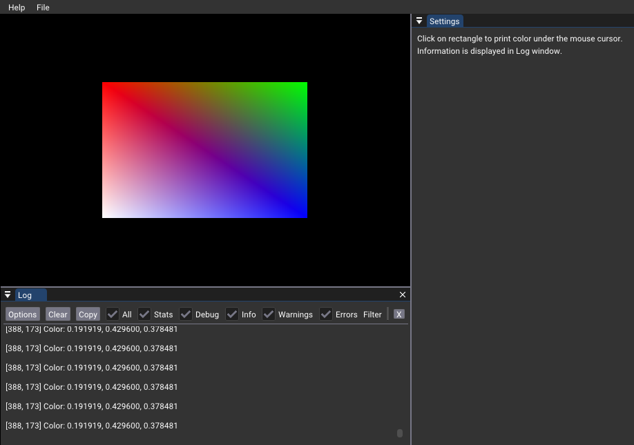

# Debug Printf




## Overview

This sample demonstrates the integration of [Debug Printf](https://github.com/KhronosGroup/Vulkan-ValidationLayers/blob/master/docs/debug_printf.md) into [nvpro-samples](https://github.com/nvpro-samples) applications, enabling in-shader debugging for Vulkan.

Even with the help of a great debugging tool like [Nsight Graphics](https://developer.nvidia.com/nsight-graphics), debugging Vulkan shaders can be very challenging. [Debug Printf](https://github.com/KhronosGroup/Vulkan-ValidationLayers/blob/master/docs/debug_printf.md) feature enables  to put Debug Print statements into shaders to debug them. This sample shows how it is added to [nvpro-sample](https://github.com/nvpro-samples) simple applications.


## Implementation

## Enabling Debug_printf

We are not using the [`VkValidationFeaturesEXT`](https://www.khronos.org/registry/vulkan/specs/1.2-extensions/man/html/VkValidationFeaturesEXT.html) but rather the [validation layers](https://vulkan.lunarg.com/doc/sdk/1.3.275.0/linux/khronos_validation_layer.html). The validation layers need to be provided at the creation of the Vulkan context, and here is how it is done.

````cpp
  // Adding the GPU debug information to the KHRONOS validation layer
  // See: https://vulkan.lunarg.com/doc/sdk/1.3.275.0/linux/khronos_validation_layer.html
  const char*    layer_name           = "VK_LAYER_KHRONOS_validation";
  const char*    validate_gpu_based[] = {"GPU_BASED_DEBUG_PRINTF"};
  const VkBool32 printf_verbose       = VK_FALSE;
  const VkBool32 printf_to_stdout     = VK_FALSE;
  const int32_t  printf_buffer_size   = 1024;

  const VkLayerSettingEXT settings[] = {
      {layer_name, "validate_gpu_based", VK_LAYER_SETTING_TYPE_STRING_EXT,
       static_cast<uint32_t>(std::size(validate_gpu_based)), &validate_gpu_based},
      {layer_name, "printf_verbose", VK_LAYER_SETTING_TYPE_BOOL32_EXT, 1, &printf_verbose},
      {layer_name, "printf_to_stdout", VK_LAYER_SETTING_TYPE_BOOL32_EXT, 1, &printf_to_stdout},
      {layer_name, "printf_buffer_size", VK_LAYER_SETTING_TYPE_INT32_EXT, 1, &printf_buffer_size},
  };

  VkLayerSettingsCreateInfoEXT layerSettingsCreateInfo = {
      .sType        = VK_STRUCTURE_TYPE_LAYER_SETTINGS_CREATE_INFO_EXT,
      .settingCount = static_cast<uint32_t>(std::size(settings)),
      .pSettings    = settings,
  };

  VkContextSettings vkSetup{
      .instanceExtensions    = {VK_EXT_DEBUG_UTILS_EXTENSION_NAME},
      .deviceExtensions      = {{VK_KHR_SWAPCHAIN_EXTENSION_NAME}, {VK_KHR_PUSH_DESCRIPTOR_EXTENSION_NAME}},
      .instanceCreateInfoExt = &layerSettingsCreateInfo,
  };
````

## Shader Integration

1. Enable extension:

````glsl
#extension GL_EXT_debug_printf : enable 
````

2. Use `debugPrintfEXT()` in shader.

````cpp
debugPrintfEXT("HERE");
````

**Note** : String [limitations](https://github.com/KhronosGroup/Vulkan-ValidationLayers/blob/master/docs/debug_printf.md).

## Message Handling

Create a debug messenger with `VK_DEBUG_UTILS_MESSAGE_SEVERITY_INFO_BIT_EXT`:

```
  // Creating the callback
  VkDebugUtilsMessengerEXT           dbg_messenger{};
  VkDebugUtilsMessengerCreateInfoEXT dbg_messenger_create_info{
      .sType           = VK_STRUCTURE_TYPE_DEBUG_UTILS_MESSENGER_CREATE_INFO_EXT,
      .messageSeverity = VK_DEBUG_UTILS_MESSAGE_SEVERITY_INFO_BIT_EXT,
      .messageType     = VK_DEBUG_UTILS_MESSAGE_TYPE_VALIDATION_BIT_EXT,
      .pfnUserCallback = dbgMessengerCallback,
  };
  NVVK_CHECK(vkCreateDebugUtilsMessengerEXT(app->getInstance(), &dbg_messenger_create_info, nullptr, &dbg_messenger));
  ```

Implement a callback to process debug messages:


```
  // Vulkan message callback - for receiving the printf in the shader
  auto dbgMessengerCallback = [](VkDebugUtilsMessageSeverityFlagBitsEXT messageSeverity, VkDebugUtilsMessageTypeFlagsEXT messageType,
                                 const VkDebugUtilsMessengerCallbackDataEXT* callbackData, void* userData) -> VkBool32 {
    // Get rid of all the extra message we don't need
    std::string cleanMsg = callbackData->pMessage;
    cleanMsg             = cleanMsg.substr(cleanMsg.find('\n') + 1);
    nvprintfLevel(LOGLEVEL_DEBUG, "%s", cleanMsg.c_str());  // <- This will end up in the Logger (only if DEBUG is on)
    return VK_FALSE;                   // to continue
  };
  ``` 

  **NOTE** Do not forget to destroy the messenger at the end of the application.

  ```
    // #debug_printf : Removing the callback
  vkDestroyDebugUtilsMessengerEXT(app->getInstance(), dbg_messenger, nullptr);
  ```


## Interactive Debug

We should avoid many printf, more specifically avoiding to be executed once per fragment. By default, the message buffer has a limitation of 1024 bytes. This is quite small and we should be careful not to exceed the buffer size.

Example of the error when exceeding the buffer size.

````
WARNING - Debug Printf message was truncated, likely due to a buffer size that was too small for the message
````

### User Interaction

To limit the amount of debug data to the information under the mouse cursor, in `onUIRender()`, we check if the mouse button is down and set the mouse cordinate, otherwise the value is set to `{-1, -1}`, which cannot be hit. Before printing information in the shader, we check if the current fragment coordinate is equal to the mouse cursor value.

```
  if(fragCoord == ivec2(pushC.mouseCoord))
    debugPrintfEXT("\n[%d, %d] Color: %f, %f, %f\n", fragCoord.x, fragCoord.y, inFragColor.x, inFragColor.y, inFragColor.z);
```

## Logging output

The output goes normaly to the console, but there is a way to forward all the data to another function. 

In `main()` there is a line that is doing this

```
// For logging
nvprintSetCallback([](int /*level*/, const char* fmt) { g_logger.addLog("%s", fmt); });
```  

The variable `g_logger` is a `SampleAppLog` that collects all logs, this was taken from Imgui example. In combination with `LoggerEngine`, it allows to render all logs in a separate Imgui window. To to this, another engine need to be added.

```
  app->addEngine(std::make_unique<LoggerEngine>(true));  // Add logger window
```


## Vulkan Config

Using the [Vulkan Configurator](https://vulkan.lunarg.com/doc/view/1.2.135.0/windows/vkconfig.html), it is possible to overide the size of the printf buffer. Open the configurator, set the values and while it is still open, run sample. The messages can be longer.


## References

* <https://github.com/KhronosGroup/Vulkan-ValidationLayers/blob/master/docs/debug_printf.md>
