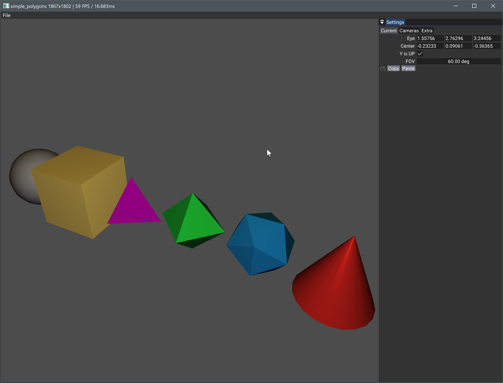

#Simple Polygons

Simple raster example, using a camera, various geometries and instances, basic lighting. 

## onAttach

The `onAttach` function will create the VMA allocator, the scene, a collection of primitives, materials and instances referring the meshes. It creates the Vulkan representation of the scene by creating multiple buffers of vertices and indices in `createVkBuffers` and the pipeline to display.

## onUIRender

Shows the camera widget in the setting window and the rendered image (G-Buffer) is displayed in the viewport window.

## onRender

Render all instance nodes of the scene. 

:warning: We could record a command buffer and execute it instead of looping over all rendering nodes. This would be better, especially with larger scenes.

