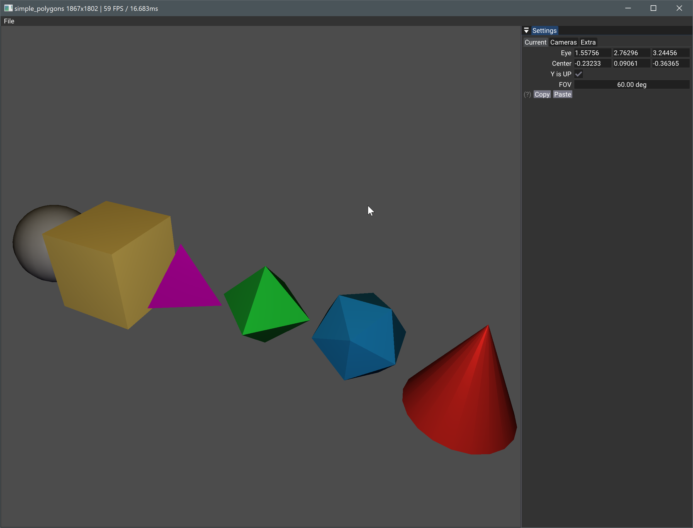

# Simple Polygons

This project demonstrates a basic raster rendering example in Vulkan, featuring:
- Camera manipulation
- Various geometric primitives
- Instance rendering
- Basic lighting model

## Overview

The Simple Polygons sample showcases fundamental 3D graphics concepts using a modern Vulkan implementation. It serves as an educational tool for understanding basic rendering pipelines and scene management.

## Descriptor Heap on a Classic Pipeline

This sample is the repository's reference for [`VK_EXT_descriptor_heap`](https://registry.khronos.org/vulkan/specs/latest/man/html/VK_EXT_descriptor_heap.html) used with a **traditional graphics `VkPipeline`** — no shader objects. The per-frame camera UBO is reached through a bound descriptor heap (`nvvk::DescriptorHeap`) instead of a descriptor set. Everything else about the pipeline is conventional, so this is a minimal "heaps without abandoning pipelines" example — the counterpart most PSO-based engines actually want.

Key points, visible in `createPipeline()` and `onRender()`:

- The pipeline opts into the heap with `VK_PIPELINE_CREATE_2_DESCRIPTOR_HEAP_BIT_EXT` (the pipeline-path counterpart of the shader-object flag `VK_SHADER_CREATE_DESCRIPTOR_HEAP_BIT_EXT`).
- A descriptor-heap pipeline has **no `VkPipelineLayout`**: the spec requires `layout == VK_NULL_HANDLE` ([VUID-VkGraphicsPipelineCreateInfo-flags-11311](https://docs.vulkan.org/spec/latest/chapters/pipelines.html#VUID-VkGraphicsPipelineCreateInfo-flags-11311)). Because there is no layout, per-draw data is sent with **`vkCmdPushDataEXT`**, not `vkCmdPushConstants`.
- `m_heap.cmdBindHeaps(...)` replaces `vkCmdBindDescriptorSets`; `vkCmdBindPipeline` and the rest of the raster setup are unchanged.
- Only `VK_EXT_descriptor_heap` and `VK_KHR_shader_untyped_pointers` are enabled — deliberately no `VK_EXT_shader_object`.

For the descriptor-heap concept in depth (mapping modes, sampler/resource heaps), see the [`descriptor_heap`](../descriptor_heap/) sample. For the same idea on a **ray-tracing** pipeline, see [`ray_trace`](../ray_trace/).

## Key Components

### Scene Initialization (`onAttach`)

The `onAttach` function sets up the rendering environment:

1. Initializes the VMA (Vulkan Memory Allocator) for efficient memory management
2. Constructs the scene graph, including:
   - Primitive geometries
   - Material definitions
   - Instance references to meshes
3. Creates Vulkan representations of the scene:
   - Generates vertex and index buffers via `createVkBuffers`
   - Establishes the rendering pipeline

### User Interface (`onUIRender`)

The UI component provides:
- A camera widget in the settings window for view manipulation
- A viewport window displaying the rendered G-Buffer

### Rendering Loop (`onRender`)

The main rendering function iterates through all instance nodes in the scene, drawing each element.

> **Note:** For performance optimization, especially with larger scenes, consider recording a command buffer instead of looping over rendering nodes in real-time.
