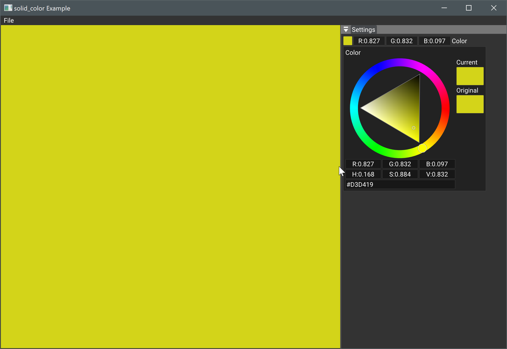

# Solid Color

The samples aren't rendering directly to the swapchain image. Instead, it is the rendered image that is displayed in the viewport. In this sample, we aren't rendering , but display a texture with the choosed color.

In `main()`, the `nvvk::Application` is created using the `nvvk::ApplicationCreateInfo`. This will have the effect, of creating the Vulkan instance, the device and the physical device, the creation of the GLFW window, the initialization of Dear Imgui, see `nvvk::Application::init()` for details. Following this, there is the creation of the `SolidColor` sample. This is derived from `nvvk::IAppEngine` which will allow the application to call some overloaded functions. The first function that is called is `onAttach()`, where the class `AllocVma` is created. This class derives from `nvvk::ResourceAllocator`, which is one of the core helper classes in `nvpro_core/nvvk`. It allows to create resources, like buffers and images, in a more efficient way than allocating memory directly with Vulkan. In our samples, we will be using the [Vulkan Memory Allocator(VMA)](https://github.com/GPUOpen-LibrariesAndSDKs/VulkanMemoryAllocator), but other allocators are available.

Still in `onAttach()`, we create the texture that will be displayed. It is only a `1x1` image, but the idea is to be able to dynamically change the value of this pixel and display the image in the viewport. 

Back at `main()`, the application `->run()` will start an infinite loop until closure is requested. In the loop, `onUIRender()`, `onUIMenu()`, `onResize(w,h)` and `onRender(cmd)` are called. In `onUIRender()`, we render the GUI in the `"Settings"` window. The image is also a UI element, and we display it in the "Viewport" window using `ImGui::Image()`. The `onRender()` function is called at each frame and if the colors have changed, `setData(cmd)` will update the texture using the color chosen in the GUI.
