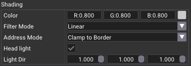

# Texture 3D

## Overview
This sample creates a 3D texture and fill the image data with a compute shader, or from the host with the CPU. 

The image generation follows Perlin noise, and `octave`, `power` and `frequency` were added to add perturbation to the noise function. The creation of the data for the image can be found in [`perlin.comp`](shaders/perlin.comp), and the software version of it, is called `fillPerlinImage`.

The image that is generated is always of power-of-two size, which means the image will be a cube of 2^level. By default, it is 64x64x64.

## Rendering

A cube is rendered, and in the fragment shader, the intersection P1 and P2 is found, a ray-marching will be done between those points until it goes over a threshold value. Once the intersection point is found, the gradient is calculated to find the normal at the surface. This normal is used for shading. See [`raster.frag.glsl`](shaders/raster.frag.glsl) for the shading code.

## Settings

### Shading
The first part allow to change the color of the surface, the texture filters and if it is using a light that follows the camera, or a fixed directional one.

### Perlin 

This is where the size of the texture can be defined and how the noise is generated. Note that it is possible to override the limits of the slider by Ctrl+click in the fields.

### Ray Marching

Ray marching traces a ray through a volume by taking multiple steps and sampling the volume texture at each `step`. It stops when the sampled value exceeds a `threshold`, and then performs interpolation to refine the hit point.

### Presets

Presets have been create, use the slider to automatically change the setting values.

